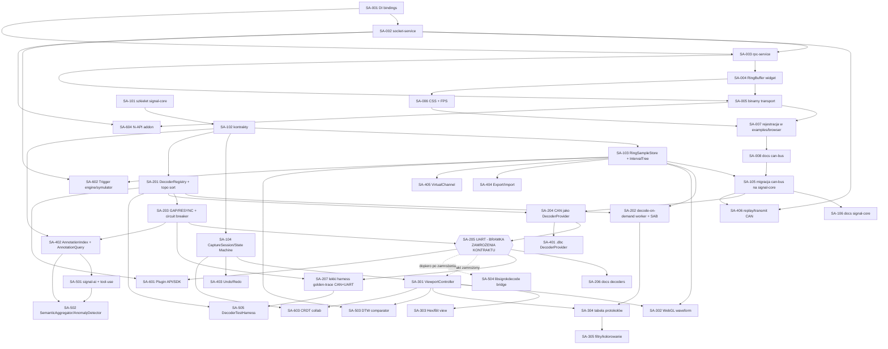

# Signal Analyzer — Zadania dla agentów AI i protokół rewizji supervisora

**Powiązane:** `SIGNAL-ANALYZER-ROADMAP.md` (architektura, kontrakty, fazy), `SIGNAL-ANALYZER-CHANGELOG.md` (append-only log), `doc/signal-analyzer/` (dokumentacja funkcjonalna).

---

## 1. Role

### 1.1. Agent-Wykonawca (Executor)

Dowolny model AI (np. inny agent/model niż supervisor) realizujący **jedną kartę zadania** (SA-xxx) z tego dokumentu. Wykonawca:
- Implementuje **wyłącznie** zakres opisany w karcie zadania — nie rozszerza go „przy okazji".
- Nie modyfikuje plików spoza `Pliki dozwolone` karty bez zgody supervisora.
- Weryfikuje pracę lokalnie (kompilacja/lint/test) przed zgłoszeniem do rewizji. Wymagane jest pokrycie testami dla nowych struktur danych, algorytmów i parserów.
- Dopisuje wpis w `SIGNAL-ANALYZER-CHANGELOG.md` (format §0.1 roadmap) — **zawsze z listą Dodane/Zmodyfikowane/Usunięte**.
- Aktualizuje dokumentację w `doc/signal-analyzer/` w zakresie zmiany (włączając w to diagramy Mermaid tam, gdzie architektura staje się złożona).
- **Nie commituje, nie pushuje, nie decyduje o wersji stabilnej.**
- Kończy pracę statusem `GOTOWE DO REWIZJI` (lub `BLOCKED` z opisem) — nie oznacza zadania jako ukończonego samodzielnie.

### 1.2. Supervisor (ja / rola nadrzędna)

- Nie implementuje kodu funkcjonalnego produktu (chyba że naprawia drobny błąd rewizyjny).
- Weryfikuje pracę wykonawcy wg checklisty §3, zwracając szczególną uwagę na zagadnienia wydajności (złożoność obliczeniowa $O(n)$) oraz zarządzania pamięcią (wycieki, GC pauses).
- Wydaje jedną z decyzji: **AKCEPTACJA**, **POPRAWKI WYMAGANE** (z listą konkretnych uwag), **ODRZUCONE** (z uzasadnieniem i alternatywą).
- Aktualizuje/doprecyzowuje kolejne karty zadań na podstawie tego, co faktycznie wyszło z poprzedniej fazy (zasada „ewolucja, nie architektura z góry" z roadmap §1).
- Rekomenduje właścicielowi, które zadania/fazy są gotowe do oznaczenia jako wersja stabilna i trafienia do gita.

---

## 2. Protokół pracy (workflow)

1. Właściciel lub supervisor wskazuje wykonawcy kartę zadania (ID `SA-xxx`) z §4.
2. Wykonawca implementuje, weryfikuje lokalnie, aktualizuje changelog + dokumentację, zgłasza „gotowe do rewizji" z podsumowaniem (co zrobił, wynik weryfikacji, ewentualne odstępstwa od karty i dlaczego).
3. Supervisor wykonuje rewizję wg checklisty §3, wydaje decyzję i zapisuje ją jako komentarz do zgłoszenia.
4. Przy `POPRAWKI WYMAGANE` — wykonawca poprawia i dopisuje **kolejny** wpis w changelogu (nie nadpisuje poprzedniego).
5. Przy `AKCEPTACJA` — zadanie oznaczane jako ukończone w §4 (supervisor aktualizuje status w tym pliku, to jedyny plik roboczy, który supervisor może swobodnie edytować).
6. Po ukończeniu całej fazy: supervisor przygotowuje krótkie podsumowanie fazy + rekomendację „gotowe do wersji stabilnej".

---

## 3. Checklista rewizji supervisora

Dla każdego zgłoszenia sprawdzam po kolei:

1. **Zgodność z kartą zadania** — czy zrobiono dokładnie to, co w `Zakres`, nic mniej/więcej.
2. **Zgodność z kontraktami** — czy interfejsy zostały zachowane, czy poprawnie użyto wzorców architektonicznych (DI, State Machine, Observable, RPC).
3. **Migracyjność** — czy nie naruszono plików core upstreamu bez jasnej zgody (np. wstrzykiwanie logiki poprzez rebindy).
4. **Wydajność i pamięć** — czy struktury danych są optymalne? Czy zapobiegnięto memory leakom (czyszczenie listenerów, unikanie niekontrolowanego rozrostu tablic)? Czy zminimalizowano presję na Garbage Collector (zero-allocation, Object Pooling)?
5. **Styl i konwencje** — 4 spacje, property injection + `@postConstruct()`, `bindRootContributionProvider`, niezmienność (immutability) dla stanów współdzielonych.
6. **Weryfikacja** — czy podano dokładną komendę, czy testy przechodzą i pokrywają warunki brzegowe (edge cases, NaN, timeouty).
7. **Changelog i Dokumentacja** — append-only log, poprawny Markdown, diagramy.
8. **Bezpieczeństwo i Niezawodność** — brak cichego połykania wyjątków (swallowing exceptions), zabezpieczenia przed prompt injection w warstwie AI, limity buforów.

---

## 4. Karty zadań

Format karty: **Status**, **Cel**, **Pliki dozwolone**, **Wymagania implementacyjne**, **Definition of Done**, **Weryfikacja**, **Zakazane**.

Zadania zostały uszczegółowione pod kątem ścisłych wymagań optymalizacyjnych i architektonicznych (Gemini 3.1 Pro expansion).

Statusy: `DO ZROBIENIA` | `W REALIZACJI` | `W REWIZJI` | `POPRAWKI WYMAGANE` | `UKOŃCZONE`.

---

### Faza 0 — CAN end-to-end na istniejącym MVP (P0)

#### SA-001 — Backend: DI bindings

- **Status:** UKOŃCZONE
- **Cel:** Utworzyć moduł backendowy analogiczny do `src/browser/can-frontend-module.ts`, żeby pakiet `@theia/can-bus` ładował się po stronie Node, oraz ustanowić stabilne identyfikatory DI (`Symbol`) dla usług implementowanych w SA-002 i SA-003.
- **Pliki dozwolone:** `packages/can-bus/src/node/can-backend-module.ts` (nowy), `packages/can-bus/tsconfig.json` (nowy), `packages/can-bus/.eslintrc.js` (nowy), `packages/can-bus/src/browser/can-view-contribution.ts`, `packages/can-bus/src/browser/can-widget.ts`, `packages/can-bus/package.json`.
- **Wymagania implementacyjne:**
  - Utworzyć eksportowany `ContainerModule` i unikalne identyfikatory `Symbol` dla `CanSocketService` oraz `CanRpcService`.
  - Nie wprowadzać atrap usług ani logiki biznesowej: implementacje nie istnieją jeszcze w tym kroku. SA-002 wiąże `CanSocketServiceImpl` przez `bind(...).toSelf().inSingletonScope()`, a SA-003 wiąże `CanRpcServiceImpl` i `RpcConnectionHandler`; obie karty mogą wtedy modyfikować ten moduł.
  - Po pojawieniu się zależności usług stosować property injection `@inject`, bez cyklicznych zależności w konstruktorach.
  - Usunąć wyłącznie obecne błędy ścisłej kompilacji w istniejącym UI, jeżeli blokują weryfikację SA-001; bez zmiany zachowania lub realizacji zakresu SA-004.
- **Definition of Done:** Moduł kompiluje się i ładuje w procesie głównym bez błędów `No matching bindings found`; tokeny `Symbol` są dostępne dla SA-002 i SA-003.
- **Weryfikacja:** `npx lerna run compile --scope @theia/can-bus`, `npm run start:browser` + analiza logów startowych Node.
- **Zakazane:** Pisanie logiki biznesowej w pliku modułu DI. Używanie ciągów znaków (string) jako identyfikatorów wiązań wstrzykiwania zależności zamiast `Symbol`.

#### SA-002 — Backend: `can-socket-service.ts`

- **Status:** UKOŃCZONE
- **Cel:** Stworzyć serwis strumieniujący ramki `CanFrame`, wyposażony w symulator i obsługę sprzętu (za odpowiednią warstwą abstrakcji), realizujący backpressure.
- **Pliki dozwolone:** `packages/can-bus/src/node/can-socket-service.ts` (nowy), `packages/can-bus/src/node/can-backend-module.ts`, `packages/can-bus/src/node/index.ts`, `packages/can-bus/package.json`.
- **Wymagania implementacyjne:**
  - Związać `CanSocketServiceImpl` w `can-backend-module.ts` przez token `CanSocketService` ustanowiony w SA-001, używając `bind(...).toSelf().inSingletonScope()` i bez globalnego singletonu poza kontenerem Theia.
  - Interfejs sprzętowy oddzielony od warstwy usługowej (wzorzec Adapter).
  - Wbudowany symulator działający na precyzyjnym liczniku (`setTimeout`/`setInterval` kompensowany timerem `hrtime.bigint()` dla dokładnego modelowania czasów nanosekundowych).
  - Deterministyczny symulator: wsparcie dla 100 do 5000 ramek/s, rozróżnienie ramek 11-bitowych i 29-bitowych.
  - Prawidłowe zarządzanie cyklem życia: zwalnianie timerów podczas `stop()` w celu zapobiegania memory leakom.
- **Definition of Done:** Symulator produkuje ramki bez jittera czasowego wyższego niż 2ms względem założeń. Testy obejmują start/stop bez wycieków zasobów.
- **Weryfikacja:** Test jednostkowy asynchroniczny `can-socket-service.spec.ts` sprawdzający dokładność dystrybucji ramek w czasie używając zamokowanego (mock) upływu czasu.
- **Zakazane:** Dodawanie bibliotek C/C++ (np. `socketcan`) bezpośrednio na ten moment bez zgody. Aktywne oczekiwanie (busy wait) pętli `while(true)` blokujące event loop Node.js.

#### SA-003 — Backend: `can-rpc-service.ts`

- **Status:** UKOŃCZONE
- **Cel:** Dwukierunkowa komunikacja RPC i Eventy z dbałością o zamykanie subskrypcji przy dyskonektach klienta WebSocket.
- **Pliki dozwolone:** `packages/can-bus/src/node/can-rpc-service.ts` (nowy), `packages/can-bus/src/node/can-backend-module.ts`, `packages/can-bus/src/common/can-protocol.ts`.
- **Wymagania implementacyjne:**
  - Związać `CanRpcServiceImpl` przez token `CanRpcService` i zarejestrować `RpcConnectionHandler` w `can-backend-module.ts`, korzystając z wzorca `ConnectionContainerModule.create(...)` i `client.onDidCloseConnection` z `packages/ai-mcp-server`.
  - Proxy dla zdarzeń przesyłające `FRAME_RECEIVED`, z jawnym usuwaniem listenerów (użycie `Disposable.create()` i rejestracji w obiekcie `DisposableCollection` połączenia) kiedy klient wywołuje `onConnectionClosed`.
  - Dodać `// TODO(SA-005): batch/binary transport` z limitem zapobiegającym przepełnieniu bufora WebSocket jeśli sieć jest wolna (prymitywne backpressure na etapie Fazy 0: np. dropowanie starych ramek w serwisie, jeśli kolejka nienazwana na froncie rośnie zbyt szybko).
- **Definition of Done:** Zdarzenia są odbierane przez klienta, a rozłączenie klienta w 100% czyści listenery w Node.js (potwierdzone testem memory leak).
- **Weryfikacja:** Test jednostkowy potwierdzający wywoływanie `dispose()` na subskrypcjach podczas zamykania połączenia symulowanego.
- **Zakazane:** Trzymanie globalnych referencji (array, map) subskrypcji klientów niezwiązanych z ich cyklem życia.

#### SA-004 — Frontend: RingBuffer w `can-widget.ts`

- **Status:** UKOŃCZONE
- **Cel:** Zero-allocation RingBuffer i wysokowydajne renderowanie tabeli do ~20 FPS bez narzutu ze strony silnika V8 Garbage Collector.
- **Pliki dozwolone:** `packages/can-bus/src/browser/can-widget.ts`, `packages/can-bus/src/browser/ring-buffer.ts`.
- **Wymagania implementacyjne:**
  - `RingBuffer<T>` operujący na uprzednio zaalokowanej tablicy (`new Array(MAX_SIZE)` lub `TypedArray`). Nadpisywanie starych elementów w logice zawijania indeksu, **bez tworzenia nowych referencji**.
  - Zastosowanie wzorca Object Pooling dla wierszy tabeli (np. tworzenie dokładnie 50 węzłów DOM i recykling ich zawartości `textContent` zamiast tworzenia/usuwania elementów).
  - Pętla aktualizacji bazująca na `requestAnimationFrame`.
- **Definition of Done:** Zero alokacji na ścieżce odbierania i renderowania ramek po początkowym buforowaniu. Test wydajności Chrome DevTools wskazuje czas renderowania < 5ms na klatkę.
- **Weryfikacja:** Analiza wydajności z włączonymi narzędziami deweloperskimi i opcją nagrywania (Timeline/Performance) w trybie symulatora 5000 fps.
- **Zakazane:** Stosowanie `Array.prototype.push()` lub `Array.prototype.shift()`. Manipulacja `innerHTML`.

#### SA-005 — Binarny transport danych

- **Status:** UKOŃCZONE
- **Cel:** 20k+ ramek/sekundę poprzez binarny transport (chunking) i zminimalizowanie serializacji po stronie Node.js.
- **Pliki dozwolone:** `packages/can-bus/src/node/can-rpc-service.ts`, `packages/can-bus/src/browser/can-widget.ts`, `packages/can-bus/src/common/can-protocol.ts`.
- **Wymagania implementacyjne:**
  - Zaprojektować i zaimplementować strukturalny nagłówek binarny, uwzględniając endianness (konsekwentne stosowanie DataView dla Little Endian / Big Endian, w zależności od wybranego standardu).
  - Batching paczek co ok. 30ms po stronie serwera przed wysłaniem.
  - Zero-allocation parser po stronie klienta (zapis bezpośrednio z odbieranego `ArrayBuffer` do cyklicznego `TypedArray` reprezentującego RingBuffer).
- **Definition of Done:** Bezstratny przesył >20 000 ramek/s. Brak nagłego wzrostu zużycia CPU serwera spowodowanego wywołaniami `JSON.stringify`.
- **Weryfikacja:** Integracyjny benchmark weryfikujący zgodność liczby i CRC przesyłanych i odbieranych ramek binarnych.
- **Zakazane:** Dekodowanie całych `ArrayBuffer` do pośrednich tablic obiektów JS przez `JSON.parse`.

#### SA-006 — CSS widgetu + wykres FPS

- **Status:** UKOŃCZONE
- **Cel:** Minimalistyczny, zgodny estetycznie wykres statystyk używając natywnego API Canvas2D (High-DPI support).
- **Pliki dozwolone:** `packages/can-bus/src/browser/style/can-widget.css`, `packages/can-bus/src/browser/can-widget.ts`, `packages/can-bus/src/browser/fps-canvas.ts`.
- **Wymagania implementacyjne:**
  - Zmienne CSS Theia (zgodność z motywami Jasny/Ciemny/Wysoki Kontrast).
  - Obsługa wyświetlaczy Retina/High-DPI dla wykresu Canvas (zastosowanie `window.devicePixelRatio` do skalowania wewnętrznego bufora canvasu).
  - Wykres liniowy rysujący przesuwający się bufor w czasie rzeczywistym.
- **Definition of Done:** Wykres płynnie prezentuje Bus Load i FPS z wyraźną, nierozmazaną linią renderowaną na monitorach o wysokiej gęstości pikseli.
- **Weryfikacja:** Wizualna inspekcja zmiany szerokości, trybu koloru i powiększenia DPI przeglądarki.
- **Zakazane:** Import bibliotek do wykresów (Chart.js, itp.). Aktualizowanie stylów motywu z użyciem wartości na sztywno, zamiast zmiennych z rejestru.

#### SA-007 — Rejestracja `@theia/can-bus` w aplikacji przykładowej

- **Status:** UKOŃCZONE
- **Cel:** Kompilacja, bundlowanie i udostępnienie pakietu jako pełnoprawnego rozszerzenia Theia.
- **Pliki dozwolone:** `examples/browser/package.json`.
- **Wymagania implementacyjne:**
  - Dodanie `"@theia/can-bus": "0.1.0"`. Upewnienie się, że w przypadku ewentualnych dodanych bibliotek natywnych (w przyszłości) proces webpack/esbuild będzie posiadał wpisy dla `externals` (zabezpieczenie na przyszłość).
- **Definition of Done:** Możliwość uruchomienia polecenia z menu komend.
- **Weryfikacja:** Uruchomienie kompilacji Theia i działający w przeglądarce projekt.
- **Zakazane:** Wszelkie zmiany innych plików poza punktem montażowym.

#### SA-008 — Dokumentacja `can-bus`

- **Status:** UKOŃCZONE
- **Cel:** Kompleksowy dokument techniczno-użytkowy oparty na wykresach Mermaid (komunikacja binarna).
- **Pliki dozwolone:** `doc/signal-analyzer/can-bus.md`, `doc/signal-analyzer/README.md`.
- **Wymagania implementacyjne:**
  - Utworzenie bloku z językiem graficznym `mermaid` dokumentującego architekturę SocketService -> RpcService -> Transport Binarny -> Frontend.
- **Definition of Done:** Diagram poprawnie renderuje się na GitHub, a tekst dokładnie pokrywa najnowsze funkcje (np. opcje symulatora).
- **Weryfikacja:** Pogląd Mermaid w markdown, weryfikacja składni (unikanie błędów typu znak specjalny bez ucieczki w etykiecie węzła).
- **Zakazane:** Publikacja pustych nagłówków sekcji bez zaimplementowanej w kodzie treści.

---

### Faza 1 — `@theia/signal-core`: kontrakty i magazyn danych (P0)

#### SA-101 — Szkielet pakietu `@theia/signal-core`

- **Status:** UKOŃCZONE
- **Cel:** Restrykcyjna konfiguracja pakietu rdzeniowego (core), nie zanieczyszczona zależnościami platformowymi.
- **Pliki dozwolone:** `packages/signal-core/package.json`, `packages/signal-core/tsconfig.json`, `packages/signal-core/src/common/index.ts`.
- **Wymagania implementacyjne:**
  - Rozszerzenie `configs/base.tsconfig.json` z dodatkowymi ostrymi flagami: `noImplicitAny`, `strictNullChecks`, jeśli bazowy ich domyślnie wprost nie włącza, chociaż zalecane jest utrzymanie standardów projektu bez overridingu.
  - Zastosowanie modułów w CommonJS, ES2023 dla kompilacji Lerna, zgodnie z głównym repozytorium Theia.
- **Definition of Done:** Pakiet jest zintegrowany ze zrzutami (lockfiles), lintingiem Lerna, oraz testami (pomimo ich początkowego braku z wynikiem pozytywnym pusto).
- **Weryfikacja:** `npx lerna run compile --scope @theia/signal-core`.
- **Zakazane:** Zależności typu `react`, `electron`, kod DOM.

#### SA-102 — Kontrakty systemowe (§3 roadmap)

- **Status:** UKOŃCZONE
- **Cel:** Skrupulatna definicja typów w TypeScript, z uwzględnieniem niemutowalności.
- **Pliki dozwolone:** `packages/signal-core/src/common/contracts.ts`, `packages/signal-core/src/common/index.ts`, `packages/signal-core/src/common/contracts.spec.ts`.
- **Wymagania implementacyjne:**
  - Wprowadzić słowa kluczowe `readonly` we wszystkich zdefiniowanych strukturach, gwarantując niezmienność na etapie kompilatora (np. `readonly startTimeNs: bigint;`).
  - Rozważyć użycie tzw. "Branded Types" dla unikalnych identyfikatorów (`type DecoderId = string & { readonly _brand: unique symbol };`), zwiększających bezpieczeństwo.
- **Definition of Done:** Interfejsy ściśle egzekwują wzorce z dokumentacji.
- **Weryfikacja:** Narzędzia statyczne TypeScript, brak błędów.
- **Zakazane:** Stosowanie typu `any`.

#### SA-103 — `RingSampleStore` + `ChunkedIntervalTree`

- **Status:** UKOŃCZONE
- **Cel:** Wydajny dostęp swobodny (random access) w czasie $O(1)$ i wyszukiwanie zakresowe (interval search) w $O(\log N + K)$ uwzględniające optymalizację cache (Cache Locality).
- **Pliki dozwolone:** `packages/signal-core/src/common/ring-sample-store.ts`, `packages/signal-core/src/common/chunked-interval-tree.ts`, testy.
- **Wymagania implementacyjne:**
  - Rozkład pamięci: W ostateczności `RingSampleStore` musi przechowywać dane w płaskiej strukturze liniowej typu `SharedArrayBuffer` lub zestawu połączonych `ArrayBuffer` z zarządzaną przez siebie paginacją.
  - `ChunkedIntervalTree`: rozbicie drzewa przedziałów na bloki (np. po 1024 elementy) wewnątrz każdego chunk, by uniknąć fragmentacji pamięci i pogorszenia się rozrzutu na stercie w V8.
- **Definition of Done:** Benchmarki (jest to wymóg DOD) dla metody wyszukiwania muszą osiągać opóźnienia bliskie zeru niezależnie od obecności 10 milionów węzłów.
- **Weryfikacja:** Wykonywanie polecenia testowego z analizą czasu operacji (przy użyciu `performance.now()`).
- **Zakazane:** Zwykła implementacja drzewa binarnego przydzielającego nowe obiekty JS per przedział.

#### SA-104 — Model sesji i kanałów (`CaptureSession`, State Machine)

- **Status:** UKOŃCZONE
- **Cel:** Solidne i stabilne zarządzanie cyklem życia (lifecycle) przechwytywania.
- **Pliki dozwolone:** `packages/signal-core/src/common/capture-session.ts`, `packages/signal-core/src/common/signal-channel.ts`, testy.
- **Wymagania implementacyjne:**
  - Implementacja wzorca State Machine (Maszyna Stanów) z przejściami: `STOPPED` -> `CAPTURING` -> `PAUSED` -> `STOPPED`. Niedozwolone przejścia rzucają wyrazisty `InvalidStateException`.
  - Posiadanie tzw. "debounce" na emiterach globalnych zdarzeń sesji, ograniczając lawinowe notyfikacje o zmianach.
- **Definition of Done:** Kod testowy przechodzi przez wszystkie dozwolone ścieżki stanów, a próby nielegalnych zmian są skutecznie blokowane.
- **Weryfikacja:** 100% Code Coverage dla modułu stanu.
- **Zakazane:** Manipulowanie polem stanu wewnątrz klas z zewnątrz bez przechodzenia przez kontroler stanów.

#### SA-105 — Migracja `@theia/can-bus` na kontrakty `signal-core`

- **Status:** UKOŃCZONE
- **Cel:** Połączenie obu modułów poprzez Wzorzec Adaptera, minimalizujące wstrząsy.
- **Pliki dozwolone:** `packages/can-bus/package.json`, `packages/can-bus/src/node/can-socket-service.ts`, `packages/can-bus/src/browser/can-widget.ts`.
- **Wymagania implementacyjne:**
  - Usunięcie starych definicji i utworzenie Adapterów zamieniających strumień `SampleBlock` w formacie bit-packed spowrotem na potrzeby dotychczasowego widgetu do czasu jego wymiany.
- **Definition of Done:** Stary widget w przeglądarce działa jak przed migracją, korzystając już z nowych bloków pod spodem.
- **Weryfikacja:** Testy regresyjne.
- **Zakazane:** Użycie polecenia `@ts-ignore` w celu obejścia różnicy starych i nowych kontraktów interfejsu.

#### SA-106 — Dokumentacja `signal-core`

- **Status:** UKOŃCZONE
- **Cel:** Dokumentacja wygenerowana na podstawie solidnych opisów JSDoc oraz plik Markdown architektury.
- **Pliki dozwolone:** `doc/signal-analyzer/signal-core.md`, komentarze JSDoc w kodzie.
- **Wymagania implementacyjne:**
  - Wyjaśnić precyzyjnie w `signal-core.md`, dlaczego i w jakich przypadkach stosowane są typy generyczne na kanałach, a także zilustrować wzorzec zarządzania pamięcią bufora.
- **Definition of Done:** Wysoce profesjonalny i czytelny przewodnik techniczny gotowy do publikacji zewnętrznej.
- **Zakazane:** Generowanie dokumentacji polegającej wyłącznie na autogenerowanym tekście bez opisów koncepcyjnych.

---

### Faza 2 — Decode DAG Engine + drugi protokół (P0)

#### SA-201 — Silnik dekodowania `DecoderRegistry` + Topological Sort

- **Status:** UKOŃCZONE
- **Cel:** Orchestracja dekodowania spełniająca wymogi minimalnej złożoności $O(V+E)$.
- **Pliki dozwolone:** `packages/signal-core/src/common/decoder-registry.ts`, `packages/signal-core/src/common/decoder-dag.ts`, testy.
- **Wymagania implementacyjne:**
  - Wdrożenie ścisłego Algorytmu Kahna do sortowania topologicznego wierzchołków dekoderów. Algorytm ten jest wymogiem i gwarantuje stabilność złożoności dla wykrywania cykli.
  - Zastosowanie wzorca Obserwatora pozwalającego na dynamiczną re-ewaluację potoku po zarejestrowaniu nowego dekodera (Pluginu), generującego nowy DAG.
- **Definition of Done:** 100 węzłów (dekoderów) w DAG poprawnie i błyskawicznie rozwiązuje swoje kolejności, bez awarii stosu (stack overflow).
- **Weryfikacja:** Dynamiczne dodawanie wtyczek do grafu i weryfikacja wyrzucanego wyniku.
- **Zakazane:** Używanie głębokich funkcji rekurencyjnych (zamiast iteracji w Kahnie), które przy potężnych DAG mogą wyczerpać stos w JS.

#### SA-202 — Decode-on-demand w WebWorkerze + SAB

- **Status:** UKOŃCZONE
- **Cel:** Bezpieczne i ekstremalnie szybkie przetwarzanie na uboczu bez ryzyka zjawiska wyścigu (race conditions).
- **Pliki dozwolone:** `packages/signal-core/src/browser/worker/decoder-worker.ts`, `packages/signal-core/src/browser/worker-decoder-engine.ts`.
- **Wymagania implementacyjne:**
  - Optymalizacja narzutu serializacji komend `postMessage`.
  - Zarządzanie cyklem życia workera, aby zapobiec „Zombie Workers” (zabicie procesu potomnego po zamknięciu sesji `terminate()`).
  - Jeśli SharedArrayBuffer jest wspierany (COOP/COEP headers są wymagane w aplikacji bazowej w produkcji), wdraża wzorzec Atomics do synchronizacji blokad; jako fallback używa Transferable Objects (oddanie praw własności z głównego wątku do workera, aby zyskać na wydajności kopiowania, uwaga na unieważnienie obiektu powracającego).
- **Definition of Done:** Skuteczne przekazywanie obciążenia procesora, gładkie skalowanie viewportu okna z obciążeniem asynchronicznym.
- **Weryfikacja:** Profilowanie na wykresach osi czasu Theia i upewnienie się, że `Self Time` w Main Thread dla zadań dekodowania zredukowało się do <1%.
- **Zakazane:** Blokowanie głównego wątku pętlą obarczoną backpressure zwrotnym (brak limitu komunikatów workera wrzucanych na kolejkę główną).

#### SA-203 — GAP/RESYNC first-class + Circuit Breaker dekoderów

- **Status:** UKOŃCZONE
- **Cel:** Wdrożenie odporności na błędy (Resiliency) dla potoków przetwarzania bez globalnego przerwania pracy.
- **Pliki dozwolone:** `packages/signal-core/src/common/annotation-validator.ts`, `packages/signal-core/src/common/decoder-circuit-breaker.ts`, testy.
- **Wymagania implementacyjne:**
  - Implementacja stanów Half-Open, Open, Closed. Jeśli błędy dekodera trwają, przełącz na `Open` (Trip). Po upływie timeoutu, wypróbuj `Half-Open` wysyłając niewielką partię okna.
  - Generowanie precyzyjnie adnotacji błędu zawierających przyczynę (stack trace limitowany z powodu pamięci), po to aby użytkownik analizatora natychmiast otrzymał zwrotny feedback w wizualizacji (na osi).
- **Definition of Done:** Stabilny silnik potrafiący wyzdrowieć po błędzie formatu trzeciego dekodera bez zniszczenia adnotacji produkowanej przez podstawowy dekoder w DAG.
- **Weryfikacja:** Test z usterką.
- **Zakazane:** Ignorowanie (swallowing) wyjątków; nielimitowane akumulowanie logów błędów w konsoli powodujące spadki płynności.

#### SA-204 — Dekoder CAN jako `DecoderProvider`

- **Status:** UKOŃCZONE
- **Cel:** Transformacja do bezstanowej lub hermetycznie-stanowej (wspierającej generatory) logiki dekodera protokołu z użyciem operacji BigInt na polach 64-bitowych ramek.
- **Pliki dozwolone:** `packages/can-bus/src/common/can-decoder-provider.ts`, testy.
- **Wymagania implementacyjne:**
  - Ze względu na zaawansowany payload (do 8 bajtów = 64 bity dla standardu, więcej w FD), ostrożne zarządzanie bitem shift (`<<`, `>>`) wymusza konsekwentne stosowanie BigInt bądź obsługi DataView.
  - Dekoder jako iterator asynchroniczny reagujący na sygnały wstrzymania (pause).
- **Definition of Done:** Przekształcenie wejścia bit-packed na ustandaryzowaną adnotację z uwzględnieniem poprawności bitów sterujących (IDE, RTR).
- **Weryfikacja:** Testy z surowymi pakietami HEX i sprawdzaniem oczekiwanego formatu wyjścia.
- **Zakazane:** Alokowanie dziesiątek zagnieżdżonych struktur mapowych na każdą odczytaną iterację ramki.

#### SA-205 — Dekoder UART (weryfikacja kontraktu na 2. protokole)

- **Status:** UKOŃCZONE
- **Cel:** Proof-of-concept dla sygnałów na wejściu cyfrowym.
- **Pliki dozwolone:** `packages/signal-core/src/common/decoders/uart-decoder-provider.ts`, testy.
- **Wymagania implementacyjne:**
  - Logika detekcji bitu startowego na bazie próbkowania (Oversampling) sygnału np. na połówce szerokości bitu.
  - Wyliczanie synchronizacji czasowej względem predefiniowanego Baud Rate (przesunięcia w oparciu o różnicę `startTimeNs` i `sampleRate`).
- **Definition of Done:** Wyświetla przetłumaczone znaki ASCII dla poprawnych przebiegów czasowych pinów TX/RX.
- **Weryfikacja:** Przeprowadzenie analizy na wirtualnych przebiegach cyfrowych reprezentujących znak np. 'A' (hex 0x41) dla UART 8N1.
- **Zakazane:** Brak walidacji bitu stopu (brak wykrywania błędu ramkowania `Framing Error`).

#### SA-206 — Dokumentacja techniczna dla Fazy 2

- **Status:** UKOŃCZONE
- **Cel:** Przewodnik dla programistów zewnętrznych (Third Party) i wewnętrznych.
- **Pliki dozwolone:** `doc/signal-analyzer/decoders.md`, `doc/signal-analyzer/README.md`.
- **Wymagania implementacyjne:**
  - Wymagane użycie bloków kodowych w Markdown dokumentujących szablon i zachowanie dekodera pod kątem kontraktu Generatorów, uwzględniając diagram klas w Mermaid.
- **Definition of Done:** Jasny poradnik krok po kroku.

#### SA-207 — Lekki harness regresyjny dekoderów (CAN + UART, golden trace)

- **Status:** DO ZROBIENIA
- **Cel:** Natychmiastowa ochrona przed regresją logiki dekoderów CAN i UART zaraz po zamrożeniu kontraktu (SA-205), zanim powstanie pełny `DecoderTestHarness` (SA-505, Faza 5). Zadanie dodane decyzją właściciela po sesji planistycznej (patrz §4a).
- **Pliki dozwolone:** `packages/signal-core/src/common/test-harness/golden-trace-runner.ts` (nowy), `packages/can-bus/src/common/__tests__/can-decoder.golden.spec.ts`, `packages/signal-core/src/common/decoders/__tests__/uart-decoder.golden.spec.ts`, zasoby `test-resources/signal-analyzer/golden-traces/{can,uart}/`.
- **Wymagania implementacyjne:**
  - Zapisać dla dekodera CAN (SA-204) i UART (SA-205) minimum 3 surowe przebiegi wejściowe wraz z oczekiwaną, zserializowaną listą `ProtocolAnnotation` jako zasoby "golden trace" w `test-resources/`.
  - Test porównuje wygenerowane adnotacje ze wzorcem pole po polu (bez hashowania kryptograficznego ani hooka CI — to zakres SA-505).
  - Uruchamiane przez istniejący `npm run test` (Mocha) danego pakietu, bez nowego runnera.
- **Definition of Done:** Świadomie wprowadzona regresja (np. błędny offset bitu w dekoderze UART) powoduje czerwony test z czytelnym diffem pól adnotacji.
- **Weryfikacja:** `npx lerna run test --scope @theia/can-bus`, `npx lerna run test --scope @theia/signal-core`.
- **Zakazane:** Duplikowanie architektury `DecoderTestHarness` z SA-505 (bez generatora CLI, hashowania ani hooków CI) — to zadanie ma pozostać minimalne; pełna wersja powstaje w SA-505.

---

### Faza 3 — Wizualizacja (P1)

#### SA-301 — Pakiet `@theia/signal-ui` i `ViewportController`

- **Status:** DO ZROBIENIA
- **Cel:** Centralny koordynator widoku z zaawansowanym throttlingiem i obustronnym wiązaniem danych.
- **Pliki dozwolone:** `packages/signal-ui/package.json`, `packages/signal-ui/tsconfig.json`, `packages/signal-ui/src/browser/viewport-controller.ts`, `packages/signal-ui/src/browser/index.ts`.
- **Wymagania implementacyjne:**
  - Ochrona przed cyklicznymi nieskończonymi wywołaniami zdarzeń (infinite event loops) podczas np. wzajemnego powiadamiania się okien o przesunięciu `cursorTimeNs`.
  - Integracja `ResizeObserver` z debounce dla responsywności UI okien podrzędnych względem krawędzi kontrolera.
- **Definition of Done:** Natychmiastowa reakcja i synchronizacja 3 różnych widżetów wyświetlających te same osie czasowe.
- **Zakazane:** Użycie wzorca globalnych Singletonów (bez kontekstu DI Kontenera Theia), które łamałyby funkcjonowanie na poziomie wielu przestrzeni roboczych (multi-workspace/multi-window).

#### SA-302 — WebGL Waveform Renderer z Min-Max LOD

- **Status:** DO ZROBIENIA
- **Cel:** Rendering akcelerowany z potężnymi możliwościami przy skrajnych zagęszczeniach pikseli i utratach kontekstu.
- **Pliki dozwolone:** `packages/signal-ui/src/browser/waveform/webgl-waveform-renderer.ts`, `packages/signal-ui/src/browser/waveform/min-max-lod.ts`, `packages/signal-ui/src/browser/waveform/canvas2d-fallback.ts`.
- **Wymagania implementacyjne:**
  - Implementacja buforowania dla utraty kontekstu: nasłuchiwanie zdarzeń `webglcontextlost` i `webglcontextrestored`, zapewniające płynną reinstalację buforów wierzchołków i shaderów bez usterki dla użytkownika, w przypadku przełączenia GPU, trybu uśpienia urządzenia czy odłączenia ekranu zewnętrznego.
  - Wykorzystanie techniki renderowania instancjonowanego (Instanced Rendering) dla wskaźników zjawisk i adnotacji (by uniknąć tysięcy draw calls).
- **Definition of Done:** Środowisko radzi sobie z wyświetleniem 20 sygnałów o milionach próbek na zoomie "Wszystko", podsumowując zakres LOD jako szary blok (poziom najniższych i najwyższych wychyleń na piksel w $O(1)$) bez zamrożenia karty przeglądarki.
- **Weryfikacja:** Profiling WebGL Draw Calls w narzędziu przeglądarki.
- **Zakazane:** Konstrukcja shaderów w JS w sposób generujący zjawiska injection oraz utrata wszystkich wykresów po wybudzeniu systemu ze snu (brak odzysku utraconego kontekstu GL).

#### SA-303 — Hex / ASCII / Bit View z nakładką adnotacji

- **Status:** DO ZROBIENIA
- **Cel:** Precyzyjny silnik renderowania surowej tabeli heksadecymalnej w sposób oszczędny względem DOM.
- **Pliki dozwolone:** `packages/signal-ui/src/browser/hexview/hex-widget.ts`, `packages/signal-ui/src/browser/hexview/annotation-overlay.ts`.
- **Wymagania implementacyjne:**
  - Zastosowanie natywnego API `IntersectionObserver` do leniwego renderowania (lazy rendering) fragmentów tabeli bitów, niewidocznych na ekranie, optymalizując do granic możliwości obciążenie CSS Paint i warstw Composite.
  - Overlay adnotacji renderowany jako absolutnie pozycjonowany nałożony obszar, aby nie komplikować natywnej pętli układu tabeli (Table Layout).
- **Definition of Done:** Możliwość szybkiego scrollowania 100MB pliku (widok bazy HEX) z nakładającymi się w pełni warstwami kolorów.

#### SA-304 — Wirtualizowana Tabela Protokołów

- **Status:** DO ZROBIENIA
- **Cel:** Elastyczne wyświetlanie gigantycznych wolumenów (Miliony rzędów), obsługujące dynamiczne wysokości zawartości ładunku tekstu i Auto-Scroll.
- **Pliki dozwolone:** `packages/signal-ui/src/browser/protocol-table/protocol-table-widget.ts`, `packages/signal-ui/src/browser/protocol-table/table-virtualizer.ts`.
- **Wymagania implementacyjne:**
  - Optymalizacja wyliczania dynamicznych wysokości (Dynamic Row Heights) dla złożonych, rozwiniętych adnotacji z ładunkiem obiektu JSON. Wykorzystanie cache offsetów do zmniejszenia kosztu algorytmu pomiaru wirtualizacji.
  - Tryb "Tail/Follow": Jeśli kursor jest przyklejony do dolnej osi w trakcie odczytu rzeczywistego (Live), wymuszać automatyczny przewijak ze spowalnianiem dla wyższych częstotliwości, aby dało się odczytać dane okiem (tzw. paczkowanie).
  - Źródło danych adnotacji na start: liniowe/naiwne przeszukiwanie bufora viewportu (SA-202 i tak ogranicza dane do okna widoku + 20% marginesu) pod kontraktem `AnnotationQuery`. Decyzja właściciela (patrz §4a): SA-402 (Faza 4) podmieni silnik na `AnnotationIndex` bez zmiany API tabeli — implementować przez interfejs, nie przez bezpośrednie odwołanie do struktury bufora.
- **Definition of Done:** Przewijanie suwakiem 500k rzędów działa płynnie (bez "przeskakiwania") - bufor krawędziowy kompensuje render przedwczesny. Benchmark naiwnego przeszukiwania viewportu < 50 ms na realistyczne okno (inaczej: eskalacja do supervisora, patrz §4a).
- **Zakazane:** Pełne ponowne obliczanie offsetów dla całej tabeli od index 0 do miliona w przypadku zmiany widoczności jednego elementu.

#### SA-305 — Filtrowanie i kolorowanie wierszy

- **Status:** DO ZROBIENIA
- **Cel:** Bezpieczne mechanizmy filtrowania i RegEx w izolacji, chroniące wątek tabelaryczny.
- **Pliki dozwolone:** `packages/signal-ui/src/browser/protocol-table/table-filter-panel.ts`, `packages/signal-ui/src/browser/protocol-table/color-rules.ts`.
- **Wymagania implementacyjne:**
  - Wszystkie wyrażenia filtrowania operujące na olbrzymim wolumenie tabelarycznym MUSZĄ być delegowane do workera przeglądarki. Wątek główny odbiera zwrotnie tylko mapę widoczności i id rekordów.
  - Ewaluator uodporniony na ReDoS (Regular expression Denial of Service) ze strzeżonym czasem wykonywania (timeout guard).
- **Definition of Done:** Nawet bardzo złożone regex na potężnej tabeli nie blokują wizualizacji kursora, a filtrowane wiersze pojawiają się asynchronicznie natychmiast po przetworzeniu.
- **Zakazane:** Stosowanie blokującego metody filtrującej `Array.prototype.filter()` w trybie synchronicznym (Main Thread) dla baz wielomilionowych.

---

### Faza 4 — Semantyka i operacje (P1)

#### SA-401 — Słowniki `.dbc` jako `DecoderProvider`

- **Status:** DO ZROBIENIA
- **Cel:** Kompletny parser metadanych CAN zdolny do obsługi standardów branżowych, uwzględniający operacje nieliniowe multipleksowane.
- **Pliki dozwolone:** `packages/can-bus/src/common/dbc-parser.ts`, `packages/can-bus/src/common/dbc-decoder-provider.ts`, testy.
- **Wymagania implementacyjne:**
  - Przestrzeganie specyfikacji ułożenia Little Endian (Intel) i Big Endian (Motorola) podczas demultipleksacji. Rozszerzenie o obsługę Multiplekserów (zmiana znaczenia sygnału w zależności od wartości innego sygnału - standard motoryzacyjny).
  - Skuteczne radzenie sobie z konwersją formatów typów zmiennoprzecinkowych przy dekodowaniu z narzutem czynnika Scale i Offset na precyzjach dziesiętnych.
- **Definition of Done:** Pokrywa w 100% testy na bazie wzorca J1939 lub innego popularnego modelu słownikowego `dbc` wraz z poprawnym tłumaczeniem (prędkość, obroty koła na minute, itp).

#### SA-402 — `AnnotationIndex` (Inverted Index) + Wyszukiwarka `AnnotationQuery`

- **Status:** DO ZROBIENIA
- **Cel:** Własna baza indeksowania dopasowana do natury sygnałów i struktury czasowo-tekstowej, gwarantująca $O(1)$ dla stałych szukanych kluczy tekstowych.
- **Pliki dozwolone:** `packages/signal-core/src/common/annotation-index.ts`, `packages/signal-core/src/common/annotation-query-engine.ts`, testy.
- **Wymagania implementacyjne:**
  - Budowa zoptymalizowanego Suffix Tree (Drzewa Sufiksowego) lub Trie dla błyskawicznego predykcyjnego wyszukiwania przedrostków tekstu i symboli atrybutów.
  - Wysoce zagęszczone struktury mapowania ID -> znacznik czasowy uwzględniające ograniczenia Garbage Collectora na stercie (heap limitations).
- **Definition of Done:** Możliwość wyszukiwania na bieżąco w polu "Znajdź" (debounce 100ms) ze sprawnym podświetlaniem wyników w potężnym buforze miliona obiektów.

#### SA-403 — Mechanizm Undo/Redo (`SessionCommand`)

- **Status:** DO ZROBIENIA
- **Cel:** Izolacja komend stanu sesji i ograniczenie użycia zasobów bez konieczności całkowitego kopiiowania stanu wielkich tablic.
- **Pliki dozwolone:** `packages/signal-core/src/common/undo-redo-manager.ts`, `packages/signal-core/src/common/session-command.ts`.
- **Wymagania implementacyjne:**
  - Ściśle określony i dający się modyfikować Memory Limit dla Historii Cofania (np. maks. 50 poleceń lub określony ułamek megabajtów). Najstarsze mutacje są zwalniane do czyszczenia (ring buffer dla poleceń).
  - Podejście Delta (przechowywanie tyko przyrostu zmutowanych bloków parametrów dekodera/stanu i ich odwrotności do rekonstrukcji) zamiast wzorca migawki Deep Copy pełnej konfiguracji całego systemu.
- **Definition of Done:** Testowa sekwencja 10 zmian offsetu czasu, odłączeń kanału i zmian zoom, dająca się płynnie i bezbłędnie przeskoczyć w przód i tył.
- **Zakazane:** Tworzenie głębokich klonów `JSON.parse(JSON.stringify())` z wielkimi strukturami danych z logiką powrotu do przeszłości.

#### SA-404 — Eksport / Import danych (CSV, JSON, VCD)

- **Status:** DO ZROBIENIA
- **Cel:** Solidna, strumieniowa kompatybilność z ekosystemami pobocznymi wspierana poprzez Backpressure Node.js API (Drain).
- **Pliki dozwolone:** `packages/signal-core/src/common/export-import-service.ts`, `packages/signal-core/src/node/file-serializer.ts`.
- **Wymagania implementacyjne:**
  - Użycie interfejsów Strumieniowych Transform (Node.js Streams / Web Streams API z uwzględnieniem kompatybilności przeglądarkowej z systemem plików lokalnym i FileSystem Access API).
  - Obserwowanie zdarzeń buforu `drain` przy odczycie/zapisie gigabajtowych logów, eliminacja dławienia pamięci głównej. Złożoność zużycia RAMu równa stałej $O(1)$.
- **Definition of Done:** Proces generacji 5 GB pliku wyjścia CSV oraz jego odczyt nie podnosi bazowego RAM procesu (Heap) wyżej niż przydzielone okno buforowe.

#### SA-405 — Wirtualne kanały matematyczne (`VirtualChannel`)

- **Status:** DO ZROBIENIA
- **Cel:** Bezpieczne i wydajne przeliczanie wyrażeń w obrębie silnika parsera abstrakcyjnego drzewa składniowego (AST).
- **Pliki dozwolone:** `packages/signal-core/src/common/virtual-channel-evaluator.ts`, `packages/signal-core/src/common/virtual-channel.ts`.
- **Wymagania implementacyjne:**
  - Użycie certyfikowanego i bezpiecznego parsera AST dla interpretacji wzorów matematycznych. Usunięcie jakiejkolwiek możliwości podpięcia nieskończonych pętli przez wyrażenia (`no loops allowed in AST mapping`).
  - Cache'owanie wyliczonych (zmemoizowanych) partii buforów, dopóki sygnały bazowe przed wyrażeniem nie zmutują.
- **Definition of Done:** Obliczanie i nakładanie na wizualizację nowego kanału operującego na jitterze różnicowym dwóch głównych (C1 - C2), podążającym na żywo, dające identyczny wynik wzorcowy, testy przeciw błędnej składni i wyciekom.
- **Zakazane:** Stosowanie eval() i funkcji globalnego wykonawcy bez piaskownicy.

#### SA-406 — Nadawanie CAN, logowanie i odtwarzanie (Replay Mode)

- **Status:** DO ZROBIENIA
- **Cel:** Gwarancja absolutnego zachowania proporcjonalnych odstępów czasowych między generowanymi ramkami.
- **Pliki dozwolone:** `packages/can-bus/src/node/can-recorder-service.ts`, `packages/can-bus/src/node/can-player-service.ts`, `packages/can-bus/src/common/can-protocol.ts`.
- **Wymagania implementacyjne:**
  - Silnik odtwarzania wdrożony jako mikrokontroler czasowy: nie polega na ogólnym `setTimeout` w węzłach pętli puszczonych luzem, lecz na pętli kompensującej nanosekundowy dryf systemowego ticku procesora.
  - Rozróżnianie logowania biernego (sniffing/Promiscuous mode) oraz czynnego z asercją logowania parametrów sprzętowych magistrali (np. Acknowledge, nakładanie się ramek przy próbie jednoczesnego zapisu).
- **Definition of Done:** Ślad na magistrali odtwarzany na hardware i mierzony fizycznym analizatorem stanów logicznych (logic analyzer) potwierdza stabilność timingów z dopuszczalnym dryfem nie większym niż ułamek milisekundy od logów VCD odniesienia.

---

### Faza 5 — Inteligencja i porównania (P2)

#### SA-501 — Pakiet `@theia/signal-ai` i integracja agenta AI

- **Status:** DO ZROBIENIA
- **Cel:** Rejestracja bota dialogowego rozszerzającego ekosystem i uodpornionego na kradzież lub halucynacje po stronie LLM.
- **Pliki dozwolone:** `packages/signal-ai/package.json`, `packages/signal-ai/src/browser/signal-ai-agent.ts`, `packages/signal-ai/src/browser/signal-ai-tools.ts`.
- **Wymagania implementacyjne:**
  - Utworzenie szczelnej warstwy kontroli (Validation Boundary) zapobiegającej Prompt Injection i wykonaniu destrukcyjnych akcji przez Model Językowy (odrzucanie "narzędzia skasuj wszystkie logi lub usuń projekt").
  - Aktywny monitor zużycia limitu tokenów (Token Tracker) po to aby asystent odrzucał zlecenia zbytniego rozdrabniania się na zbyt gigantyczne okna czasowe i rekomendował zastosowanie innego skryptu zmniejszającego granulację.
- **Definition of Done:** Agent wywołuje zarejestrowane narzędzia i generuje wiarygodne merytorycznie wyniki tekstowe bez fałszywych wniosków wymyślonych przez halucynację AI (z włączonym trybem surowych metryk powiązania Grounding/RAG z adnotacjami).

#### SA-502 — `SemanticAggregator` + `AnomalyDetector`

- **Status:** DO ZROBIENIA
- **Cel:** Wytrenowanie detekcji na danych w locie, korzystając ze zoptymalizowanych matematycznych algorytmów bez przechowywania historii (Streaming Algorithms).
- **Pliki dozwolone:** `packages/signal-ai/src/common/semantic-aggregator.ts`, `packages/signal-ai/src/common/anomaly-detector.ts`.
- **Wymagania implementacyjne:**
  - Zaimplementować ciągłe obliczanie statystyk Z-score używając np. Algorytmu Welforda dla wariancji z jednym przejściem przez tablice (One-pass running variance $O(1)$ memory).
  - Generowanie zagregowanych wektorów adnotacji (przesuwanie w oknach czasowych) z kategoryzacją do skomasowanych, tokeno-oszczędnych deskryptorów dla Agentów NLP.
- **Definition of Done:** Detekcja nagłego przesunięcia średniej (Time-shift anomaly, Frequency anomaly) wyłapuje różnicę minimalną 5 sigma względem wzorca zachowań i emituje metadane, zachowując minimalny stan pamięci wirtualnej przy wielogodzinnym działaniu.

#### SA-503 — Porównywanie sesji z algorytmem DTW (Dynamic Time Warping)

- **Status:** DO ZROBIENIA
- **Cel:** Analiza wzorców elastyczna i wysoce tolerancyjna, uodporniona przed eksplozją zapotrzebowania na pamięć $O(N^2)$ (zabezpieczenie korytarza).
- **Pliki dozwolone:** `packages/signal-core/src/common/dtw-comparator.ts`, `packages/signal-ui/src/browser/comparator-widget.ts`.
- **Wymagania implementacyjne:**
  - Algorytm macierzowy DTW (Dynamic Time Warping) musi zastosować ucięcie pasma, np. ograniczenie pasma poszukiwań "Sakoe-Chiba Band" lub heurystykę FastDTW. Celem jest obniżenie klasycznego problemu ujemnego wpływu kwadratowej pojemności pamięci podczas macierzowych obliczeń dystansu na korzyść asymptotyki kwaziliniowej.
- **Definition of Done:** Skrypt przetwarza w mniej niż 2 sekundy macierz dystansu wzorców tysięcy punktów, płynnie renderując na siatce połączone krzywymi pasma pokrycia zidentyfikowanych podobieństw rozciągniętych i skróconych śladów fal.
- **Zakazane:** Stosowanie podstawowej implementacji klasycznego DTW ładującej setki megabajtów wyliczanej dwuwymiarowej tablicy matrycy do RAM na długich próbkach, co kończy się zderzeniem z OOM (Out Of Memory Exception).

#### SA-504 — Most `libsigrokdecode` (Python sidecar, opcjonalny)

- **Status:** DO ZROBIENIA
- **Cel:** Proces wieloplatformowy umożliwiający posługiwanie się gigantycznym ekosystemem sprzętowo-software'owym Sigrok bez ryzyk zablokowania bazowej aplikacji.
- **Pliki dozwolone:** `packages/signal-core/src/node/sigrok-bridge.ts`, `scripts/sigrok-sidecar.py`.
- **Wymagania implementacyjne:**
  - Wdrożenie procedur Bezpiecznego i Łagodnego Zamknięcia (Graceful Shutdown) i czyszczenia (SIGTERM, SIGKILL z poziomu Theia backendu po zamknięciu wątku), z gwarancją niepozostawiania zjawisk zombie w powłoce systemowej u użytkownika.
  - Implementacja kolejkowania zdarzeń wzdłuż IPC JSON (inter-process communication) ograniczająca zapotrzebowanie parsera Pythona na zbyt częste strzały we/wy (I/O multiplexing).
- **Definition of Done:** Wykrycie i dodanie kilkuset dekoderów wspieranych przez Sigrok bez zawieszenia programu głównego; błyskawiczne zabicie ubocznych procesów po wyjściu aplikacji ze środowiskiem (Electron i Browser exit).

#### SA-505 — Harness testowy dekoderów (`DecoderTestHarness`)

- **Status:** DO ZROBIENIA
- **Cel:** Wytworzenie rygorystycznych weryfikacji powstrzymujących regresje logiki dekodowania w procesach ciągłej integracji CI/CD projektu theia.
- **Pliki dozwolone:** `packages/signal-core/src/common/test-harness/decoder-test-harness.ts`, odpowiednie pliki testowe.
- **Wymagania implementacyjne:**
  - Generator powiązany z procesami skryptowymi CI (dodany hook do `npm run test`) służący z automatycznego komparowania struktury adnotacji testowanej wersji z surowym, kryptograficznie skróconym zapisem hash wyników w "Golden Traces" osadzonych jako zasoby (resources) podfolderu.
  - Rozszerza bazę golden trace założoną w SA-207 (Faza 2, CAN+UART) o wszystkie pozostałe dekodery zarejestrowane w `DecoderRegistry`; nie zaczyna od zera.
- **Definition of Done:** Bezobsługowy proces odpalany wywołaniami linii poleceń asertuje odchyłki wyników. W wypadku porażki wyrzuca w raporcie precyzyjne odniesienie różnicy (np. `diff payload bytes`).

---

### Faza 6 — Ekosystem (P3)

#### SA-601 — Publiczne Plugin API + SDK oraz Resolver Zależności

- **Status:** DO ZROBIENIA
- **Cel:** Piaskownica oraz jasne definicje publicznego dostępu na miarę wzorca theiaext do celów rozbudowy trzecich stron.
- **Pliki dozwolone:** `packages/signal-core/src/common/plugin-api/` (katalog), `packages/signal-core/src/common/plugin-resolver.ts`.
- **Wymagania implementacyjne:**
  - Wdrożenie koncepcji barier architektonicznych z odpowiednio izolowanymi warstwami, z opcją na izolowanie obcego (niezaufanego) kodu dekoderów zewnętrznych developerów w dodatkowych kontenerach (Worker, lub wtyczka theia-plugin ext-host), dając im dostęp tylko do API oznaczonych adnotacją `@public` za pośrednictwem Theia Plugin API.
  - Rozwiązywanie konfliktów rygorystycznie używając klasycznego SemVer w trakcie ładowania (loading resolution).
- **Definition of Done:** Załadowana wtyczka-złośliwa z zewnętrznego manifestu powodująca wewnątrz pętlę nieskończoną, kończy na crashu jedynie swojego procesu podrzędnego i zwraca błąd z `PluginResolver`, nie zakłócając stabilności całej platformy aplikacji i samego IDE.

#### SA-602 — Silnik wyzwalaczy (Trigger Engine) i symulator protokołów

- **Status:** DO ZROBIENIA
- **Cel:** Konstrukcja ociężałej maszyny stanów na bazie zaawansowanych wyzwalaczy reagujących w potoku o najwyższym priorytecie i minimalnym rzucaniu warunkowym.
- **Pliki dozwolone:** `packages/signal-core/src/common/trigger-engine.ts`, `packages/signal-core/src/common/protocol-simulator.ts`.
- **Wymagania implementacyjne:**
  - Bufor pre-trigger oraz bufor post-trigger operujący bezalokacyjnie jako krąg logicznych przesunięć znaczników zrzutu sesji sprzętu, wyzwalający się na krawędzi sygnałów natychmiast lub z wprowadzonym w symulatorze dodatkowym parametrem losowego jitteru symulującego szumy rzeczywistych ścieżek prądowych.
- **Definition of Done:** Możliwość ustawienia wyzwalacza zatrzymującego maszynę pomiarową na "Tylko w trybie anomalii długości paczki trwającej > 10ms", na tle symulowanych dziesiątek tysięcy poprawnych ramek.

#### SA-603 — Współpraca w czasie rzeczywistym (CRDT) i Multi-Domain Clocking UI

- **Status:** DO ZROBIENIA
- **Cel:** Implementacja stabilnej struktury do operacji asynchronicznych podczas rozłączeń w trybie wspólnym (offline reconciliation).
- **Pliki dozwolone:** `packages/signal-ui/src/browser/collaboration/crdt-session-sync.ts`, `packages/signal-ui/src/browser/multi-domain-clock-widget.ts`.
- **Wymagania implementacyjne:**
  - Adaptacja silnika Automerge lub Yjs z silnymi gwarancjami spójności przy wielokrotnym edytowaniu opisu, dodawaniu adnotacji ręcznych z użyciem kanałów Theia komunikacji w backendzie do dystrybucji zmian pomiędzy użytkownikami.
  - Automatyczne rozwiązywanie problemów związanych z czasem rozłączeń do rozejścia na różne platformy, zapewniające gładkie fuzjowanie (merging) w tle za pomocą wektorowych zegarów Lampa-Porta lub struktury drzewa ułamków logarytmicznych u używanych bibliotek.
- **Definition of Done:** Dwa węzły podłączone przez WebSockets modyfikujące te same adnotacje w czasie rozłączeń sieci, odzyskujące bezkonfliktowo ostateczną synchroniczność po ponownym re-connect (potwierdzone w teście End-to-End narzędziami Cypress lub Playwright w oddzielnym theia setupie wizualnym).

#### SA-604 — Natywny N-API Addon dla szybkiego przechwytywania (Ingestion Hot-Path)

- **Status:** DO ZROBIENIA
- **Cel:** Najwyższa forma ekstremalnej optymalizacji (C++ Native) połączona płynnym mostem V8.
- **Pliki dozwolone:** `packages/signal-core/src/node/native/`, `packages/signal-core/binding.gyp`.
- **Wymagania implementacyjne:**
  - Ręczne wiązanie, uwzględniające specyfikę zarządzania cyklem życia Garbage Collectora między stertą V8 a pamięcią niezarządzaną (Unmanaged memory mmap). Błędy w wyzwoleniu tych pętli prowadzą do uciążliwych błędów Segfault (Segmentation Faults - ubicie procesu bazowego IDE). Trzeba stosować bezpieczne bufory `Napi::Buffer<uint8_t>::New()` z odpowiednimi finalizatorami `std::free`.
- **Definition of Done:** Natywny Add-On przyspiesza operację przetwarzania gigantycznych obciążeń transferów interfejsu PCAP (z kart fizycznych ethernet) czy SocketCAN do bezpośrednich ArrayBufferów o 65% w relacji do czystego silnika Node.js na testowanym procesorze serwerowym oraz nie pozwala silnikowi na błędy wycieków po włączeniu i wyłączeniu analizatora kilkaset razy w teście zmęczeniowym.
- **Zakazane:** Brak kompatybilności wstecznej (Fallback): w razie nieudanej pre-kompilacji modułu C++ lub na nowym systemie bez `node-gyp` moduł MUSI bezproblemowo zniżać się (downgrade/fallback) do czystego interpretera JavaScript bez awarii ładowania całego systemu Signal Analyzera.

---

## 4a. DAG zależności między zadaniami

Graf pokazuje twarde zależności (poprzednik musi mieć decyzję `AKCEPTACJA`, zanim następnik zacznie implementację). Zależności wewnątrz jednej fazy, niewymienione poniżej, mogą być realizowane równolegle.



**Krytyczne bramki (gate) — nie pomijać:**

- **SA-205 = bramka zamrożenia kontraktu.** Zgodnie z roadmap §1/§4 (Faza 2): dopiero po tym, jak dekoder UART (2. protokół) potwierdzi, że kontrakt `DecoderProvider`/`ProtocolAnnotation` działa bez zmian, kontrakt zostaje ZAMROŻONY. Faza 3 (wizualizacja) i SA-504 (libsigrokdecode) nie mogą realnie ruszyć przed tą decyzją — jeśli SA-205 wykaże potrzebę zmiany kontraktu, to `apiVersion` bump + migrator, a Faza 3 startuje później niż w tabeli §4.
- **SA-105 wymaga całej Fazy 0 (SA-001…SA-008)** — migracja can-bus na kontrakty `signal-core` przepina istniejący, działający widget; regresja Fazy 0 jest niedopuszczalna (DoD SA-105).

**Decyzje właściciela (zatwierdzone 2026-08-04, wg rekomendacji z sesji planistycznej):**

1. **SA-304** rusza z naiwnym/liniowym przeszukiwaniem bufora viewportu pod kontraktem `AnnotationQuery` (SA-202 i tak ogranicza dane do okna widoku + 20% marginesu). SA-402 (Faza 4) podmienia silnik na `AnnotationIndex` bez zmiany API tabeli. Kryterium rewizji: jeśli benchmark SA-304 przekroczy 50 ms na realistyczne okno, kolejność zostaje zrewidowana. Karta SA-304 zaktualizowana o ten wymóg i próg benchmarku.
2. **SA-505 pozostaje w Fazie 5** (pełny CI harness, wiele dekoderów, hash kryptograficzny), ale dodano nowe zadanie **SA-207** (Faza 2, zaraz po SA-205) — lekki harness golden-trace tylko dla CAN i UART, bez hooka CI ani hashowania. SA-505 rozszerza tę bazę zamiast zaczynać od zera.

## 4b. Wzorce z istniejącego kodu Theia (zweryfikowane ścieżki)

| Wzorzec | Zastosuj w | Plik referencyjny |
| --- | --- | --- |
| `ContainerModule` + `RpcConnectionHandler` + `bindRootContributionProvider` w module backendowym | SA-001, SA-003 | `packages/core/src/node/messaging/messaging-backend-module.ts` |
| `ConnectionContainerModule.create(...)` z czyszczeniem per-połączenie (`client.onDidCloseConnection`) | SA-003 (dispose subskrypcji przy rozłączeniu klienta) | `packages/ai-mcp-server/src/node/mcp-backend-module.ts` |
| `bindContributionProvider` (scoped do kontenera połączenia) vs `bindRootContributionProvider` (root) | SA-001, SA-101 (wybór właściwego wiązania) | `packages/core/src/common/contribution-provider.ts` |
| `DisposableCollection` do zbiorczego zwalniania listenerów połączenia | SA-003 (test memory-leak na dispose) | `packages/core/src/node/messaging/websocket-frontend-connection-service.ts` |
| Rejestracja `Agent`/`ChatAgent` przez `bindRootContributionProvider(bind, ChatAgent)` + `bind(Agent).toService(...)` | SA-501 | `packages/ai-chat/src/browser/ai-chat-frontend-module.ts` |
| Konkretne agenty i narzędzia (tool-use) z `@theia/ai-core` gotowe do wzorowania (np. `ExploreAgent`, `TodoWriteTool`) | SA-501, SA-601 | `packages/ai-ide/src/browser/frontend-module.ts` |
| Istniejący frontend-module pakietu `can-bus` (wzorzec do rozszerzenia o `node/`) | SA-001 (analogia backend/frontend) | `packages/can-bus/src/browser/can-frontend-module.ts` |

---

## 5. Szablon zgłoszenia wykonawcy do rewizji

```text
Zadanie: SA-xxx
Status: GOTOWE DO REWIZJI | BLOCKED
Zrobione: <krótki opis>
Odstępstwa od karty: <jeśli są, z uzasadnieniem - np. odkryta pułapka wydajnościowa>
Weryfikacja: <komenda + wynik profili czasowych jeśli zastosowano>
Changelog: <link/cytat wpisu dopisanego do SIGNAL-ANALYZER-CHANGELOG.md>
Dokumentacja: <plik(i) zaktualizowane, ze ścieżkami diagramów>
```

## 6. Szablon decyzji supervisora

```text
Zadanie: SA-xxx
Decyzja: AKCEPTACJA | POPRAWKI WYMAGANE | ODRZUCONE
Uzasadnienie: <checklist §3 — co sprawdzono z naciskiem na Złożoność Algorytmiczną i Czystość Pamięciową>
Uwagi/poprawki: <lista konkretnych punktów technicznych z propozycją zmiany, jeśli POPRAWKI WYMAGANE>
Rekomendacja dla właściciela: <np. „gotowe do wersji stabilnej” / „poczekać do końca fazy”>
```
