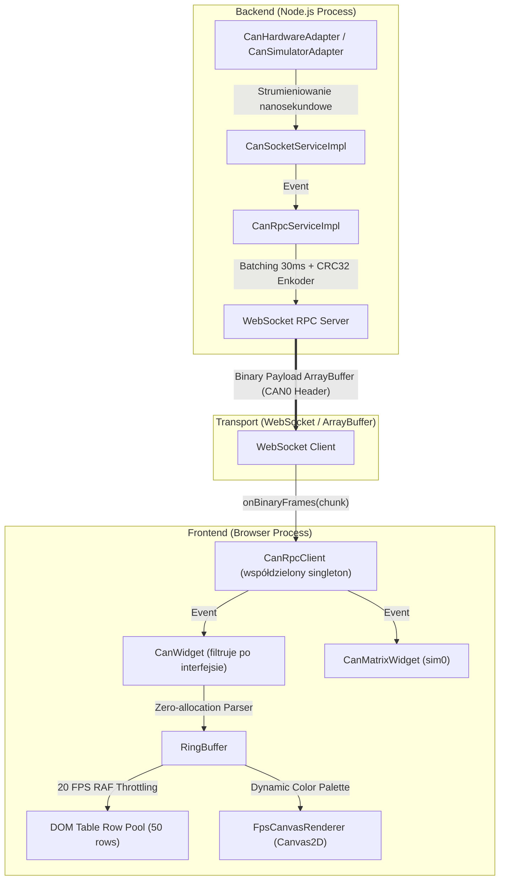

# Dokonanie i Architektura Pakietu `@theia/can-bus`

## Dwa demonstracyjne interfejsy

Każde okno **CAN Bus Analyzer** ma listę wyboru interfejsu z pozycjami
**Demo** i **Demo 2**. Są to dwa niezależne generatory danych w backendzie;
ramki mają własną nazwę interfejsu i odmienny zakres identyfikatorów CAN.

Wybór jest wyłączny w obrębie otwartego interfejsu Theia: gdy jedno okno
wybierze Demo, pozycja Demo jest wyszarzona i niedostępna w pozostałych
oknach. Zamknięcie pierwszego okna zwalnia interfejs. Wszystkie okna
używają jednego współdzielonego połączenia RPC (frontendowy singleton
`CanRpcClient`), a backend strumieniuje ramki wszystkich uruchomionych
interfejsów jednocześnie; każde okno filtruje strumień po swoim wybranym
interfejsie. Dzięki temu kilka okien może przechwytywać jednocześnie różne
interfejsy (np. Demo + Demo 2 + sim0 w CAN ID Matrix).

## CAN ID Matrix — inspekcja wybranej ramki

Widok **CAN ID Matrix** grupuje ramki według `interface`, typu identyfikatora
(standardowy/rozszerzony), CAN ID oraz DLC. Dla każdej grupy pokazuje licznik,
częstotliwość i okres występowania. Kliknięcie wiersza wybiera jego ostatnią
ramkę bez zmieniania danych przechwyconych z magistrali.

Poniżej tabeli działają trzy komponenty:

- **Matrix Message Explorer** — źródło grup i statystyk częstości;
- **Frame Payload Inspector** — tylko do odczytu: HEX, ASCII i bity zaznaczonego bajtu;
- **Typed Field Decoder** — interpretuje zaznaczony bajt od razu jako `UINT8`
  (ustawienie domyślne); obsługuje też `INT8`, `UINT16`, `INT16`, `UINT32`,
  `INT32`, `FLOAT32`, `FLOAT64` oraz `ASCII`, z wyborem endianowości.

Typy wielobajtowe wymagają, by od wskazanego bajtu w ramce było wystarczająco
dużo danych. Pole pozostaje powiązane z aktualnie wybraną ramką Matrix.

## CAN Value Plot — wykresy zmiennych w czasie

**CAN Value Plot** pobiera dane z rejestru **Global Variables**. Widżet otwiera
się jako osobna zakładka i pozwala dodawać wiele zmiennych do jednego okna.
Każda zmienna jest osobną serią z własnym buforem próbek, legendą i panelem
wykresu. Zmienne dodaje się przez wybór na liście **Add plot**, a następnie
można je niezależnie usuwać.

- wartości i znaczników czasu publikowanych przez `GlobalVariableRegistry`,
- tylko zmiennych numerycznych (`BOOL`, liczby); teksty i tablice bajtów są pomijane,
- wspólnej osi czasu oraz automatycznie dobieranego zakresu obejmującego kilka okresów.

Zmiany wartości są odbierane przez `GlobalVariableRegistry.onDidVariableChange`.
Każda seria używa pierścienia `ValueSampleStore`, dzięki czemu wiele wykresów
może działać równolegle bez tworzenia osobnego widżetu.

Sterowanie w pasku narzędzi widżetu:

| Kontrolka | Opis |
| --- | --- |
| **Start / Stop / Pause / Clear** | stan przechwytywania i czyszczenie bufora |
| **ID** (+ Ext) | identyfikator CAN (hex `0x...` lub dziesiętnie) |
| **Interface** | wybór z listy interfejsów otwartych analizatorów (`All` = bez filtra) |
| **Byte / Len** | bajt startowy i długość pola (1–8) |
| **Type / Endian / Divisor** | typ dekodowania (`UINT`/`INT` o dowolnej długości 1–8 bajtów, typy stałe `UINT8`…`FLOAT64`), endianowość i dzielnik wyniku |
| **Auto window** | okno czasowe = 5 × estymowany okres sygnału (estymacja EMA z odstępów próbek), zawsze w zakresie 1 ms–1 s |
| **Window** | ręczna podstawa czasu: 1, 2, 5, 10, 20, 50, 100, 250, 500, 1000 ms |

Wykres rysuje sygnał schodkowy (zero-order hold) na kanwie z obsługą
wysokiego DPI i kolorami motywu Theia; oś X to czas względny do „now",
oś Y skaluje się automatycznie z 10% marginesem. Status pokazuje estymowany
okres/częstotliwość i liczbę próbek w buforze (pierścień 8192 próbek —
najstarsze są nadpisywane).

## 1. Architektura Dwuwarstwowa

Pakiet `@theia/can-bus` został zaprojektowany jako hybrydowe rozszerzenie Eclipse Theia z wyraźnym podziałem na warstwę wykonywczą Node.js (Backend) oraz warstwę prezentacji (Browser Frontend).



---

## 2. Format Koperty Binarnej (Lossless Envelope Protocol)

Przesył danych z serwera do przeglądarki odbywa się za pomocą zoptymalizowanego nagłówka i bufora binarnego (`Big-Endian` dla nagłówka, `Little-Endian` dla danych ramek).

### Nagłówek Koperty (12 Bajtów)

- `[0..3]`: Magic ID: `0x43414E30` (`CAN0` w formacie ASCII)
- `[4..7]`: `frameCount` (Uint32, liczba ramek zawartych w paczce)
- `[8..11]`: `crc32` (Uint32, suma kontrolna IEEE 802.3 wyliczona dla całego ładunku ramek)

### Pojedyncza Ramka w Ładunku

- `Timestamp` (Float64, 8B): czas nadejścia w ms.
- `ID + Flags` (Uint32, 4B): 29-bit / 11-bit ID oraz flagi `extended`, `rtr`, `error`.
- `DLC` (Uint8, 1B): Długość danych payload (0-8 bajtów).
- `Interface Name Length` (Uint8, 1B): Długość nazwy interfejsu w bajtach UTF-8.
- `Interface Name String` (N bajtów): Kodowany znakowo interfejs CAN (np. `can7`, `vcan0`).
- `Payload Data` (DLC bajtów): Surowe bajty danych ramek CAN.

---

## 3. Kluczowe Komponenty i Optymalizacje

### 3.1. Zero-Allocation RingBuffer (`ring-buffer.ts`)

Struktura danych operująca na prealokowanej tablicy wskaźników bez wywołań `Array.prototype.push()` lub `shift()`. Gwarantuje brak narzutu dla V8 Garbage Collectora podczas pracy przy 20k+ ramek/s.

### 3.2. Rendering DOM i Throttling (`can-widget.ts`)

- **DOM Pooling:** Tabela statystyk utrzymuje dokładnie 50 gotowych węzłów DOM, podmieniając wyłącznie ich zawartość `textContent` (zgodnie z dyrektywami jakościowymi DoD — zero użycia `innerHTML`).
- **20 FPS Throttled RAF:** Aktualizacja interfejsu odbywa się za pomocą `requestAnimationFrame` z bramką czasową 45-50ms, oszczędzając czas procesora użytkownika dla wygładzonej animacji.

### 3.3. Canvas2D i Dynamiczne Motywy (`fps-canvas.ts`)

Renderowanie wykresów obciążenia magistrali (`Bus Load`) i klatkażu (`FPS`) dopasowuje się automatycznie do aktywnego motywu Theia (Dark/Light/High-Contrast) odczytując zmienne CSS przez `getComputedStyle(this.node)`. Obsługiwane są ekrany Retina / High-DPI (`window.devicePixelRatio`).

---

## 4. Instrukcja Uruchomienia i Testowania

### Budowanie i Uruchomienie Aplikacji

1. Kompilacja pakietu CAN Bus:

   ```bash
   npx lerna run compile --scope @theia/can-bus
   ```

2. Budowanie aplikacji przeglądarkowej:

   ```bash
   npx lerna run build --scope @theia/example-browser
   ```

3. Uruchomienie serwera dev/browser:

   ```bash
   cd examples/browser && npm start
   ```

### Uruchomienie Testów Jednostkowych i Benchmarku

Wszystkie 23 testy jednostkowe wraz z przetestowaniem odporności sumy kontrolnej CRC32 i wydajności transportu binarnego wykonuje się poleceniem:

```bash
npx lerna run test --scope @theia/can-bus
```
