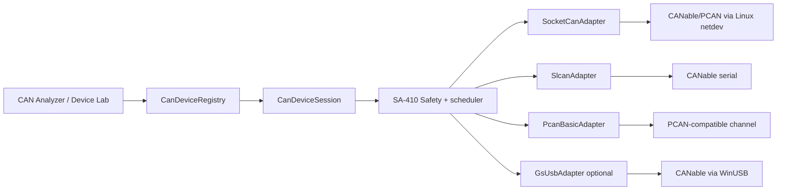

# CANable 2.0 i adaptery PCAN-compatible — plan integracji z Theia

**Status:** plan aktywny; podstawowe fizyczne adaptery po ESP32-S3
**Decyzja właściciela:** 2026-08-28
**Urządzenia:** CANable 2.0 oraz posiadany, działający adapter PCAN-compatible/klon
**Powiązane dokumenty:** `can-device-lab.md`, `esp32-s3-can-integration-plan.md`
**Powiązane prace:** SA-002, SA-005, SA-406, SA-410 i SA-421

## 1. Cel i kolejność

Theia ma obsługiwać trzy podstawowe rodziny fizycznych interfejsów CAN:

1. nasze ESP32-S3 z izolowanym CAN, przez USB lub Ethernet;
2. CANable 2.0, przez SLCAN albo candleLight/`gs_usb` zależnie od firmware;
3. adaptery PCAN-compatible, w tym posiadany egzemplarz/klon, który już poprawnie działa w obecnym środowisku.

Najkrótszy następny vertical slice wykorzystuje posiadany, działający adapter PCAN jako fixture referencyjny. CANable 2.0 jest drugim fixture i przechodzi osobną kwalifikację dla każdego firmware. Nazwa z aukcji, wygląd obudowy albo sam VID/PID nie są dowodem zgodności.

### 1.1. Decyzje v1

| Temat | Decyzja |
| --- | --- |
| Wspólne API Theia | wszystkie adaptery implementują `CanDeviceProvider`/`CanDeviceSession` z planu ESP32-S3 |
| PCAN na Windows | PCAN-Basic przez izolowany native driver bridge |
| PCAN na Linux | preferowany SocketCAN; PCAN-Basic chardev tylko jako jawny, alternatywny backend |
| CANable SLCAN | czysty adapter serial w backendzie Node.js |
| CANable candleLight | SocketCAN/`gs_usb` na Linux; bezpośredni WinUSB/libusb dopiero po spike'u |
| CAN FD | nigdy na podstawie nazwy; wyłącznie gdy firmware, driver i test fixture potwierdzą capability |
| TX safety | host egzekwuje SA-410; adaptery zewnętrzne nie są uznawane za on-device safety guard |
| Timestamp | capability opisuje prawdziwe źródło i dokładność; host receive time jest fallbackiem, nie timestampem sprzętowym |
| Klony | obsługa według działającego protokołu/API, nie według deklarowanej marki |

## 2. CANable 2.0 — profile urządzenia

CANable 2.0 obsługuje Classical CAN 2.0A/B do 1 Mbit/s. Sprzęt ma przełączaną terminację i może pracować z firmware SLCAN albo alternatywnym candleLight. Producent opisuje CAN FD w SLCAN jako funkcję beta, natomiast publikowany profil candleLight dla CANable 2.0 nie obsługuje FD. Dlatego pierwsza kwalifikacja Theia obejmuje Classical CAN; FD pozostaje wyłączone do osobnego testu konkretnego firmware. Źródła: [CANable — opis urządzenia](https://canable.io/), [CANable — getting started](https://canable.io/getting-started.html).

### 2.1. Profil SLCAN

Identyfikator endpointu:

```text
canable:<usb-identity>:slcan:<serial-port>
```

Charakterystyka:

- urządzenie wystawia port szeregowy/USB CDC;
- backend używa protokołu SLCAN, a nie TCAN;
- parser jest strumieniowy i rozdziela rekordy po terminatorze protokołu;
- konfiguracja, open/close, listen-only, RX i TX są mapowane na komendy SLCAN;
- bitrate portu USB i bitrate CAN są osobnymi parametrami;
- ASCII zwiększa narzut i liczbę kopii w porównaniu z `gs_usb`;
- timestamp SLCAN jest używany tylko, jeśli firmware jawnie go wspiera i przejdzie test wrap/rozdzielczości;
- firmware/adapter może nie raportować rzeczywistego zakończenia TX na magistrali.

Pierwszy profil ma wspierać Classical CAN 11/29-bit, DLC 0–8, listen-only, normal RX/TX i bezpieczne close/reset. Rozszerzenia CAN FD w różnych wariantach SLCAN nie wchodzą do baseline v1.

### 2.2. Profil candleLight/gs_usb

Identyfikator endpointu:

```text
canable:<usb-identity>:gs-usb:<channel>
```

Firmware candleLight implementuje interfejs zgodny z głównym sterownikiem Linux `gs_usb`, więc urządzenie może pojawić się jako natywny interfejs SocketCAN. Dokumentacja firmware ostrzega, że echo TX może oznaczać zapis do peryferium CAN, a nie potwierdzone wysłanie na magistralę; Theia nie może nazywać tego ACK ani reakcją DUT. Źródło: [candleLight firmware](https://github.com/candle-usb/candleLight_fw).

Priorytet backendów:

1. Linux: `SocketCanAdapter` na interfejsie utworzonym przez `gs_usb`;
2. Windows: spike bezpośredniego WinUSB/libusb, dopiero po rozpoznaniu deskryptorów i wersji firmware;
3. fallback: przełączenie urządzenia na zweryfikowany firmware SLCAN, jeżeli bezpośredni backend USB nie jest jeszcze gotowy.

Theia nie aktualizuje firmware automatycznie. UI pokazuje wykryty profil i wersję, a zmiana firmware jest osobną, ręczną operacją serwisową.

### 2.3. Ograniczenia elektryczne

CANable i jego warianty nie są traktowane jako galwanicznie izolowane tylko dlatego, że są adapterami USB-CAN. Przed TX użytkownik potwierdza:

- wspólną masę i dopuszczalny potencjał między hostem a DUT;
- pozycję przełącznika terminacji 120 Ω;
- liczbę terminatorów na stole;
- bitrate oraz stan zasilania DUT;
- brak połączenia z pojazdem lub działającą maszyną.

Pole `galvanicIsolation` w capabilities ma wartość `YES`, `NO` albo `UNKNOWN`. Dla nierozpoznanego CANable/klona domyślne jest `UNKNOWN`, nie `YES`.

## 3. PCAN-compatible i klony

### 3.1. Zasada zgodności

Nazwa „PCAN” w planie oznacza backend zgodny z API/driverem, nie obietnicę, że każdy klon jest sprzętowo lub programowo identyczny z produktem PEAK-System.

Urządzenie trafia do providera `pcan-basic`, jeżeli:

1. zainstalowane PCAN-Basic wykrywa kanał jako attached/available albo occupied w dozwolonym trybie współdzielenia;
2. API zwraca informacje o kanale i pozwala go zainicjalizować;
3. kontrolowany test RX/TX oraz statusów przechodzi na izolowanym stole;
4. odłączenie i reconnect nie pozostawiają zarezerwowanego kanału;
5. capabilities wynikają z API i testu, nie z nazwy USB.

Jeżeli adapter sprzedany jako „PCAN” pojawia się jako SLCAN albo `gs_usb`, jest obsługiwany przez odpowiedni provider CANable/generic USB-CAN. Nie implementujemy nieudokumentowanego raw USB konkretnego klona tylko po to, aby pasował do etykiety handlowej.

### 3.2. Backend PCAN-Basic

PCAN-Basic udostępnia wykrywanie kanałów, inicjalizację Classical CAN/CAN FD, odczyt z timestampem, zapis, status, reset kolejek i zwolnienie kanału. API jest dostępne dla Windows i Linux; możliwości zależą od urządzenia oraz sterownika. Źródła: [PEAK PCAN-Basic](https://www.peak-system.com/products/software/development-packages/pcan-basic/?L=1), [lista operacji PCAN-Basic](https://www.peak-system.com/documentation/API/PCAN-Basic.Net/html/aeec6faf-dd92-bc63-f9cd-a42c55c5a91d.htm).

Mapowanie:

| PCAN-Basic | Warstwa Theia |
| --- | --- |
| attached channels / channel condition | discovery i reservation |
| device ID, hardware name, controller number | descriptor i fingerprint |
| `Initialize` | Classical CAN configuration |
| `InitializeFD` | konfiguracja FD tylko po capability probe |
| receive event + `Read`/`ReadFD` do pustej kolejki | batched RX bez aktywnego pollingu |
| `Write`/`WriteFD` | admission do kolejki sterownika, nie on-bus ACK |
| `GetStatus` i status frames | bus state, warning, passive, bus-off |
| `Reset` | kontrolowane czyszczenie RX/TX po STOP/fault |
| `Uninitialize` | release kanału i cleanup |

PCAN-Basic potrafi zgłaszać event odbioru, po którym aplikacja powinna opróżnić kolejkę. Pozwala to zbudować RX worker bez pętli busy-wait. Źródło: [PEAK ReceiveEvent](https://www.peak-system.com/documentation/API/PCAN-Basic.Net/html/56fd40a9-11b2-4e78-91c6-f9b0089693a2.htm).

### 3.3. Linux: SocketCAN kontra PCAN-Basic

Na Linux urządzenie PCAN może być obsługiwane przez mainline SocketCAN albo przez wariant sterownika/API PCAN-Basic. Jeden fizyczny kanał nie jest otwierany równocześnie przez oba backendy.

Reguła wyboru:

- jeżeli istnieje działający netdev `canX` i jego driver odpowiada fixture — użyj `SocketCanAdapter`;
- jeżeli użytkownik jawnie wybrał PCAN-Basic/chardev i biblioteka wykrywa kanał — użyj `PcanBasicAdapter`;
- registry scala wyniki po fingerprint i pokazuje jeden kanał z listą dostępnych backendów;
- przełączenie backendu wymaga stop, release i ponownej konfiguracji;
- wynik wyboru i wersja drivera są zapisywane w journalu eksperymentu.

Sterownik PEAK w trybie netdev integruje urządzenia z SocketCAN; producent opisuje też odrębny tryb chardev dla PCAN-Basic. Źródło: [PEAK Linux driver manual](https://www.peak-system.com/fileadmin/media/linux/files/PCAN-Driver-Linux_UserMan_eng.pdf).

### 3.4. Posiadany działający egzemplarz

Posiadany adapter jest pierwszym fixture `PCAN-COMPAT-01`. Przed kodowaniem trzeba zapisać bez zgadywania:

```text
fixtureId: PCAN-COMPAT-01
system: Windows/Linux + wersja
backend: PCAN-Basic albo SocketCAN
USB VID/PID: do odczytu
USB serial/path: do odczytu
PCAN channel handle/netdev: do odczytu
hardware name/device ID: do odczytu z API
driver/API version: do odczytu
firmware version: jeśli API udostępnia
CAN modes: wynik probe
galvanic isolation: YES/NO/UNKNOWN na podstawie sprzętu
termination: wbudowana/zewnętrzna/UNKNOWN
```

Nie wpisujemy do kodu jednego numeru kanału typu `PCAN_USBBUS1`. Discovery buduje descriptor dynamicznie, a konfiguracja użytkownika może przypiąć alias do stabilnego fingerprintu.

## 4. Wspólna architektura adapterów



### 4.1. Podział odpowiedzialności

`CanDeviceRegistry`:

- zbiera discovery z providerów;
- deduplikuje fizyczne kanały;
- nadaje stabilne endpoint IDs;
- przechowuje alias oraz stan kwalifikacji;
- rezerwuje kanał między wieloma widgetami Theia.

`CanDeviceSession`:

- zwraca capabilities konkretnego połączenia;
- konfiguruje bitrate/mode/filter;
- dostarcza batch RX i zdarzenia bus state;
- przyjmuje TX oraz rozróżnia queue admission od potwierdzenia magistrali;
- wykonuje stop/flush/release;
- mapuje zegar drivera na monotoniczny czas sesji.

Adapter backendu:

- jest jedyną warstwą znającą SLCAN, SocketCAN, `gs_usb` albo PCAN-Basic;
- nie implementuje logiki kampanii ani UI;
- nie podnosi capability, której nie potwierdził driver/probe;
- nigdy nie mapuje local echo na odpowiedź DUT.

### 4.2. Native driver bridge

PCAN-Basic i bezpośredni `gs_usb` wymagają natywnego dostępu. Rekomendowany jest mały proces `can-driver-host`, a nie ładowanie obcej DLL bezpośrednio do głównego procesu backendu Theia:

- dynamicznie ładuje PCAN-Basic, więc brak biblioteki nie blokuje startu Theia;
- domyślnie korzysta z biblioteki zainstalowanej przez użytkownika; dołączenie DLL/SO do dystrybucji wymaga wcześniejszego przeglądu licencji PCAN-Basic;
- izoluje błąd drivera/FFI od IDE;
- wysyła do Node.js batch’e binarne przez named pipe/Unix domain socket;
- ma osobny kanał urgent STOP i limitowane kolejki;
- raportuje wersję biblioteki, drivera, urządzenia i wszystkie statusy;
- kończy sesję i zwalnia kanał po utracie IPC;
- nie jest instalowany, gdy używany jest wyłącznie SLCAN lub SocketCAN.

Przed implementacją należy zrobić krótki spike N-API kontra sidecar. Sidecar jest wyborem domyślnym ze względu na izolację, lecz wynik musi uwzględnić dystrybucję Windows, podpisywanie binariów i opóźnienie IPC.

## 5. Model capabilities

Każdy endpoint raportuje co najmniej:

```ts
interface CanAdapterCapabilities {
    readonly backend: 'TCAN' | 'SOCKETCAN' | 'SLCAN' | 'GS_USB' | 'PCAN_BASIC';
    readonly classicalCan: boolean;
    readonly canFd: boolean;
    readonly extendedId: boolean;
    readonly rtr: boolean;
    readonly listenOnly: boolean;
    readonly oneShot: boolean;
    readonly hardwareFilters: number | 'UNKNOWN';
    readonly timestampOrigin: 'HARDWARE' | 'DRIVER' | 'FIRMWARE' | 'HOST_RECEIVE';
    readonly timestampResolutionNs?: number;
    readonly txCompletion: 'ON_BUS' | 'DRIVER_ACCEPTED' | 'PERIPHERAL_QUEUED' | 'UNKNOWN';
    readonly localEcho: 'NONE' | 'DRIVER' | 'FIRMWARE' | 'UNKNOWN';
    readonly galvanicIsolation: 'YES' | 'NO' | 'UNKNOWN';
    readonly termination: 'BUILT_IN_SWITCH' | 'SOFTWARE' | 'EXTERNAL' | 'UNKNOWN';
}
```

Capability probe jest bezpieczny i domyślnie pasywny. Nie wysyła CAN. Próba TX jest osobnym testem po uzbrojeniu stołu.

## 6. Klasyfikacja zaufania urządzenia

| Stan | Znaczenie | Domyślne uprawnienia |
| --- | --- | --- |
| `DISCOVERED` | znaleziony port/kanał, brak udanego open | brak capture/TX |
| `PROTOCOL_VERIFIED` | backend otworzył urządzenie i odczytał capabilities | listen-only/capture |
| `BENCH_VERIFIED` | exact fingerprint przeszedł RX, TX, stop i fault tests | TX po zwykłym ARM SA-410 |
| `DEGRADED` | zmienił się firmware/driver albo test wykrył błąd | capture-only do ponownej kwalifikacji |
| `BLOCKED` | zły protokół, niestabilny driver lub niebezpieczny fault | brak użycia |

Kwalifikacja jest przypisana do fingerprintu oraz wersji firmware/drivera. Zmiana któregoś elementu cofa urządzenie do `PROTOCOL_VERIFIED`. Posiadany poprawnie działający adapter PCAN może zostać `BENCH_VERIFIED` po zapisaniu fingerprintu i przejściu powtarzalnego testu, zamiast każdorazowo traktować go jako nieznany klon.

## 7. RX, timestampy i backpressure

Wszystkie backendy produkują wspólny `RawCanBatch`. Różnice są zachowane w metadanych:

- PCAN-Basic: timestamp drivera/API, jeśli zwrócony przez `Read/ReadFD`;
- SocketCAN: kernel timestamp i jawna domena zegara;
- `gs_usb`: timestamp/echo zgodne z faktycznym firmware oraz driverem;
- SLCAN: timestamp firmware tylko po probe, w przeciwnym razie `HOST_RECEIVE`;
- każda utrata kolejki adaptera, drivera, IPC lub backendu staje się jawnym GAP;
- backend→frontend nadal używa istniejącego binarnego batcha SA-005;
- wolny UI nie może zatrzymać opróżniania kolejki drivera CAN.

SLCAN i PCAN mają inne formaty natywne, ale nie tworzymy równoległych modeli `CanFrame`. Normalizacja następuje raz przy wejściu do wspólnego ingestion.

## 8. TX i bezpieczeństwo

CANable i PCAN-compatible nie implementują TCAN ARM token ani sprzętowej polityki ESP32. Dlatego:

- SA-410 waliduje allowlistę, ID mode, DLC, FPS, bus-load, czas i stan sesji przed wywołaniem adaptera;
- scheduler hosta używa czasu monotonicznego i ograniczonego look-ahead;
- adapter ma ograniczoną kolejkę i nie nadrabia spóźnienia nieograniczonym burstem;
- `STOP` zatrzymuje scheduler, czyści kolejkę hosta i wywołuje dostępny reset/flush drivera;
- po bus-off, disconnect lub błędzie API sesja przechodzi do `FAULT` i wymaga ponownego ARM;
- `Write`/echo oznacza co najwyżej przyjęcie przez driver/peryferium, chyba że backend udowodni silniejszą semantykę;
- brak ACK na stole jest diagnozowany przez status kontrolera, a nie przez brak local echo;
- przełączenie backendu, bitrate albo urządzenia zawsze rozbraja sesję.

W przeciwieństwie do ESP32-S3, po awarii procesu hosta nie ma naszego firmware, które niezależnie egzekwuje heartbeat. Scenariusz nie może więc wysłać do drivera długiej, nieodwołalnej kolejki. Domyślny look-ahead TX dla adapterów hostowych jest krótki i ograniczony pomiarem zdolności flush konkretnego drivera.

## 9. Plan realizacji

Identyfikatory `USBCAN-*` są lokalne dla integracji adapterów.

| Etap | Zakres | Definition of Done |
| --- | --- | --- |
| USBCAN-001 | Inwentaryzacja `PCAN-COMPAT-01` i CANable 2.0 | fingerprint, OS, firmware, driver, izolacja, terminacja i capabilities zapisane bez domysłów |
| USBCAN-002 | Wspólny `CanDeviceRegistry/Session` | symulator, ESP32 i adapter USB mieszczą się w jednym kontrakcie; deduplikacja i reservation |
| USBCAN-003 | `SocketCanAdapter` | discovery netdev, configure, RX batch, TX, timestamps, errors i hot-unplug na Linux |
| USBCAN-004 | `SlcanAdapter` | serial discovery, parser odporny na fragmentację, Classical RX/TX, listen-only i reconnect |
| USBCAN-005 | Spike native bridge + PCAN-Basic | działający inventory/open/RX/TX/status/close na `PCAN-COMPAT-01`; decyzja sidecar kontra N-API |
| USBCAN-006 | Produkcyjny `PcanBasicAdapter` | event-driven RX, batch, dynamiczne kanały, cleanup, błędy i opcjonalny FD probe |
| USBCAN-007 | Integracja UI | grupy urządzeń, backend, trust state, capabilities, alias i powód niedostępności |
| USBCAN-008 | TX safety i journal | SA-410, status admission/echo/on-bus, STOP/flush, fault i pełny audit |
| USBCAN-009 | Opcjonalny direct `gs_usb` Windows | wdrożenie tylko po conformance na CANable; fallback SLCAN pozostaje |
| USBCAN-010 | Bramka E2E | PCAN fixture + CANable SLCAN + CANable/SocketCAN, długi RX, TX, hot-unplug, bus-off i wiele widgetów |

Kolejność:

```text
USBCAN-001 → USBCAN-002 ┬→ USBCAN-003 ───────────────┐
                        ├→ USBCAN-004 ───────────────┤
                        └→ USBCAN-005 → USBCAN-006 ─┼→ USBCAN-007 → 008 → 010
                                      USBCAN-009 ────┘  (opcjonalny po pomiarze)
```

## 10. Macierz wsparcia pierwszej wersji

| Urządzenie/backend | Windows | Linux | Classical CAN | CAN FD | Priorytet |
| --- | --- | --- | --- | --- | --- |
| `PCAN-COMPAT-01` / PCAN-Basic | wymagany | opcjonalny | wymagany | probe, bez założenia | P0 |
| PCAN / SocketCAN | nie | wymagany | wymagany | według netdev + testu | P1 |
| CANable 2.0 / SLCAN | wymagany | wymagany | wymagany | poza baseline | P0 |
| CANable 2.0 / candleLight + SocketCAN | nie | wymagany | wymagany | wyłączony dla publikowanego profilu | P1 |
| CANable 2.0 / direct `gs_usb` | spike | przez SocketCAN | wymagany po spike | poza baseline | P2 |

„Wymagany” oznacza element bramki akceptacji, nie deklarację, że dowolny klon będzie działał bez kwalifikacji.

## 11. Test kwalifikacyjny fixture

Każdy fingerprint przechodzi ten sam scenariusz:

1. discovery oraz 20 cykli open/configure/close;
2. listen-only baseline przy 125, 250, 500 kbit/s i — jeśli sprzęt pozwala — 1 Mbit/s;
3. 10 minut RX przy maksymalnym obciążeniu odpowiednim dla trybu bez cichej utraty;
4. standard 11-bit, extended 29-bit, DLC 0–8 i RTR, jeśli capability;
5. kontrolowany TX z allowlistą i drugim węzłem zapewniającym ACK;
6. porównanie planowanego TX, local echo, RX drugiego interfejsu i reakcji DUT;
7. STOP przy pełnej kolejce i pomiar liczby ramek wysłanych po żądaniu;
8. odłączenie USB podczas RX i TX, ponowne wykrycie bez automatycznego ARM;
9. error-warning, error-passive, bus-off i recovery;
10. dwa widgety/urządzenia równolegle oraz poprawne reservation;
11. restart backendu Theia bez pozostawienia zajętego kanału;
12. zapis wersji drivera, firmware i wyniku do raportu fixture.

## 12. Kryteria akceptacji

- posiadany PCAN-compatible działa w Theia co najmniej tak stabilnie jak w obecnym używanym narzędziu;
- CANable 2.0 działa przez SLCAN na Windows i Linux dla Classical CAN;
- co najmniej jeden natywny backend Linux (`gs_usb`/SocketCAN lub PCAN/SocketCAN) przechodzi pełny capture;
- żaden adapter nie reklamuje CAN FD, izolacji, timestampu sprzętowego ani on-bus TX bez probe/dowodu;
- urządzenie jest wybierane po stabilnym descriptorze/fingerprint, nie po kolejności COM/`canX`/PCAN handle;
- utrata ramek, przepełnienie kolejki i disconnect są jawnie zapisane;
- local echo i driver queue admission nie są prezentowane jako odpowiedź DUT;
- zmiana urządzenia, backendu, bitrate lub profilu zawsze rozbraja TX;
- brak opcjonalnego PCAN-Basic/native bridge nie uniemożliwia uruchomienia Theia;
- testy aktywnego TX pozostają ograniczone do izolowanego stołu.

## 13. Poza zakresem v1

- gwarantowanie działania wszystkich klonów PCAN z AliExpress/eBay;
- reverse engineering zamkniętego raw USB nieznanego klona;
- automatyczne flashowanie CANable;
- uznanie beta CAN FD w SLCAN za funkcję produkcyjną;
- długi, autonomiczny scheduler TX w adapterze, który nie ma naszego safety firmware;
- współdzielenie jednego kanału przez kilka aktywnych sesji TX;
- wspólny sterownik dla urządzeń o podobnej obudowie, ale innym protokole;
- zakładanie izolacji lub terminacji na podstawie nazwy produktu.

## 14. Dane potrzebne do rozpoczęcia USBCAN-001

Bez zatrzymywania pozostałych prac należy zebrać z posiadanego PCAN-compatible i CANable:

- system operacyjny, na którym obecnie działają;
- nazwę używanego programu/drivera i jego wersję;
- wynik enumeracji USB oraz numer seryjny, jeśli istnieje;
- wersję firmware CANable i informację SLCAN/candleLight;
- informację, czy PCAN fixture obsługuje Classical CAN czy także FD;
- informację o izolacji galwanicznej i terminacji;
- jeden krótki, anonimizowany ślad RX oraz kontrolowaną ramkę TX;
- oczekiwany bitrate najczęściej używany na stole.

Brak tych danych nie blokuje kontraktów, symulatora ani parsera SLCAN. Blokuje natomiast oznaczenie konkretnego egzemplarza jako `BENCH_VERIFIED`.
