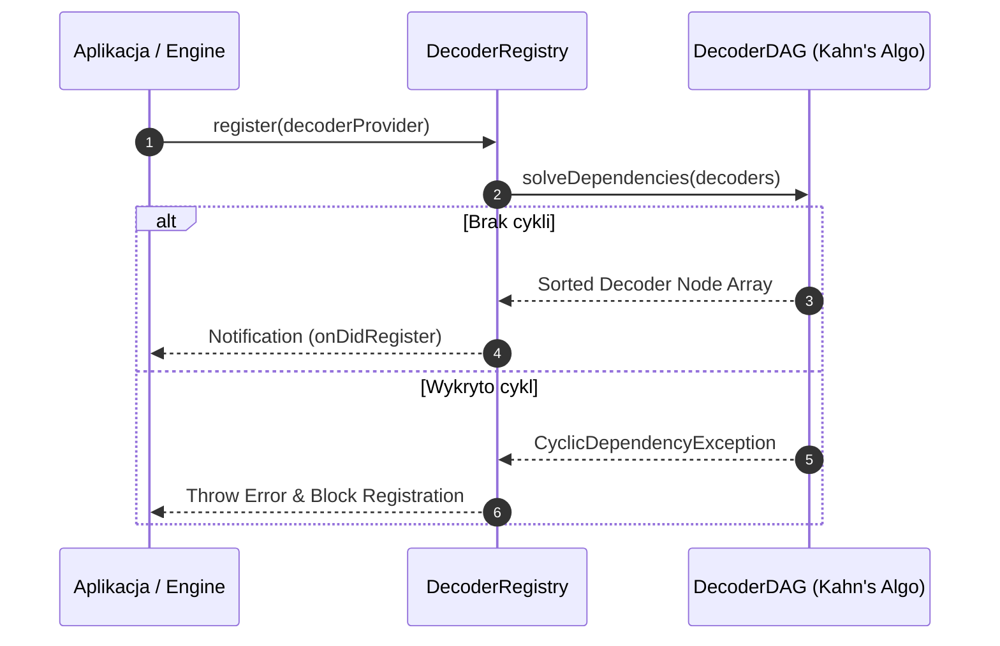
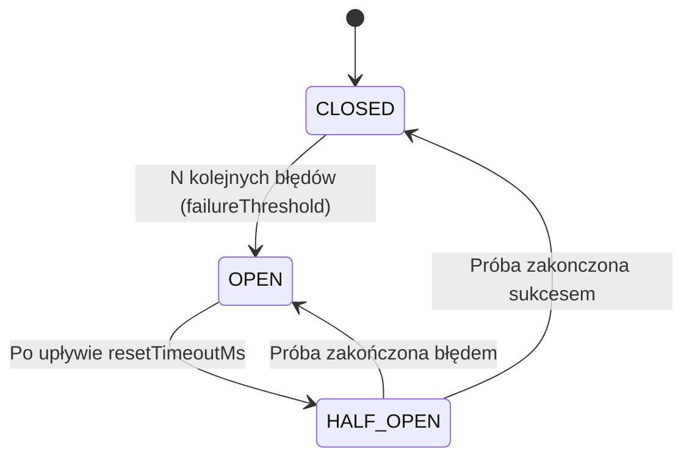

# Architektura silnika dekoderów (Faza 2)

## 1. Wstęp i przegląd architektoniczny

Dokument opisuje architekturę silnika dekodowania protokołów w wieloprawidłowym środowisku analizatora sygnałów (`@theia/signal-core` oraz `@theia/can-bus`).
Silnik zapewnia bezstanową oraz strumieniową analizę ramek próbek i adnotacji bez obciążania głównego wątku interfejsu (Self Time w Main Thread < 1%).

---

## 2. Rejestracja i sortowanie topologiczne (DAG)

Wszystkie wtyczki dekoderów implementują zamrożony interfejs `DecoderProvider` (`apiVersion: 1.0.0`) i są rejestrowane w `DecoderRegistry`.
Zależności pomiędzy dekoderami (np. dekoder sygnałów wyższego poziomu zależny od adnotacji dekodera fizycznego) są rozwiązywane w oparciu o wolny od rekurencji, iteracyjny **Algorytm Kahna** $O(V+E)$ w `DecoderDAG`.

### Diagram sekwencji sortowania DAG

---

## 3. Izolowany watek roboczy (WebWorker) i zero-copy

Asynchroniczne dekodowanie realizowane jest przez `WorkerDecoderEngine`, który deleguje przetwarzanie do podwątku `decoder-worker.ts`.

### Mechanizm przesyłu danych
- **Transferable Objects:** `postMessage(message, [buffer])` umożliwia przekazywanie buforów próbek `ArrayBuffer` z zerowym narzutem kopiowania w czasie $O(1)$.
- **SharedArrayBuffer + Atomics:** Opcjonalny tryb dla przeglądarek z nagłówkami Cross-Origin Isolation (COOP/COEP).
- **Ochrona przed Zombie Workers:** Metoda `terminate()` anuluje wszystkie oczekujące obietnice (`PendingRequests`) i natychmiastowo niszczy podwątek.
- **Kontrola backpressure:** Przy przekroczeniu limitu `maxPendingRequests` rzucany jest `BackpressureExceededException`.

---

## 4. Odporność na błędy (Circuit Breaker)

Silnik wykorzystuje wzorzec `DecoderCircuitBreaker` zapobiegający zatrzymaniu pętli dekodowania w przypadku awarii pojedynczego dekodera w potoku.

### Stany obwodu

- **CLOSED:** Dekoder wywoływany jest w sposób standardowy.
- **OPEN:** Dekoder zostaje odcięty, a silnik natychmiast zwraca pierwszorzędną adnotację `DECODER_FAULT` bez wykonania akcji.
- **HALF_OPEN:** Po upływie limitu czasu próbna obietnica sprawdza czy dekoder odzyskał sprawność.

Adnotacje błędów i luk czasowych (`GAP`, `RESYNC`, `DECODER_FAULT`) tworzone są przez `AnnotationValidator` z nakładanym limitem pamięciowym na ślad stosu (stack trace truncation).

---

## 5. Implementacje protokołów (CAN & UART)

1. **CanDecoderProvider (`@theia/can-bus`):** Przetwarza surowe próbki sygnałowe lub ramki binarne za pomocą `CanBinaryDecoder` i `DataView`/`BigInt`, zwracając adnotacje `annotation:can`.
2. **UartDecoderProvider (`@theia/signal-core`):** Realizuje dekodowanie cyfrowych sygnałów szeregowych UART przy konfigurowalnym `baudrate` (np. 9600, 115200), `dataBits`, `parity` i `stopBits`.

---

## 6. Weryfikacja i zestawienie testów

Całość Fazy 2 została zweryfikowana poprzez zestaw testów jednostkowych i integracyjnych:
- `@theia/signal-core`: 34/34 passing (coverage 95.09%)
- `@theia/can-bus`: 26/26 passing (coverage 96.69%)
