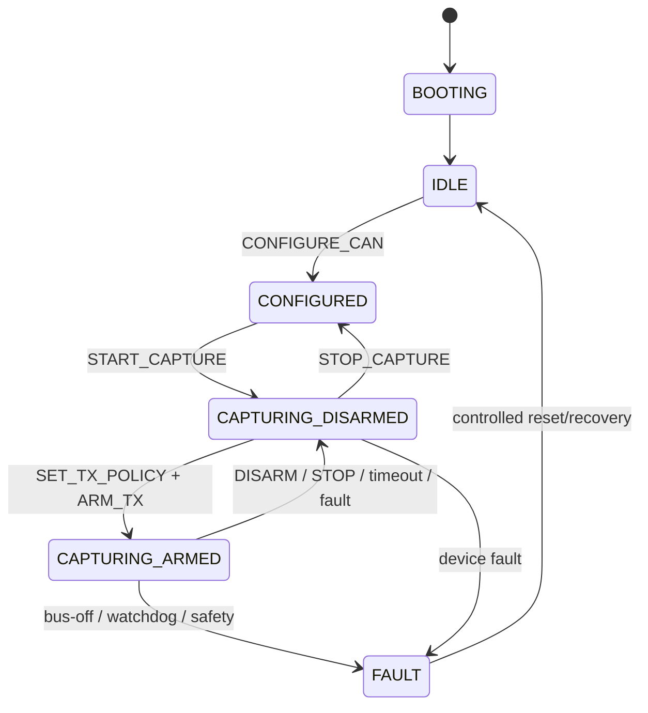

# Theia CAN Device Protocol (TCAN) v1

**Status:** draft do zamrożenia przed implementacją ESPCAN-002
**Urządzenie referencyjne:** ESP32-S3 + izolowany Classical CAN
**Transporty:** USB CDC-ACM, opcjonalny USB bulk, TCP/IP, opcjonalny UDP RX
**Kolejność bajtów:** little-endian
**Dokument planu:** `esp32-s3-can-integration-plan.md`

## 1. Cel i zakres

TCAN jest binarnym protokołem między urządzeniem CAN a backendem Theia. Ta sama komenda i ten sam format batcha działają przez USB oraz Ethernet. Adapter transportowy odpowiada jedynie za framing, połączenie, MTU i wykrycie zerwania linku.

TCAN v1 obsługuje:

- identyfikację urządzenia, negocjację wersji i capabilities;
- konfigurację kanału CAN oraz filtrów;
- odbiór ramek w batchach z czasem urządzenia i jawną informacją o lukach;
- bezpieczne nadawanie natychmiastowe i zaplanowane;
- on-device TX policy, ARM token, heartbeat i awaryjny STOP;
- wyniki TX, stan kontrolera, bus-off i diagnostykę kolejek;
- synchronizację zegara host–urządzenie;
- TCP jako pełny transport oraz opcjonalny UDP wyłącznie dla RX.

TCAN nie opisuje semantyki sygnałów DBC, ISO-TP/UDS ani kampanii Device Lab. Te warstwy budują ramki CAN w Theia, a urządzenie wykonuje wyłącznie zwalidowany capture i TX.

## 2. Niezmienniki

1. Nie przesyłamy surowych struktur C/C++ z paddingiem ABI.
2. Każda liczba wielobajtowa jest little-endian.
3. Odbiorca sprawdza `magic`, wersję, długość i CRC przed zmianą stanu.
4. `payloadLength` jest sprawdzane przed alokacją.
5. Niepoprawny batch jest odrzucany w całości; nie wolno wykonać poprawnego prefiksu.
6. Timestamp RX pochodzi z urządzenia, nie z czasu odebrania przez Theia.
7. TX po UDP jest zabroniony.
8. Reconnect nie wznawia konfiguracji sterującej, ARM ani kolejki TX.
9. Utrata danych jest reprezentowana przez sekwencje i `GAP_EVENT`, nigdy przez syntetyczne ramki.
10. `EMERGENCY_STOP` i zdarzenia fault mają zasoby niezależne od kolejki danych.

## 3. Typy i kodowanie

| Nazwa | Rozmiar | Znaczenie |
| --- | ---: | --- |
| `u8/u16/u32/u64` | 1/2/4/8 | liczba bez znaku LE |
| `i32/i64` | 4/8 | liczba ze znakiem LE |
| `uuid128` | 16 | 16 bajtów identyfikatora w porządku RFC 4122 |
| `bytes[n]` | n | surowe bajty |
| `utf8[n]` | n | tekst UTF-8 bez końcowego NUL |

Struktury są pakowane bez niejawnego wyrównania. Pola `reserved` nadawca zeruje, a odbiorca ignoruje. Długości tekstu i list zawsze znajdują się przed danymi.

## 4. Envelope

Każdy komunikat ma 32-bajtowy nagłówek, payload i 4-bajtowy CRC payloadu:

| Offset | Pole | Typ | Znaczenie |
| ---: | --- | --- | --- |
| 0 | `magic` | u32 | bajty ASCII `TCAN`, wartość LE `0x4E414354` |
| 4 | `versionMajor` | u8 | v1 = 1 |
| 5 | `versionMinor` | u8 | początkowo 0 |
| 6 | `messageType` | u8 | typ z rozdziału 6 |
| 7 | `flags` | u8 | flagi envelope |
| 8 | `headerLength` | u16 | v1 = 32 |
| 10 | `status` | u16 | 0 w request/event; kod statusu w response |
| 12 | `sessionId` | u32 | 0 przed `HELLO`; potem ID bieżącej sesji |
| 16 | `sequence` | u32 | monotoniczny modulo 2³² w danym kierunku/kanale transportu |
| 20 | `requestId` | u32 | korelacja request/response; 0 dla eventu |
| 24 | `payloadLength` | u32 | liczba bajtów po nagłówku, bez końcowego CRC |
| 28 | `headerCrc32c` | u32 | CRC32C 32 bajtów nagłówka przy tym polu równym 0 |
| 32 | `payload` | bytes | dokładnie `payloadLength` bajtów |
| 32 + N | `payloadCrc32c` | u32 | CRC32C payloadu; dla pustego payloadu 0 |

Całkowity rozmiar surowej ramki wynosi `36 + payloadLength`. Implementacja ESP32-S3 musi mieć bezwzględny limit `payloadLength <= 65535`; niższy limit jest negocjowany w `HELLO/CAPABILITIES`.

### 4.1. CRC32C

Używamy CRC-32C Castagnoli:

```text
polynomial normal:    0x1EDC6F41
polynomial reflected: 0x82F63B78
init:                 0xFFFFFFFF
reflect input/output: true
final xor:            0xFFFFFFFF
```

Wektor kontrolny: CRC32C ASCII `123456789` = `0xE3069283`. Pusty payload ma CRC `0x00000000`.

### 4.2. Flagi envelope

| Bit | Nazwa | Znaczenie |
| ---: | --- | --- |
| 0 | `RESPONSE` | odpowiedź; powtarza `messageType` i `requestId` requestu |
| 1 | `EVENT` | komunikat asynchroniczny; `requestId = 0` |
| 2 | `ACK_REQUIRED` | request wymaga response także przy `OK` |
| 3 | `URGENT` | ścieżka sterująca omijająca kolejkę danych |
| 4 | `MORE` | kolejne fragmenty logicznej odpowiedzi nastąpią |
| 5 | `RETRANSMIT` | powtórzenie eventu o tej samej treści |
| 6–7 | `RESERVED` | 0 w v1 |

Request nie ma `RESPONSE` ani `EVENT`. Response ma `RESPONSE`, a event ma `EVENT`; oba bity jednocześnie są błędem. Nieznane flagi w major v1 powodują `INVALID_FRAME`.

### 4.3. Sequence i requestId

- `sequence` zaczyna się od 1 po utworzeniu sesji;
- `HELLO` request przed utworzeniem sesji używa `sessionId = 0` i `sequence = 0`;
- osobne liczniki są prowadzone dla host→device, device→host TCP/USB i device→host UDP;
- utrata `sequence` w TCP/USB oznacza błąd implementacji lub restart, nie zwykłą utratę sieci;
- UDP może mieć luki, duplikaty i zmianę kolejności; host wykrywa je modulo 2³²;
- `requestId` jest wybierany przez hosta i może obsługiwać wiele requestów in-flight;
- urządzenie nie wykonuje ponownie nieidempotentnego requestu o tym samym `requestId` w tej samej sesji; zwraca zapamiętany wynik albo `DUPLICATE_REQUEST`.

## 5. Statusy

| Kod | Nazwa | Znaczenie |
| ---: | --- | --- |
| 0 | `OK` | sukces |
| 1 | `INVALID_FRAME` | niepoprawny nagłówek, flagi lub struktura payloadu |
| 2 | `CRC_ERROR` | błąd CRC |
| 3 | `UNSUPPORTED_VERSION` | brak wspólnej wersji |
| 4 | `UNSUPPORTED_MESSAGE` | nieznany/wyłączony message type |
| 5 | `INVALID_STATE` | komenda niedozwolona w bieżącym stanie |
| 6 | `INVALID_ARGUMENT` | wartość poza zakresem |
| 7 | `NOT_AUTHENTICATED` | wymagane uwierzytelnienie |
| 8 | `AUTH_FAILED` | niepoprawne uwierzytelnienie |
| 9 | `BUSY` | inny control lease lub czasowo zajęty zasób |
| 10 | `RESOURCE_EXHAUSTED` | brak kolejki/bufora |
| 11 | `SAFETY_VIOLATION` | naruszenie aktywnej polityki TX |
| 12 | `DEADLINE_MISSED` | ramka/batch dotarł za późno |
| 13 | `CAN_BUS_OFF` | kontroler w bus-off |
| 14 | `UNSUPPORTED_CAPABILITY` | sprzęt nie obsługuje żądanej funkcji |
| 15 | `DUPLICATE_REQUEST` | duplikat nie może zostać bezpiecznie odtworzony |
| 16 | `INTERNAL_ERROR` | błąd firmware |

Response z błędem może zawierać wspólny payload:

```text
detailCode:u32 | messageLength:u16 | message:utf8[messageLength]
```

Logika hosta nie zależy od tekstu. Tekst jest krótki, diagnostyczny i ograniczony przez capabilities.

## 6. Typy komunikatów

### 6.1. Sterowanie

| Wartość | Nazwa | Idempotentny |
| ---: | --- | --- |
| `0x01` | `HELLO` | tak |
| `0x02` | `AUTH` | tak |
| `0x03` | `GET_CAPABILITIES` | tak |
| `0x04` | `CONFIGURE_CAN` | tak dla tej samej konfiguracji |
| `0x05` | `START_CAPTURE` | tak; zwraca aktywny capture |
| `0x06` | `STOP_CAPTURE` | tak |
| `0x08` | `SET_TX_POLICY` | tak dla identycznego payloadu |
| `0x09` | `ARM_TX` | tak dla tego samego `armNonce` |
| `0x0A` | `DISARM_TX` | tak |
| `0x0B` | `EMERGENCY_STOP` | tak; zawsze `URGENT` |
| `0x0C` | `TX_BATCH` | deduplikowany przez `requestId` i `batchId` |
| `0x0D` | `CANCEL_TX` | tak |
| `0x0E` | `GET_STATUS` | tak |
| `0x0F` | `CREDIT` | tak; używa rosnących liczników całkowitych |
| `0x10` | `TIME_SYNC` | tak |
| `0x11` | `PING` | tak |
| `0x12` | `CONTROL_HEARTBEAT` | tak |
| `0x13` | `OPEN_UDP_RX` | tak |
| `0x14` | `CLOSE_UDP_RX` | tak |

Wartość `0x07` pozostaje zarezerwowana. Komendy aktualizacji firmware otrzymają osobny zakres po ustabilizowaniu capture/TX.

### 6.2. Dane i zdarzenia

| Wartość | Nazwa | Kierunek |
| ---: | --- | --- |
| `0x40` | `RX_BATCH` | device→host event |
| `0x41` | `TX_RESULT_BATCH` | device→host event |
| `0x42` | `BUS_STATE` | device→host event |
| `0x43` | `GAP_EVENT` | device→host event |
| `0x44` | `DEVICE_EVENT` | device→host event |

Nieznany typ z poprawną długością jest pomijany. Jeżeli miał `ACK_REQUIRED`, odbiorca odpowiada `UNSUPPORTED_MESSAGE`.

Jeżeli opis konkretnej komendy nie definiuje payloadu odpowiedzi, response `OK` ma pusty payload. Każda komenda zmieniająca stan wymaga poprawnego auth i control lease, z wyjątkiem jawnie opisanej ścieżki `EMERGENCY_STOP`.

## 7. Handshake, tożsamość i auth

### 7.1. HELLO

Pierwszy request po nowym połączeniu ma `sessionId = 0`. Poprawna odpowiedź `HELLO` używa już `sessionId = assignedSessionId` w nagłówku. Samo `HELLO` nie przyznaje control lease.

`HELLO` request:

| Pole | Typ |
| --- | --- |
| `clientNonce` | u64 |
| `minMajor`, `maxMajor` | u8, u8 |
| `minMinor`, `maxMinor` | u8, u8 |
| `requestedFeatures` | u64 |
| `clientMaxRxPayload` | u32 |
| `clientNameLength` | u16 |
| `clientName` | utf8 |

`HELLO` response:

| Pole | Typ |
| --- | --- |
| `clientNonce` | u64 |
| `deviceNonce` | u64 |
| `assignedSessionId` | u32, nie 0 |
| `selectedMajor`, `selectedMinor` | u8, u8 |
| `authMode` | u8: 0 NONE, 1 PAIRING_HMAC_SHA256 |
| `transportKind` | u8: 0 USB_CDC, 1 USB_BULK, 2 TCP |
| `deviceId` | uuid128 |
| `hardwareRevision` | u16 |
| `firmwareMajor`, `firmwareMinor`, `firmwarePatch` | u16, u16, u16 |
| `deviceMaxRxPayload` | u32 |
| `availableFeatures` | u64 |
| `serialLength`, `serial` | u16 + utf8 |
| `modelLength`, `model` | u16 + utf8 |

Wybrany limit payloadu to minimum limitu hosta, urządzenia i transportu. Host porównuje `deviceId` z wynikiem discovery; niezgodność oznacza konflikt tożsamości.

### 7.2. AUTH i control lease

USB może mieć `authMode = NONE` w profilu deweloperskim. Ethernet w wersji z aktywnym TX wymaga `PAIRING_HMAC_SHA256`. `AUTH` jest wykonywane również dla trybu NONE (`method = 0`, `proofLength = 0`), dzięki czemu przyznanie control lease ma zawsze ten sam, jawny krok.

`AUTH` request:

```text
method:u8 | reserved:u8 | proofLength:u16 | proof:bytes[proofLength]
```

Dla HMAC-SHA256 `proofLength = 32`, a wejście HMAC jest dokładnie konkatenacją:

```text
ASCII "TCAN-AUTH-V1"                    (12 bajtów)
clientNonce:u64 LE
deviceNonce:u64 LE
deviceId:uuid128
assignedSessionId:u32 LE
selectedMajor:u8
selectedMinor:u8
transportKind:u8
```

Kluczem jest 256-bitowy sekret urządzenia utworzony przy produkcji/parowaniu i przechowywany bez wyświetlania w logach. Poprawny response `OK` ma payload:

```text
authenticated:u8
leaseGranted:u8
leaseOwnerTransport:u8   # 0xFF, jeżeli lease jest wolny/udzielony tej sesji
reserved:u8
leaseId:u32              # 0, jeżeli nie udzielono
deviceProofLength:u16
reserved:u16
deviceProof:bytes[deviceProofLength]
```

Dla HMAC `deviceProofLength = 32`, a urządzenie liczy proof z tego samego klucza nad:

```text
ASCII "TCAN-DEVICE-V1"                  (14 bajtów)
clientNonce:u64 LE
deviceNonce:u64 LE
deviceId:uuid128
assignedSessionId:u32 LE
proof hosta:bytes[32]
```

Host musi zweryfikować `deviceProof`; samo `status = OK` nie dowodzi tożsamości urządzenia. Dla auth NONE długość wynosi 0. Poprawny proof uwierzytelnia sesję nawet wtedy, gdy `leaseGranted = 0`, ponieważ lease ma inny endpoint. Komendy zmieniające stan zwracają wtedy `BUSY`, ale taka sesja może wysłać `EMERGENCY_STOP`. Capture-only bez auth może być dozwolony wyłącznie przez jawny profil firmware; domyślnie sieciowy dostęp wymaga auth.

Lease wygasa przy zamknięciu transportu, heartbeat timeout, resecie urządzenia lub błędzie sesji. Nie przechodzi na drugi endpoint.

## 8. Capabilities

`GET_CAPABILITIES` ma pusty payload. Response zaczyna się stałym prefiksem:

| Pole | Typ |
| --- | --- |
| `capabilityRevision` | u32 |
| `featureBits` | u64 |
| `deviceClockHz` | u64 |
| `maxPayload` | u32 |
| `maxRxBatchFrames` | u16 |
| `maxTxBatchFrames` | u16 |
| `rxQueueDepthFrames` | u16 |
| `txQueueDepthFrames` | u16 |
| `maxFilters` | u16 |
| `maxErrorTextBytes` | u16 |
| `channelCount` | u8 |
| `reserved` | u8 |
| `tlvBytes` | u16 |
| `tlvs` | bytes |

Feature bits v1:

| Bit | Nazwa |
| ---: | --- |
| 0 | `CAN_RX` |
| 1 | `CAN_TX` |
| 2 | `EXTENDED_ID` |
| 3 | `RTR` |
| 4 | `LISTEN_ONLY` |
| 5 | `LOOPBACK` |
| 6 | `ONE_SHOT_TX` |
| 7 | `HARDWARE_RX_TIMESTAMP` |
| 8 | `DRIVER_RX_TIMESTAMP` |
| 9 | `CAN_FD` |
| 10 | `SCHEDULED_TX` |
| 11 | `USB_CDC` |
| 12 | `USB_BULK` |
| 13 | `TCP` |
| 14 | `UDP_RX` |
| 15 | `AUTH_PSK` |
| 16 | `BUS_ERROR_COUNTERS` |
| 17 | `TRANSCEIVER_STANDBY_CONTROL` |

ESP32-S3 z wbudowanym TWAI ustawia `CAN_FD = 0`, `channelCount = 1` i deklaruje semantykę timestampu przez dokładnie jeden z bitów timestamp, zgodnie z faktycznym driverem.

### 8.1. TLV capabilities

Każdy TLV ma:

```text
type:u16 | length:u16 | value:bytes[length]
```

Znane typy v1:

- `0x0001 CHANNEL`: `channelIndex:u8`, `controllerKind:u8`, `channelFlags:u16`, `maxDataLength:u8`, `reserved:u8`, `bitrateCount:u16`, następnie `bitrate:u32[bitrateCount]`;
- `0x0002 TRANSPORT`: `transportKind:u8`, `reserved:u8`, `recommendedBatchFrames:u16`, `recommendedFlushUs:u32`, `transportMtu:u32`;
- `0x0003 TIMESTAMP`: `origin:u8`, `wrapBits:u8`, `reserved:u16`, `resolutionTicks:u32`, `estimatedAccuracyNs:u32`;
- `0x0004 BOARD`: `transceiverFlags:u32`, `terminationFlags:u32`, `boardProfileRevision:u32`.

`controllerKind` v1: 0 `TWAI_CLASSIC`, 1 `EXTERNAL_CAN_FD`. `channelFlags` używa bitów: 0 RX, 1 TX, 2 EXTENDED_ID, 3 RTR, 4 CAN_FD, 5 LISTEN_ONLY, 6 LOOPBACK, 7 ONE_SHOT_TX. Pozostałe bity są 0.

Nieznany TLV jest pomijany po `length`. Zmiana znaczenia istniejącego TLV wymaga nowego major.

## 9. Maszyna stanów



`GET_STATUS`, `PING`, `DISARM_TX` i `EMERGENCY_STOP` są dozwolone w każdym stanie poza `BOOTING`. `EMERGENCY_STOP`:

1. przerywa planowanie nowych ramek;
2. czyści niewysłaną kolejkę TX;
3. unieważnia ARM token;
4. pozostawia RX aktywny, jeżeli kontroler nie jest w fault;
5. odpowiada dopiero po wykonaniu punktów 1–3.

Zmiana konfiguracji, filtrów, polityki albo control lease zawsze rozbraja TX. Capture jest wymagany przed ARM, aby host widział baseline i stan magistrali.

## 10. Konfiguracja CAN i filtry

`CONFIGURE_CAN` request:

| Pole | Typ | Znaczenie |
| --- | --- | --- |
| `channelIndex` | u8 | v1 ESP32-S3 = 0 |
| `mode` | u8 | 0 NORMAL, 1 LISTEN_ONLY, 2 LOOPBACK |
| `options` | u16 | bit 0 ONE_SHOT; reszta 0 |
| `nominalBitrate` | u32 | bity/s |
| `dataBitrate` | u32 | 0 dla Classical CAN |
| `samplePointPermille` | u16 | 0 = wybór firmware |
| `sjw` | u16 | 0 = wybór firmware |
| `requestedRxQueue` | u16 | 0 = default |
| `requestedTxQueue` | u16 | 0 = default |
| `filterCount` | u16 | liczba rekordów filtra |
| `reserved` | u16 | 0 |
| `filters` | `Filter[filterCount]` | rekordy po 12 bajtów |

`Filter`:

```text
canId:u32 | idMask:u32 | flagsMask:u16 | flagsValue:u16
```

Ramka przechodzi filtr, gdy:

```text
(frame.canId & idMask) == (canId & idMask)
AND
(frame.flags & flagsMask) == (flagsValue & flagsMask)
```

Lista filtrów jest sumą logiczną OR. Pusta lista akceptuje wszystkie ramki wspierane przez kanał. Firmware może użyć jednego filtra sprzętowego i reszty programowo, ale zwraca błąd, jeśli liczba przekracza `maxFilters`.

Response `OK` zawiera zastosowaną konfigurację:

```text
configGeneration:u32
actualNominalBitrate:u32
actualDataBitrate:u32
actualSamplePointPermille:u16
actualSjw:u16
actualRxQueue:u16
actualTxQueue:u16
acceptedFilterCount:u16
reserved:u16
```

Urządzenie referencyjne odrzuca `dataBitrate != 0`, flagę CAN FD oraz payload CAN > 8.

## 11. Capture i kontrola przepływu

`START_CAPTURE` request:

```text
channelIndex:u8
deliveryMode:u8          # v1 request musi mieć 0 = bieżący USB/TCP
reserved:u16
requestedBatchFrames:u16
requestedFlushUs:u16
initialCreditBytes:u32
initialCreditFrames:u32
```

Response:

```text
captureId:u32
startDeviceTicks:u64
appliedBatchFrames:u16
appliedFlushUs:u16
```

`STOP_CAPTURE` request ma `captureId:u32`. Powtórzony stop zwraca `OK`. Response:

```text
captureId:u32
stoppedAtDeviceTicks:u64
rxFramesTotal:u64
rxDroppedTotal:u64
```

### 11.1. CREDIT

Application-level credit zapobiega nieograniczonemu buforowaniu poza stosem transportu. Grant jest licznikiem całkowitym od początku `captureId`, a nie wartością dodawaną:

```text
captureId:u32
creditKind:u8            # 0 RX_BATCH, 1 TX_RESULT_BATCH
reserved:u8
reserved:u16
grantedTotalFrames:u64
grantedTotalBytes:u64
```

Urządzenie prowadzi osobne `consumedTotalFrames/Bytes` i wysyła dane tylko wtedy, gdy nie przekroczy grantów. Powtórzenie tego samego lub starszego grantu niczego nie dodaje, dzięki czemu `CREDIT` jest idempotentny. Zmniejszenie wartości zwraca `INVALID_ARGUMENT`. Urządzenie rozlicza liczbę rekordów CAN i cały rozmiar envelope. Eventy `BUS_STATE`, `GAP_EVENT`, response oraz `EMERGENCY_STOP` nie zużywają kredytu i mają mały zarezerwowany limit.

Przy kredycie 0 urządzenie buforuje do zadeklarowanej kolejki. Gdy ring RX jest pełny, odrzuca najnowszą lub najstarszą ramkę zgodnie z capability/board profile, zwiększa licznik i emituje `GAP_EVENT` przy najbliższej możliwości. Nigdy nie blokuje ISR/drivera CAN oczekiwaniem na hosta.

## 12. Wspólny format ramki CAN

Flagi rekordu CAN:

| Bit | Nazwa |
| ---: | --- |
| 0 | `EXTENDED` |
| 1 | `RTR` |
| 2 | `FD` |
| 3 | `BRS` |
| 4 | `ESI` |
| 5 | `ERROR_FRAME` |
| 6 | `TX_ECHO` |
| 7–15 | reserved |

Mapowanie DLC → liczba bajtów:

| DLC | 0–8 | 9 | 10 | 11 | 12 | 13 | 14 | 15 |
| --- | --- | --- | --- | --- | --- | --- | --- | --- |
| bytes | identycznie | 12 | 16 | 20 | 24 | 32 | 48 | 64 |

Dla Classical CAN `FD/BRS/ESI = 0`, `dlc <= 8` i `dataLength = dlc`. Dla RTR `dataLength = 0`, a `dlc` zachowuje żądaną długość. ESP32-S3 nie emituje ani nie przyjmuje rekordu FD.

## 13. RX_BATCH

`RX_BATCH` jest eventem. Prefix ma 32 bajty:

| Offset | Pole | Typ |
| ---: | --- | --- |
| 0 | `channelIndex` | u8 |
| 1 | `timestampOrigin` | u8: 0 DRIVER_RECEIVE, 1 HARDWARE_SOF, 2 HARDWARE_EOF |
| 2 | `recordFormat` | u8: v1 = 0 |
| 3 | `batchFlags` | u8: v1 = 0 |
| 4 | `recordCount` | u16 |
| 6 | `reserved` | u16 |
| 8 | `captureId` | u32 |
| 12 | `droppedBefore` | u32 |
| 16 | `rxSequenceStart` | u64 |
| 24 | `baseDeviceTicks` | u64 |

Po prefiksie występuje `recordCount` rekordów zmiennej długości:

```text
deltaTicks:u32
canId:u32
flags:u16
dlc:u8
dataLength:u8
data:bytes[dataLength]
```

Timestamp rekordu to `baseDeviceTicks + deltaTicks`. `rxSequenceStart` jest numerem pierwszej fizycznie odebranej ramki; każda kolejna ma numer +1. Licznik jest u64 i resetuje się przy nowym `captureId`.

`droppedBefore` podaje liczbę ramek utraconych bezpośrednio przed pierwszym rekordem batcha. Nie zastępuje `GAP_EVENT`, lecz pozwala poprawnie oznaczyć lukę nawet wtedy, gdy osobny event dotrze później. Batch nie może przechodzić przez znaną urządzeniu lukę: jest zamykany przed luką, a następny batch ustawia `droppedBefore`. `recordCount = 0` jest zabronione.

Batcher wysyła batch po pierwszym spełnionym warunku:

- osiągnięcie `appliedBatchFrames`;
- brak miejsca na kolejny rekord w `maxPayload`/MTU;
- upłynięcie `appliedFlushUs` od pierwszego rekordu;
- zdarzenie fault/stop wymagające opróżnienia poprawnych danych.

## 14. Polityka bezpieczeństwa i ARM

### 14.1. SET_TX_POLICY

Firmware egzekwuje niezależną kopię najważniejszych ograniczeń SA-410.

Prefix requestu:

| Pole | Typ |
| --- | --- |
| `maxFps` | u32 |
| `maxBusLoadPermille` | u16 |
| `maxQueuedFrames` | u16 |
| `maxDurationMs` | u32 |
| `heartbeatTimeoutMs` | u16 |
| `minInterFrameUs` | u16 |
| `maxTotalFrames` | u32 |
| `policyFlags` | u16 |
| `idRuleCount` | u16 |
| `idRules` | `IdRule[idRuleCount]` |

`policyFlags`:

| Bit | Nazwa | Domyślnie |
| ---: | --- | --- |
| 0 | `ALLOW_EXTENDED` | 0 |
| 1 | `ALLOW_RTR` | 0 |
| 2 | `ALLOW_FD` | 0; zawsze odrzucone na referencyjnym ESP32-S3 |
| 3 | `ALLOW_ONE_SHOT` | 0 |
| 4 | `ALLOW_RECOVERY_WITHOUT_REARM` | 0 i niewspierane w pierwszej wersji |

`IdRule` ma 12 bajtów:

```text
startId:u32 | endId:u32 | flagsMask:u16 | flagsValue:u16
```

Reguły są allowlistą. Brak reguł oznacza brak prawa do TX, nie „allow all”. Zakres całego 11-bit CAN wymaga jawnej wartości `startId=0`, `endId=0x7FF`; firmware nadal egzekwuje pozostałe limity.

Response:

```text
policyGeneration:u32
effectiveMaxFps:u32
effectiveMaxBusLoadPermille:u16
effectiveMaxQueuedFrames:u16
effectiveMaxDurationMs:u32
effectiveHeartbeatTimeoutMs:u16
reserved:u16
```

Firmware może tylko zaostrzyć żądane limity. Limit bus-load dotyczy sumy ruchu obserwowanego w RX i planowanego własnego TX w przesuwanym oknie. Firmware konserwatywnie szacuje zajętość z bitratu, długości ramki i bezpiecznego narzutu bit stuffing, unikając podwójnego policzenia rozpoznanego local echo. Dokładna arbitrażowa zajętość pozostaje estymatą raportowaną wraz z metrykami.

### 14.2. ARM_TX

Request:

```text
policyGeneration:u32 | armNonce:u64
```

Response:

```text
policyGeneration:u32
armToken:u64
armedAtDeviceTicks:u64
expiresAtDeviceTicks:u64
```

`armToken` jest losowy, niezerowy i ważny tylko w bieżącej sesji/config generation. Unieważniają go:

- `DISARM_TX` lub `EMERGENCY_STOP`;
- zmiana konfiguracji, filtrów lub polityki;
- `STOP_CAPTURE`;
- control heartbeat timeout;
- rozłączenie USB/TCP lub utrata lease;
- bus-off, watchdog, reset albo inny fault;
- przekroczenie czasu/liczby ramek z polityki.

`CONTROL_HEARTBEAT` payload zawiera `armToken:u64` i ostatni znany `policyGeneration:u32`. PING nie przedłuża ARM.

### 14.3. DISARM_TX i EMERGENCY_STOP

`DISARM_TX` jest normalną komendą właściciela lease:

```text
armToken:u64 | reasonCode:u16 | reserved:u16
```

`EMERGENCY_STOP` ma flagę `URGENT` i payload niezależny od ARM tokenu:

```text
reasonCode:u16 | reserved:u16 | clientContext:u32
```

Może go wysłać każda uwierzytelniona sesja, także wtedy, gdy nie ma control lease. Pozwala to zatrzymać urządzenie po drugim, poprawnie uwierzytelnionym endpoincie, ale nie pozwala przejąć konfiguracji ani TX. Response obu komend:

```text
cancelledFrames:u32 | disarmedAtDeviceTicks:u64
```

Brak aktualnego ARM również zwraca `OK` i `cancelledFrames = 0`.

## 15. TX_BATCH i scheduler

`TX_BATCH` request ma 32-bajtowy prefix:

| Offset | Pole | Typ |
| ---: | --- | --- |
| 0 | `channelIndex` | u8 |
| 1 | `timeMode` | u8 |
| 2 | `latePolicy` | u8 |
| 3 | `reserved` | u8 |
| 4 | `recordCount` | u16 |
| 6 | `reserved` | u16 |
| 8 | `batchId` | u32 |
| 12 | `policyGeneration` | u32 |
| 16 | `armToken` | u64 |
| 24 | `baseTicksOrDelay` | u64 |

`timeMode`:

- 0 `IMMEDIATE` — `baseTicksOrDelay` i `dueDeltaTicks` muszą być 0;
- 1 `RELATIVE_TO_ACCEPT` — `baseTicksOrDelay` to opóźnienie od przyjęcia batcha; odstępy zachowuje urządzenie;
- 2 `ABSOLUTE_DEVICE_TICKS` — baza w zegarze urządzenia, wymagająca wcześniejszego time sync.

`latePolicy`:

- 0 `DROP_LATE` — nie wysyłaj spóźnionego rekordu;
- 1 `SEND_NOW` — wyślij możliwie szybko, lecz nadal egzekwuj FPS/bus-load;
- 2 `ABORT_REMAINDER` — zatrzymaj pozostałą część batcha po pierwszym deadline miss.

Rekord TX:

```text
dueDeltaTicks:u32
clientTag:u32
canId:u32
flags:u16
dlc:u8
dataLength:u8
data:bytes[dataLength]
```

`clientTag` jest niezerowym identyfikatorem ramki w journalu hosta. Nie musi być globalnie unikalny poza sesją.

### 15.1. Atomowe admission

Przed wstawieniem pierwszego rekordu firmware waliduje cały batch:

- strukturę, DLC/dataLength i capabilities;
- `policyGeneration`, `armToken` i stan kontrolera;
- wszystkie ID/flags względem allowlisty;
- monotoniczne `dueDeltaTicks`;
- rozmiar i dostępne miejsce kolejki;
- limity FPS, czasu i liczby ramek możliwe do określenia przed wykonaniem.

Jeżeli którykolwiek rekord jest niepoprawny albo brakuje miejsca, firmware przyjmuje 0 rekordów. Nie ma częściowego admission.

Response `OK`:

```text
batchId:u32
acceptedCount:u16
txQueueAvailable:u16
acceptedBaseDeviceTicks:u64
```

Dla `RELATIVE_TO_ACCEPT` pole `acceptedBaseDeviceTicks` podaje faktyczną bazę harmonogramu. Dla `IMMEDIATE` jest czasem admission, a dla trybu absolute powtarza żądaną bazę.

### 15.2. CANCEL_TX

```text
armToken:u64 | batchId:u32 | clientTag:u32
```

`batchId = 0` oznacza wszystkie batch’e bieżącego ARM. `clientTag = 0` oznacza cały wskazany batch. Już przekazanej do kontrolera ramki nie można cofnąć. Response rozróżnia:

```text
cancelledCount:u16 | alreadyInDriverCount:u16 | notFoundCount:u16 | reserved:u16
```

Ramki policzone jako `alreadyInDriverCount` otrzymają później swój końcowy `TX_RESULT_BATCH`.

## 16. TX_RESULT_BATCH

Event ma prefix:

```text
batchId:u32
resultCount:u16
reserved:u16
baseActualDeviceTicks:u64
```

Każdy 16-bajtowy rekord:

```text
clientTag:u32
actualDeltaTicks:u32
result:u16
controllerState:u8
retryCount:u8
txErrorCounter:u16
reserved:u16
```

Kody `result`:

| Kod | Nazwa |
| ---: | --- |
| 0 | `SENT` |
| 1 | `DROPPED_LATE` |
| 2 | `CANCELLED` |
| 3 | `SENT_AFTER_DEADLINE` |
| 4 | `NO_ACK` |
| 5 | `BUS_OFF` |
| 6 | `DRIVER_ERROR` |
| 7 | `SAFETY_STOP` |

`actualDeviceTicks` oznacza najlepszy dostępny moment zakończenia/raportu sterownika, a nie gwarantowany moment SOF na przewodzie. Dokładna semantyka pochodzi z capability `TIMESTAMP`. Gdy `retryCount` lub licznik błędów nie są dostępne, wartość wynosi odpowiednio `0xFF` lub `0xFFFF`.

Admission `OK` oznacza tylko przyjęcie do kolejki. Nie jest potwierdzeniem wysłania na magistralę ani reakcji DUT. Host journal zapisuje osobno `QUEUED`, każdy wynik TX i ewentualne local echo.

## 17. BUS_STATE, GAP_EVENT i DEVICE_EVENT

### 17.1. BUS_STATE

```text
channelIndex:u8
state:u8                # 0 STOPPED, 1 ERROR_ACTIVE, 2 ERROR_WARNING,
                        # 3 ERROR_PASSIVE, 4 BUS_OFF, 5 RECOVERING
lastAlert:u16
configGeneration:u32
deviceTicks:u64
txErrorCounter:u16      # 0xFFFF gdy niedostępny
rxErrorCounter:u16      # 0xFFFF gdy niedostępny
rxQueueUsed:u16
txQueueUsed:u16
estimatedBusLoadPermille:u16
measuredRxFps:u16
rxDroppedTotal:u64
txDeadlineMissedTotal:u64
```

Zmiana do `BUS_OFF` natychmiast rozbraja TX, czyści niewysłaną kolejkę i emituje event poza kredytem. Recovery nie przywraca ARM.

### 17.2. GAP_EVENT

```text
channelIndex:u8
reason:u8               # 0 DEVICE_RX_OVERFLOW, 1 TRANSPORT_QUEUE,
                        # 2 UDP_LOSS_REPORTED_BY_HOST, 3 DEVICE_RESTART,
                        # 4 CAPTURE_RECONFIGURED
reserved:u16
captureId:u32
firstMissingRxSequence:u64
missingCount:u64
estimatedStartTicks:u64
estimatedEndTicks:u64
```

Urządzenie zgłasza własne utraty. Host tworzy lokalny GAP dla utraty UDP na podstawie `rxSequence`; nie odsyła go jako polecenia w v1.

### 17.3. DEVICE_EVENT

```text
deviceTicks:u64
eventCode:u16
severity:u8             # 0 INFO, 1 WARNING, 2 ERROR, 3 FATAL
reserved:u8
detailCode:u32
textLength:u16
text:utf8[textLength]
```

Zdarzenia obejmują reset cause, niski heap, utratę transportu, konflikt lease, watchdog i zmianę transceiver standby. Tekst jest informacyjny.

## 18. Status i diagnostyka

`GET_STATUS` response:

```text
deviceState:u8
authenticated:u8
controlLeaseHeld:u8
transportKind:u8
sessionId:u32
configGeneration:u32
captureId:u32
policyGeneration:u32
armed:u8
busState:u8
reserved:u16
deviceTicks:u64
rxFramesTotal:u64
txFramesTotal:u64
rxDroppedTotal:u64
protocolCrcErrors:u32
protocolLengthErrors:u32
freeHeapBytes:u32
minimumFreeHeapBytes:u32
lastResetReason:u32
```

Status nie zastępuje eventów, lecz umożliwia resynchronizację UI po opóźnieniu lub diagnostykę reconnectu. Nowy session po reconnect nadal jest rozbrojony, nawet jeśli poprzedni status był armed.

## 19. Zegar i TIME_SYNC

`deviceClockHz` z capabilities określa liczbę ticków na sekundę. Licznik jest monotoniczny u64 i nie jest resetowany przez start capture. Reset sprzętu jest wykrywany przez nowy session i `DEVICE_EVENT`.

`TIME_SYNC` request:

```text
t1HostMonotonicNs:u64 | exchangeId:u32 | reserved:u32
```

Response tworzony możliwie blisko obsługi transportu:

```text
t1HostMonotonicNs:u64
exchangeId:u32
reserved:u32
t2DeviceReceiveTicks:u64
t3DeviceSendTicks:u64
```

Host zapisuje `t4HostMonotonicNs` przy odbiorze, wykonuje serię wymian i wybiera próbki o najmniejszym RTT. Estymuje offset i niepewność. Czas ścienny UTC jest metadanym hosta; urządzenie nie używa NTP/RTC do timestampów CAN.

Tryb `RELATIVE_TO_ACCEPT` nie wymaga zsynchronizowanego offsetu i jest domyślny dla sekwencji po TCP. `ABSOLUTE_DEVICE_TICKS` jest dozwolony, gdy oszacowana niepewność mieści się w limicie scenariusza.

`PING` request ma `pingNonce:u64`. Response powtarza `pingNonce:u64` i dodaje `deviceTicks:u64`. PING sprawdza żywotność transportu, lecz nie odnawia ARM ani control heartbeat.

## 20. Transport USB

### 20.1. USB CDC-ACM

Surowa ramka TCAN (`header + payload + payload CRC`) jest kodowana COBS i zakończona pojedynczym `0x00`:

```text
COBS(TCAN_FRAME) 00
```

Parser:

- przyjmuje fragmenty i wiele ramek w jednym read;
- ma twardy limit zakodowanej ramki;
- po błędzie COBS odrzuca dane do następnego `0x00`;
- nie traktuje ustawień baud rate portu CDC jako rzeczywistej szybkości USB;
- nie miesza logów tekstowych z protokołem.

### 20.2. USB vendor-specific bulk

Bulk IN/OUT przenosi surowe ramki bez COBS. Granica transferu USB nie jest granicą ramki TCAN; parser składa dane według `headerLength`, `payloadLength` i CRC. Zalecana konfiguracja composite używa osobnego CDC dla logów.

Numer seryjny deskryptora USB i `deviceId` muszą być stabilne. VID/PID prototypowy nie może zostać użyty jako produkcyjny bez prawidłowego przydziału.

## 21. Transport TCP/IP

- domyślny port `9751`, konfigurowalny;
- discovery mDNS: `_theia-can._tcp.local`;
- TXT co najmniej: `id=<uuid>`, `model=<name>`, `proto=1.0`, `auth=psk|none`;
- jedno połączenie TCP przenosi request/response i eventy;
- ramki są surowym strumieniem jak USB bulk; granice `read()` nie mają znaczenia;
- host ustawia `TCP_NODELAY`; batching wykonuje TCAN, nie Nagle;
- `CONTROL_HEARTBEAT` podczas ARM jest częstszy niż połowa `heartbeatTimeoutMs`;
- keepalive systemowy może być włączony, ale nie zastępuje heartbeat aplikacyjnego;
- zerwanie socketu unieważnia lease, ARM i kolejkę TX;
- ponowne połączenie zaczyna od `HELLO`, auth i nowego `sessionId`.

Sieciowy TX nie może być otwarty bez auth w profilu przeznaczonym do normalnego użycia. TLS może zostać dodany jako zabezpieczenie transportu, ale nie zmienia envelope ani on-device safety policy.

## 22. Opcjonalny UDP RX

UDP działa tylko obok aktywnego, uwierzytelnionego TCP.

`OPEN_UDP_RX` request przez TCP:

```text
captureId:u32
hostUdpPort:u16
requestedMaxDatagram:u16
mode:u8                 # 0 MIRROR, 1 PRIMARY_WITH_TCP_FALLBACK
reserved:u8
reserved:u16
subscriptionNonce:u64
```

Response:

```text
deviceUdpPort:u16
appliedMaxDatagram:u16
udpStreamId:u32
subscriptionToken:u64
```

Każdy datagram UDP ma 12-bajtowy prefiks poza envelope TCAN:

```text
udpStreamId:u32 | subscriptionToken:u64 | TCAN_FRAME
```

Prefiks i pełna ramka TCAN wliczają się do `appliedMaxDatagram`. Pozwala to odrzucić obcy datagram przed pełnym parsowaniem payloadu. Pierwszy datagram host→device zawiera ramkę `OPEN_UDP_RX` bez `ACK_REQUIRED`. Ma bieżący `sessionId`, osobny licznik UDP `sequence` i payload:

```text
subscriptionNonce:u64
```

Jest to jedyna komenda dozwolona jako datagram i służy wyłącznie do potwierdzenia adresu/NAT; nie zmienia konfiguracji capture. Po jej zweryfikowaniu urządzenie wysyła do tego endpointu tylko:

- `RX_BATCH`;
- `BUS_STATE`;
- `GAP_EVENT`.

Każda pełna ramka TCAN wraz z prefiksem UDP mieści się w jednym datagramie i ma osobny licznik `sequence`. `appliedMaxDatagram` domyślnie nie przekracza 1200 bajtów. Fragmentacja TCAN i IP jest zabroniona. Batch jest skracany przed przekroczeniem MTU.

Host:

- odrzuca zły `sessionId`, token/stream i CRC;
- deduplikuje `sequence`;
- może uporządkować pakiety w małym oknie, ale nie ukrywa trwałej luki;
- oznacza capture jako lossy po wykryciu brakującego `rxSequence`;
- zamyka UDP i przechodzi na TCP po timeout, nadmiernej utracie lub zmianie sieci.

`CLOSE_UDP_RX` request przez TCP ma `udpStreamId:u32`. Response podaje `udpStreamId:u32`, `lastUdpSequence:u32` i `lastRxSequence:u64`. Zamknięcie UDP nie zatrzymuje capture; kolejne batch’e wracają na TCP, jeśli jest dostępny kredyt.

`TX_BATCH`, ARM, policy, STOP, auth, status request i credit nie są prawidłowymi datagramami UDP. Urządzenie je odrzuca bez wykonania.

## 23. Parser i bezpieczeństwo implementacji

- przed alokacją sprawdź `headerLength`, `payloadLength`, negocjowany limit i możliwość overflow `36 + payloadLength`;
- sprawdź CRC nagłówka przed zaufaniem `payloadLength`, a CRC payloadu przed dispatch;
- liczby `recordCount`, `filterCount`, `idRuleCount` i długości tekstów muszą dokładnie mieścić się w payloadzie;
- sprawdź `recordCount × minimumRecordSize`, a następnie przejdź rekord po rekordzie bez arytmetyki poza zakresem;
- `dataLength` musi odpowiadać DLC/flags/capabilities;
- zarezerwuj stały górny limit równoległych requestów i cache duplikatów;
- błędny request nie odświeża control heartbeat;
- HMAC porównuj stałoczasowo; nonce musi pochodzić z bezpiecznego RNG;
- nie loguj klucza, pełnego proof ani ARM tokenu;
- kolejki control i urgent nie współdzielą wszystkich buforów z RX;
- fuzzing obejmuje envelope, CRC, COBS, TLV, filtry, RX/TX records i przejścia stanów.

## 24. Conformance i golden vectors

Jedno repozytorium wektorów powinno zawierać plik binarny oraz opis JSON dla:

- pustego PING i odpowiedzi;
- HELLO/AUTH poprawnego i błędnego;
- capabilities referencyjnego ESP32-S3;
- konfiguracji 500 kbit/s w listen-only;
- RX batch: standard, extended, RTR, DLC 0 i DLC 8;
- TX batch immediate oraz relative z trzema rekordami;
- odrzucenia całego batcha przez jeden ID spoza allowlisty;
- TX results: sent, late, cancel i bus-off;
- GAP oraz zmian error-active → passive → bus-off;
- maksymalnego payloadu i każdej długości granicznej;
- COBS oraz tego samego envelope w raw USB/TCP;
- UDP duplicate, reorder i loss.

Każdy codec C i TypeScript musi:

1. odkodować identyczny zestaw golden frames;
2. zakodować bajtowo identyczny wynik;
3. odrzucić zestaw negative vectors bez częściowego efektu;
4. przejść test fragmentacji strumienia w każdym możliwym offsecie;
5. przejść test wielu sklejonych ramek;
6. przejść co najmniej 10 minut fuzzingu parsera z sanitizerem po stronie hosta.

Przed oznaczeniem v1 jako `FROZEN` trzeba dodać do repozytorium co najmniej jeden pełny hexdump z wyliczonym CRC32C, generowany przez współdzielone narzędzie conformance, nie wpisany ręcznie.

## 25. Zgodność wersji

- zmiana znaczenia pola, kodowania czasu, CRC, maszyny stanów albo rekordu CAN wymaga `versionMajor` +1;
- dodanie message type, statusu, feature bitu lub opcjonalnego TLV może zwiększyć `versionMinor`;
- odbiorca ignoruje nieznany TLV, ale nie nieznane bity flag struktury, jeśli wpływają na jej interpretację;
- host podaje zakres wspieranych wersji w `HELLO`, urządzenie wybiera najwyższą wspólną;
- brak wspólnej major kończy sesję po odpowiedzi `UNSUPPORTED_VERSION`;
- firmware nigdy nie włącza capability tylko dlatego, że pole istnieje w protokole.

## 26. Mapowanie do Theia

| TCAN | Theia |
| --- | --- |
| `deviceId + transport` | `CanDeviceDescriptor` i endpoint |
| capabilities CAN | walidacja `CanInterfaceConfig` oraz UI |
| `captureId` | fizyczny uchwyt sesji capture |
| `deviceTicks` | monotoniczny czas sesji po mapowaniu clock sync |
| `RX_BATCH` | `RawCanBatch`, potem binarny batch backend→frontend |
| `rxSequence/GAP_EVENT` | dropped frames + jawna luka w journalu |
| `SET_TX_POLICY` | ograniczenia `CanExperimentSessionConfig` SA-410 |
| `armToken` | sprzętowy uchwyt uzbrojenia; nigdy frontendowy sekret |
| `clientTag` | korelacja z `TxFrameEvent`/trial/sequenceIndex |
| admission response | `QUEUED` albo błąd adaptera |
| `TX_RESULT_BATCH` | `SENT`, `DEADLINE_MISSED`, `ADAPTER_ERROR`, bus-off |
| `BUS_STATE` | `BusMetricsSnapshot`, status i automatyczny FAULT |

Backend zachowuje surowy `deviceTicks`, `rxSequence`, `captureId`, `batchId` i `clientTag` w journalu. Pole `CanFrame.timestamp` w milisekundach jest widokiem kompatybilności, nie jedynym źródłem czasu.

## 27. Otwarte decyzje przed zamrożeniem v1

Poniższe pozycje wymagają pomiaru lub review, lecz nie powinny zmieniać semantyki protokołu:

- CDC-ACM jako jedyny USB MVP czy od razu composite vendor bulk + CDC;
- dokładna semantyka timestampu dostępna w wybranej wersji ESP-IDF TWAI;
- rozmiary kolejek, flush timeout i limity batchy dla konkretnego wariantu RAM/PSRAM;
- sterownik Ethernet, osiągalny MTU i zachowanie przy zmianie linku;
- sposób produkcyjnego provisioning klucza PSK i odzyskania dostępu;
- czy capture-only po Ethernet może być jawnie włączony bez auth;
- próg automatycznego fallback UDP→TCP;
- polityka bufora przy kredycie 0: drop newest czy drop oldest;
- dokładny konserwatywny model bus-load używany przez `safety_guard`.

Każda decyzja ma zostać zapisana w board profile/capabilities i pokryta golden testem albo testem sprzętowym.
