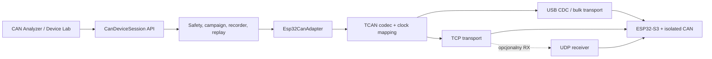

# ESP32-S3 z izolowanym CAN — plan integracji z Theia

**Status:** plan aktywny; pierwsze fizyczne urządzenie referencyjne CAN
**Decyzja właściciela:** 2026-08-28
**Warianty połączenia:** natywny USB oraz Ethernet/TCP; UDP jako opcjonalny strumień RX
**Protokół:** `esp32-s3-can-device-protocol.md`
**Kolejne podstawowe adaptery:** `can-usb-adapters-integration-plan.md`
**Powiązane prace:** SA-002, SA-005, SA-406, SA-410 i SA-421

## 1. Cel i decyzje

Pierwszym rzeczywistym urządzeniem obsługiwanym przez `@theia/can-bus` będzie nasza płytka z ESP32-S3 i galwanicznie izolowanym portem CAN. Ten sam egzemplarz ma być dostępny w Theia w dwóch konfiguracjach transportu:

1. **ESP32-S3 CAN — USB** — połączenie lokalne przez natywny port USB ESP32-S3;
2. **ESP32-S3 CAN — Ethernet** — połączenie zdalne przez TCP/IP, z opcjonalnym UDP tylko dla strumienia odbieranych ramek.

Oba warianty używają jednego binarnego protokołu `TCAN v1`, tych samych komend, timestampów i reguł bezpieczeństwa. Transport nie zmienia semantyki sesji. Urządzenie ma jeden trwały `deviceId`, dlatego Theia grupuje USB i Ethernet jako dwa endpointy tego samego sprzętu, a nie dwa niezależne interfejsy CAN.

### 1.1. Najważniejsze decyzje projektowe

| Temat | Decyzja v1 | Uzasadnienie |
| --- | --- | --- |
| CAN | Classical CAN, 11 i 29 bit, 0–8 bajtów | Wbudowany kontroler TWAI ESP32-S3 nie obsługuje CAN FD |
| USB MVP | Native USB CDC-ACM + COBS | szybki bring-up i prosta obsługa na Windows/Linux |
| USB docelowy | opcjonalny vendor-specific bulk | mniejszy narzut; ten sam envelope TCAN |
| Ethernet | TCP jako kanał sterowania, RX i TX | kolejność, niezawodność i prosta obsługa reconnect |
| UDP | opcjonalnie tylko dane RX/status | utrata jest dopuszczalna i jawnie wykrywana; TX po UDP jest zabroniony |
| Timing TX | paczki planowane w zegarze urządzenia | jitter sieci/USB nie zmienia odstępów między ramkami |
| Bezpieczeństwo | polityka TX egzekwowana również w firmware | błąd lub utrata hosta nie może pozostawić aktywnego nadajnika |
| Właściciel sesji | jeden control lease na urządzenie | brak wyścigu między USB i Ethernetem |
| Format danych | binarny, little-endian, batch | brak JSON i obiektu JavaScript na każdą ramkę w hot-path |

UDP nie przyspieszy magistrali CAN. Może zmniejszyć wpływ head-of-line blocking przy złej sieci, ale w v1 nie może służyć do sterowania ani nadawania. Domyślnym i kompletnym wariantem sieciowym pozostaje TCP.

## 2. Potwierdzony profil sprzętowy

ESP32-S3 ma jeden kontroler TWAI zgodny z Classical CAN. Obsługuje standardowe identyfikatory 11-bit i rozszerzone 29-bit, ale ramki CAN FD interpretuje jako błąd. Kontroler wymaga zewnętrznego transceivera; w naszym urządzeniu transceiver i bariera izolacyjna są częścią płytki. Źródło: [Espressif TWAI dla ESP32-S3](https://docs.espressif.com/projects/esp-idf/en/stable/esp32s3/api-reference/peripherals/twai.html).

Natywny stos USB ESP32-S3/TinyUSB obsługuje CDC, urządzenia złożone i klasę vendor-specific. Umożliwia to rozpoczęcie od CDC-ACM i późniejsze dodanie bulk bez zmiany protokołu aplikacyjnego. USB-OTG i USB-Serial-JTAG współdzielą wewnętrzny PHY, dlatego board profile musi też określić ścieżkę flash/debug/recovery po uruchomieniu funkcji urządzenia USB. Źródło: [Espressif USB Device Stack](https://docs.espressif.com/projects/esp-idf/en/stable/esp32s3/api-reference/peripherals/usb_device.html).

Przed implementacją firmware trzeba uzupełnić wersjonowany `board profile` o fakty płytki, których nie wolno zaszyć jako domysłów:

- GPIO `TWAI_TX` i `TWAI_RX`;
- GPIO `TRANSCEIVER_EN/STB`, jego aktywny poziom i bezpieczny stan po resecie;
- obecność oraz sposób wykrywania terminacji 120 Ω;
- typ transceivera i maksymalny wspierany bitrate;
- typ kontrolera/PHY Ethernet, magistrala do ESP32-S3 i osiągalny MTU;
- sposób zasilania, wykrywanie VBUS i zachowanie przy jednoczesnym USB + zasilaniu zewnętrznym;
- rewizja PCB, numer seryjny i sposób pozyskania stabilnego `deviceId`;
- diody/status fizyczny: link, capture, armed TX, bus-off/fault.

CAN FD pozostaje w kontrakcie protokołu jako capability przyszłego sprzętu, lecz ESP32-S3 musi zwracać `CAN_FD = false`, `maxDataLength = 8` i odrzucać próby konfiguracji FD kodem `UNSUPPORTED_CAPABILITY`.

## 3. Dwie konfiguracje urządzenia

### 3.1. Konfiguracja USB

Identyfikator endpointu:

```text
esp32s3-can:<deviceId>:usb
```

MVP używa natywnego USB CDC-ACM. Ramki TCAN są kodowane COBS i kończone `0x00`; logi tekstowe nie mogą być wplatane do tego samego strumienia. Docelowa konfiguracja composite może wystawić:

- vendor-specific bulk IN/OUT dla TCAN;
- osobny CDC-ACM wyłącznie dla logów, recovery i serwisu.

Theia rozpoznaje sprzęt po VID/PID, numerze seryjnym USB i potwierdzonym `deviceId` z `HELLO`. Nazwa portu COM/`ttyACM` nie jest trwałą tożsamością. Odłączenie USB unieważnia control lease, token ARM i kolejkę TX.

### 3.2. Konfiguracja Ethernet

Identyfikator endpointu:

```text
esp32s3-can:<deviceId>:tcp:<address>
```

Urządzenie ogłasza usługę mDNS `_theia-can._tcp.local`. TCP na konfigurowalnym porcie, domyślnie `9751`, przenosi pełny protokół: konfigurację, RX, bezpieczny TX, status i diagnostykę. Theia może też połączyć się z ręcznie podanym adresem IPv4/IPv6, gdy mDNS nie przechodzi między podsieciami.

Opcjonalny UDP jest otwierany komendą po uwierzytelnionym TCP. Przenosi jedynie `RX_BATCH`, `BUS_STATE` i `GAP_EVENT`. Jedna ramka TCAN wraz z 12-bajtowym prefiksem UDP mieści się w jednym datagramie, domyślnie do 1200 bajtów, aby uniknąć fragmentacji IP. Utrata datagramu jest wykrywana przez `sequence` envelope oraz `rxSequence` ramek CAN. Polecenia konfiguracji, ARM, STOP i TX nigdy nie są wysyłane po UDP.

### 3.3. Jednoczesne USB i Ethernet

Warstwa discovery scala endpointy po `deviceId`. Reguły v1:

- urządzenie może mieć wiele widocznych endpointów, ale tylko jeden aktywny control lease;
- otwarcie drugiego endpointu nie przejmuje sesji i zwraca `BUSY` z opisem transportu właściciela;
- Theia może zaproponować ręczne rozłączenie pierwszej sesji, ale nie kradnie lease automatycznie;
- rozłączenie właściciela natychmiast rozbraja TX i czyści niewysłane ramki;
- reconnect tworzy nowy `sessionId`; nie wznawia ARM ani zaplanowanego TX;
- `EMERGENCY_STOP` ma zarezerwowaną ścieżkę sterującą i działa także przy zatkanej kolejce danych.

## 4. Architektura po stronie Theia



### 4.1. Nowe kontrakty

Obecny `CanHardwareAdapter` ma tylko synchroniczne `configure/start/stop`, a `CanTransmitAdapter` zwraca pojedynczy `boolean`. Dla fizycznego urządzenia potrzebny jest addytywny, asynchroniczny kontrakt sesji:

```ts
interface CanDeviceProvider {
    discover(): AsyncIterable<CanDeviceDescriptor>;
    connect(endpoint: CanDeviceEndpoint): Promise<CanDeviceSession>;
}

interface CanDeviceSession {
    readonly descriptor: CanDeviceDescriptor;
    readonly capabilities: CanDeviceCapabilities;
    configure(config: CanInterfaceConfig): Promise<AppliedCanConfig>;
    startCapture(options: CaptureOptions): Promise<CaptureHandle>;
    setTxPolicy(policy: CanExperimentSessionConfig): Promise<TxPolicyHandle>;
    armTx(policy: TxPolicyHandle): Promise<ArmHandle>;
    transmit(batch: ScheduledCanBatch): Promise<TxAdmission>;
    emergencyStop(): Promise<void>;
    frames(): AsyncIterable<RawCanBatch>;
    events(): AsyncIterable<CanDeviceEvent>;
    close(): Promise<void>;
}
```

Nazwy są planem kontraktu, nie gotowym API. Przed implementacją trzeba je pogodzić z SA-410 i zachować jedno źródło prawdy dla polityki bezpieczeństwa.

### 4.2. Proponowany podział plików

```text
packages/can-bus/src/common/
  can-device.ts                    # descriptor, endpoint, capabilities, session DTO
  esp32-can-device-protocol.ts     # typy TCAN, stałe, encoder/decoder
  esp32-can-device-protocol.spec.ts

packages/can-bus/src/node/device/
  can-device-registry.ts           # provider registry + deduplikacja deviceId
  esp32-can-device-provider.ts     # wspólna tożsamość USB/TCP
  esp32-can-session.ts             # handshake, auth, lease, state machine
  esp32-can-usb-transport.ts       # CDC najpierw, bulk później
  esp32-can-tcp-transport.ts
  esp32-can-udp-rx-transport.ts    # opcjonalny
  esp32-can-clock-sync.ts
  esp32-can-adapter.ts             # most do obecnych usług CAN
```

Frontend nie otwiera USB ani socketu. Widzi descriptor/capabilities przez backend Theia, wybiera endpoint i pokazuje wspólną nazwę urządzenia z oznaczeniem `USB`, `TCP` lub `TCP + UDP RX`.

### 4.3. Integracja z istniejącym hot-path

`CanBinaryEncoder` w `can-protocol.ts` pozostaje formatem backend → frontend. Nie jest protokołem urządzenia: nie ma wersji, zegara urządzenia, statusu kontrolera, TX admission ani luk. Adapter ESP32 wykonuje dokładnie jedno przejście:

```text
TCAN RX_BATCH → walidacja → mapowanie zegara → istniejący binarny batch UI
```

Docelowo `RawCanBatch` zachowuje `Uint8Array` i metadane bez tworzenia `CanFrame` dla każdej ramki. Obiekty `CanFrame` powstają tylko na granicy starszego API, rejestratora lub funkcji wymagającej pojedynczej ramki.

## 5. Architektura firmware ESP32-S3

Firmware powinien mieć niezależne moduły i kolejki:

```text
transport_usb ─┐
transport_tcp ─┼─> protocol_rx ─> session/safety ─> tx_scheduler ─> TWAI TX
               │                         │
transport_udp <┘                         └─> urgent STOP queue

TWAI RX ─> timestamp/rx ring ─> batcher ─> credit/router ─> USB/TCP/UDP
TWAI alerts ──────────────────────────────> BUS_STATE / GAP / FAULT
```

Wymagane komponenty:

- `identity_nvs`: trwały `deviceId`, serial, board revision i klucz parowania;
- `protocol_codec`: parser strumieniowy, limity długości, CRC32C i obsługa nieznanych komunikatów;
- `session_manager`: handshake, auth, pojedynczy control lease i heartbeat;
- `can_driver`: konfiguracja TWAI, RX, TX, alerty, bus-off i kontrolowane recovery;
- `rx_batcher`: batch do limitu ramek, limitu payloadu albo czasu flush;
- `tx_scheduler`: batch admission, kolejka według `deviceTicks`, late policy i wyniki per ramka;
- `safety_guard`: allowlista ID, FPS, bus-load, czas, liczba ramek, ARM token i watchdog;
- `transport_router`: osobne pule/kolejki control, RX i TX results;
- `diagnostics`: high-water marks, drop counters, reset cause, heap i status transportów;
- `watchdog`: przy błędzie pozostawia transceiver/TWAI w stanie bez TX.

Ścieżka `EMERGENCY_STOP`, `DISARM_TX`, heartbeat timeout i bus-off nie może czekać na zwolnienie bufora RX. Kontrola dostaje osobną małą pulę buforów oraz wyższy priorytet niż serializacja danych.

## 6. Plan realizacji

Identyfikatory `ESPCAN-*` są lokalne dla tej integracji i nie zmieniają istniejącej numeracji SA.

| Etap | Zakres | Wynik / Definition of Done |
| --- | --- | --- |
| ESPCAN-001 | Zamrożenie board profile i TCAN v1 | znane piny, transceiver, Ethernet, zasilanie; specyfikacja przechodzi review host + firmware |
| ESPCAN-002 | Codec i emulator PC | parser/encoder C oraz TypeScript; golden vectors, fragmentacja w każdym bajcie, fuzzing length/CRC/COBS |
| ESPCAN-003 | Firmware TWAI RX + diagnostyka | listen-only i normal RX, timestamp, batch, alerty, bus-off, jawny GAP; test na generatorze CAN |
| ESPCAN-004 | USB CDC-ACM | discovery, HELLO, capabilities, configure, ciągły RX i reconnect bez utraty stanu hosta |
| ESPCAN-005 | Provider urządzeń w Theia | urządzenie widoczne w UI, stabilny `deviceId`, endpoint USB, bridge do capture i statystyk |
| ESPCAN-006 | Bezpieczny TX | on-device policy, ARM token, scheduled batch, TX results, STOP, timeout i integracja z SA-406/SA-410 |
| ESPCAN-007 | Ethernet/TCP | mDNS + adres ręczny, auth, ten sam conformance trace, reconnect zawsze rozbrojony |
| ESPCAN-008 | Opcjonalny UDP RX | otwarcie przez TCP, MTU bez fragmentacji, detekcja loss/reorder i automatyczny fallback do TCP |
| ESPCAN-009 | USB vendor bulk | benchmark względem CDC; wdrożenie tylko gdy daje istotną korzyść i ma stabilną obsługę Windows/Linux |
| ESPCAN-010 | Bramka sprzętowa E2E | długi capture, pełne obciążenie CAN, zaplanowany TX, utrata kabli, bus-off, dwa endpointy i raport wydajności |

Kolejność krytyczna:

```text
ESPCAN-001 → ESPCAN-002 → ESPCAN-003 → ESPCAN-004 → ESPCAN-005
                                      └→ ESPCAN-006 → ESPCAN-007 → ESPCAN-008
                                                       └──────────→ ESPCAN-010
ESPCAN-009 jest optymalizacją po pomiarze, nie blokuje pierwszego urządzenia.
```

## 7. Budżety i kryteria akceptacji

### 7.1. Poprawność i wydajność

- 10 minut odbioru przy 100% obciążenia Classical CAN 1 Mbit/s bez cichej utraty; każda utrata ma `GAP_EVENT` i licznik diagnostyczny;
- protokół hosta i parser są przygotowane na co najmniej 20 000 ramek CAN/s, nawet jeżeli rzeczywisty limit TWAI/transportu okaże się niższy;
- batch jest wysyłany po osiągnięciu limitu ramek/payloadu albo limitu czasu, domyślnie 1 ms; wartości są konfigurowalne w granicach capabilities;
- UI pozostaje responsywne, a backend nie serializuje pojedynczej ramki do JSON;
- połączenie TCP i USB daje ten sam uporządkowany ślad CAN po przeliczeniu `deviceTicks`;
- UDP nigdy nie ukrywa utraty lub zmiany kolejności; niekompletny capture jest wyraźnie oznaczony;
- zaplanowane odstępy TX są realizowane przez urządzenie, a wynik zawiera czas planowany i rzeczywisty; opóźnienie arbitrażu CAN nie jest błędnie przypisywane transportowi.

Dokładny limit ramek/s, p99 jitter TX i maksymalny rozmiar batcha zostaną zamrożone po ESPCAN-003/004 na podstawie pomiaru tego PCB. Nie należy wpisywać marketingowej wartości przed benchmarkiem.

### 7.2. Bezpieczeństwo

- start po resecie, reconnect i przełączenie transportu zawsze prowadzi do `DISARMED`;
- zmiana konfiguracji CAN lub polityki TX unieważnia ARM token i czyści kolejkę;
- brak control heartbeat, zerwanie TCP/USB, bus-off, watchdog, przekroczenie FPS/bus-load/czasu albo brak zasobów zatrzymuje nowe TX;
- `EMERGENCY_STOP` jest idempotentny i opróżnia niewysłaną kolejkę w maksymalnie 20 ms od poprawnego sparsowania komendy;
- urządzenie nie wykonuje częściowo niepoprawnego `TX_BATCH`; admission jest atomowe;
- Ethernet wymaga uwierzytelnienia przed uzyskaniem control lease; brak sekretu produkcyjnego nie może oznaczać otwartego zdalnego TX;
- LED/stan fizyczny jednoznacznie pokazuje `TX ARMED` oraz `BUS-OFF/FAULT`;
- testy aktywnego TX odbywają się wyłącznie na izolowanym stole zgodnie z `can-device-lab.md`.

## 8. Macierz testów

| Obszar | Przypadki obowiązkowe |
| --- | --- |
| Codec | poprawne ramki, zły magic/version/length/CRC, nieznany type, concatenation, fragment w każdym offsetcie, COBS z bajtami `0x00` |
| Tożsamość | zmiana COM/IP bez zmiany device, dwa endpointy jednego UUID, konflikt sklonowanego UUID |
| RX | 11/29-bit, RTR, DLC 0–8, filtry, batch timeout/size, overflow przed i po kredycie 0 |
| TX | immediate, relative, absolute, kolejność tagów, late policy, brak miejsca, zły token, ID poza allowlistą |
| Timing | synchronizacja zegara, wrap licznika pomocniczego, jitter USB/TCP, odtworzenie sekwencji po opóźnionej sieci |
| Fault | error-passive, bus-off, recovery, odłączenie CAN, USB, Ethernet i zasilania, watchdog, niski heap |
| Multi-transport | USB owner + próba TCP, TCP owner + próba USB, rozłączenie właściciela, ponowny HELLO bez resume |
| UDP | loss, duplicate, reorder, zbyt duży datagram, zmiana adresu, fallback do TCP |
| Długotrwałe | 8 h RX, 1 h kontrolowanego TX, 100 reconnectów, 100 start/stop bez wycieku buforów |

## 9. Minimalny vertical slice

Pierwszy używalny przekrój kończy się na ESPCAN-006 i obejmuje:

1. wykrycie urządzenia po USB;
2. `HELLO`, capabilities i stabilny `deviceId`;
3. konfigurację bitrate oraz listen-only;
4. batch RX z timestampami urządzenia i jawnymi lukami;
5. wyświetlenie ramek w istniejącym CAN Analyzer;
6. politykę TX z małą allowlistą, ARM, pojedynczy lub krótki zaplanowany batch;
7. wyniki TX, bus state i działający `EMERGENCY_STOP`;
8. ten sam przypadek odtworzony w emulatorze protokołu i na fizycznym stole.

Ethernet/TCP jest następnym krokiem, ale nie tworzy drugiej implementacji protokołu. Po jego dodaniu ten sam zestaw conformance musi przejść bez zmian semantycznych.

## 10. Poza zakresem pierwszej wersji

- CAN FD na wbudowanym TWAI ESP32-S3;
- TX po UDP;
- automatyczne przejęcie control lease między USB i Ethernetem;
- przezroczysty bridge SocketCAN po IP;
- aktualizacja firmware przez TCAN przed ustabilizowaniem capture/TX;
- TLS jako zamiennik dla polityki TX — transport security i bezpieczeństwo magistrali są oddzielnymi warstwami;
- automatyczne bus-off recovery bez cooldownu i ponownego uzbrojenia;
- obietnica konkretnego limitu wydajności przed pomiarem prototypu.

## 11. Otwarte dane wymagane od hardware/firmware

Implementację ESPCAN-001 można zamknąć dopiero po wpisaniu do board profile:

- schematu zasilania i izolacji CAN;
- modelu transceivera, sterowania standby i obecności terminacji;
- kontrolera/PHY Ethernet oraz używanego stosu ESP-IDF;
- sposobu programowania/recovery przy zajętym natywnym USB;
- VID/PID dla prototypu i planu identyfikatorów produkcyjnych;
- sposobu nadawania numerów seryjnych oraz kluczy parowania;
- zachowania urządzenia, gdy USB i Ethernet są aktywne jednocześnie.

Brak tych danych nie blokuje emulatora, codeców TypeScript/C ani testów golden vectors, ale blokuje uznanie firmware za sprzętowo gotowy.
