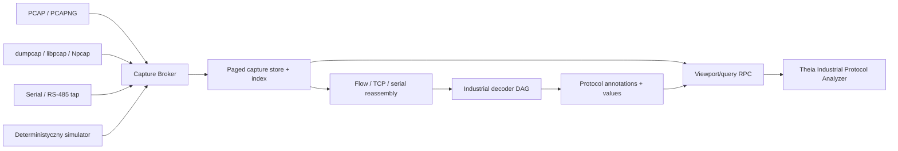

# Industrial Protocol Analyzer — plan implementacji

**Status:** PLAN GOTOWY DO REWIZJI — WSTRZYMANE OPERACYJNIE

**Data decyzji właściciela:** 2026-08-24

**Zmiana priorytetu 2026-08-28:** CAN Device Lab jest najbliższym etapem implementacyjnym. Niniejszy plan pozostaje ważny, ale SA-611…SA-619 nie rozpoczynają się bez ponownego polecenia właściciela.

**Pierwsza kolejność protokołów:** Modbus RTU → EtherCAT → PROFINET

**Perspektywa po pierwszej bramce:** Modbus TCP, Siemens S7comm/ISO-on-TCP oraz VARAN

## 1. Cel produktu

Powstaje osobne narzędzie `Industrial Protocol Analyzer`, działające podobnie do Wiresharka, lecz ukierunkowane na automatykę. Ma przechwytywać lub importować komunikację, odtwarzać strukturę sesji i protokołów, korelować żądania z odpowiedziami, prezentować wartości procesowe oraz wykrywać błędy czasu, CRC i sekwencji.

> **ZASTĄPIONE OPERACYJNIE 2026-08-28:** pierwotnie to narzędzie miało być następnym aktywnym etapem. CAN Device Lab otrzymał pierwszeństwo; architektura, kolejność protokołów i pasywne granice bezpieczeństwa poniżej pozostają zachowane.

Istniejący CAN Analyzer pozostaje bazą dla aktywnego CAN Device Lab. Logic Analyzer i własny hardware nadal są zachowane w dokumentacji jako perspektywa i nie są teraz implementowane.

Pierwsza wersja jest pasywna i bezpieczna:

- nie wysyła poleceń do PLC ani urządzeń polowych;
- nie wykonuje zapisu rejestrów, pamięci PLC ani konfiguracji EtherCAT;
- nie wstrzykuje ramek i nie działa jako EtherCAT MainDevice;
- wyraźnie oddziela przechwytywanie, dekodowanie i przyszłe funkcje aktywne;
- zachowuje surowe dane i oznacza każdą lukę lub ucięcie capture.

## 2. Doprecyzowanie rodzin protokołów

| Nazwa robocza | Faktyczny zakres | Nośnik | Identyfikacja początkowa |
| --- | --- | --- | --- |
| Modbus RTU | Modbus Application Protocol w ramkach RTU z CRC16 | RS-232/RS-485/serial | parametry portu i cisza międzyramkowa |
| EtherCAT | EtherCAT Device Protocol i datagramy procesowe | Ethernet warstwy 2 | EtherType `0x88A4` |
| PROFINET | DCP, RT/IO, PNIO-CM, LLDP oraz diagnostyka cyklu | Ethernet L2 oraz DCE/RPC dla części acyklicznej | EtherType `0x8892`, FrameID i kontekst AR/CR |
| Modbus TCP | wspólne PDU Modbus z nagłówkiem MBAP | Ethernet/TCP | TCP `502` |
| Siemens S7 | TPKT → COTP → S7comm; S7comm Plus/Protected Communication | Ethernet/TCP | zwykle TCP `102`, późniejszy decoder |
| VARAN | real-time Ethernet SIGMATEK/VNO | Ethernet PHY, własne ramki | etap przyszły po pozyskaniu trace/specyfikacji |

PROFINET jest bieżącą rodziną Siemens/PI po LAN. Obejmuje komunikację cykliczną RT/IO, discovery/configuration DCP i komunikację acykliczną; system description PI wskazuje EtherType `0x8892`. Źródła: [PI — PROFINET System Description](https://www.profibus.com/download/profinet-technology-and-application-system-description), [Wireshark PROFINET DCP](https://www.wireshark.org/docs/dfref/p/pn_dcp.html), [Wireshark PROFINET RT](https://www.wireshark.org/docs/dfref/p/pn_rt.html).

S7comm nie jest odmianą PROFINET ani zmodyfikowanym Modbusem. Pozostaje osobnym, późniejszym decoderem diagnostycznym przez ISO-on-TCP/RFC 1006. Źródła: [Siemens S7-1200 — TCP i ISO-on-TCP](https://cache.industry.siemens.com/dl/files/129/109764129/att_974298/v1/s71200_system_manual_en-US_en-US.pdf), [Wireshark S7comm](https://wiki.wireshark.org/S7comm).

Modbus jest wspólnym protokołem aplikacyjnym dla transmisji szeregowej i TCP/IP, ale RTU i TCP mają inne framingi. Źródła: [Modbus specifications](https://www.modbus.org/modbus-specifications), [Modbus Application Protocol V1.1b3](https://www.modbus.org/file/secure/modbusprotocolspecification.pdf).

EtherCAT osadza własne datagramy bezpośrednio w standardowej ramce Ethernet i używa EtherType `0x88A4`; nie należy zakładać obecności TCP/IP. Źródło: [EtherCAT Technology Group — technology](https://www.ethercat.org/en/technology.html).

Określenie „wartan” zostało roboczo zinterpretowane jako `VARAN`. Producent opisuje VARAN jako sprzętowo realizowany system real-time Ethernet w modelu manager/client. Przed rozpoczęciem jego dekodera właściciel potwierdza nazwę i dostarcza capture albo sprzęt. Źródło: [SIGMATEK VARAN](https://www.sigmatek-automation.com/en/products/real-time-ethernet-varan/).

## 3. Doświadczenie użytkownika

Docelowy przebieg:

1. `Analyzer → New Industrial Protocol Analyzer`.
2. Wybór źródła: plik PCAP/PCAPNG, interfejs sieciowy, port szeregowy, zapis binarny albo simulator.
3. Konfiguracja capture z widocznym typem łącza, timestampem, snaplen, parametrami serial i licznikiem dropów.
4. Widok pakietów/ramek z czasem, źródłem, celem, protokołem, funkcją i podsumowaniem.
5. Drzewo warstw i pól, hex dump z podświetleniem wybranego pola oraz panel wartości procesowych.
6. Filtry po polach i pełnym tekście, statystyki cyklu, błędów i request/response.
7. Eksport wybranego zakresu do PCAPNG, CSV/JSON lub sesji projektu.

Układ pierwszego widgetu:

```text
+-------------------+-------------------------------------------+
| Sources / Flows   | Frame table                               |
| interfaces        | No | Time | Src | Dst | Protocol | Info  |
| serial ports      +-------------------------------------------+
| imported files    | Protocol tree / correlated transaction    |
| sessions          +-------------------------------------------+
|                   | Hex + ASCII | Process values | Diagnostics|
+-------------------+-------------------------------------------+
```

Tabela i drzewo są wirtualizowane. Frontend otrzymuje tylko widoczne rekordy i żądane bajty; cały PCAP ani pełny strumień nie może trafić do pamięci renderera.

## 4. Architektura



Nowy pakiet produktu: `@theia/industrial-protocol-analyzer`. Nie należy umieszczać tej funkcji w `@theia/can-bus`.

Planowana granica pakietów:

- `src/common`: kontrakty capture, rekordów, flow, transakcji, filtrów i wyników;
- `src/node`: providerzy PCAP/PCAPNG, live network, serial, store, reassembly i RPC;
- `src/browser`: widget, tabela, drzewo pól, hex, filtry, statystyki i lifecycle;
- `src/decoders`: wspólne PDU Modbus, Modbus RTU, EtherCAT oraz PROFINET DCP/RT/IO;
- `test-data`: małe legalnie redystrybuowalne golden traces i generatory;
- opcjonalny `packet-native-host`: C++20 dla capture/index/reassembly po potwierdzeniu profilem.

## 5. Kontrakty danych do zamrożenia

Nie wolno udawać ramek sieciowych przez istniejący `SampleBlock`, ponieważ pakiet nie ma częstotliwości próbkowania i składa się z rekordów o zmiennym rozmiarze. SA-611 definiuje osobny kontrakt wejściowy, a wynik dekodowania pozostaje zgodny z `ProtocolAnnotation`.

Minimalny model:

```text
CaptureRecord {
  recordId: u64
  sourceId: string
  timestampNs: i64
  clockDomain: string
  linkType: ETHERNET | RAW_IP | SERIAL_BYTES
  direction: RX | TX | UNKNOWN
  originalLength: u32
  capturedLength: u32
  sequence: u64
  flags: TRUNCATED | GAP_BEFORE | CHECKSUM_OFFLOADED
  payload: bytes
}

PacketBatch {
  batchId: u64
  firstRecordId: u64
  records: offset/length metadata
  payloadArena: bytes
}

IndustrialTransaction {
  transactionId: string
  protocol: string
  requestRecordIds: u64[]
  responseRecordIds: u64[]
  startTimeNs: i64
  endTimeNs: i64
  status: COMPLETE | TIMEOUT | EXCEPTION | MALFORMED | ORPHAN
}
```

Wymagania kontraktu:

- `capturedLength <= originalLength`; ucięcie jest jawne;
- timestamp ma domenę i rozdzielczość źródła;
- batch używa jednego bufora i offsetów, bez obiektu na każdy bajt;
- numer sekwencji pozwala wykryć drop capture;
- reassembly przechowuje limity pamięci, timeout i powód przerwania;
- pole protokołu zachowuje zakres bajtów dla podświetlenia hex;
- filtry nie wykonują kodu użytkownika i mają limit czasu/złożoności;
- nie zmienia się znaczenia zamrożonych `SampleBlock` i `DecoderProvider` bez bramki supervisora.

## 6. Źródła danych

### 6.1. PCAP i PCAPNG

Pierwszy provider działa offline. Indeksuje plik stronicowo, zachowuje interfejsy, timestamp resolution, snaplen i statystyki dropów. PCAPNG jest formatem natywnym sesji sieciowej; PCAP jest importem zgodnościowym.

Plik wielogigabajtowy nie jest ładowany w całości. Store utrzymuje indeks czasu, protokołu, flow i record ID, a UI pyta o ograniczony zakres.

### 6.2. Sieć na żywo

Preferowana kolejność:

1. `dumpcap` jako osobny, minimalny proces capture i zapis pierścieniowy PCAPNG;
2. adapter Npcap/libpcap dopiero po przeglądzie licencji, uprawnień i benchmarku;
3. opcjonalny C++ `packet-native-host`, jeżeli Node/worker nie utrzyma wymaganej szybkości indeksowania.

Proces Theia nie działa stale z uprawnieniami administratora. Brak sterownika lub praw daje czytelny stan `Capture unavailable`, a import plików pozostaje dostępny.

EtherCAT wymaga prawidłowego punktu obserwacji: TAP, port mirror/SPAN albo dedykowany adapter. Zwykłe podłączenie laptopa do przypadkowego portu nie gwarantuje widoczności całego ruchu i nie może być przedstawiane jako kompletna diagnostyka magistrali.

### 6.3. Modbus RTU

Pasywny podsłuch RS-485 wymaga sprzętu, który nie wpływa na magistralę i potrafi określić kierunek albo obserwować obie strony. Zwykłe otwarcie portu COM może być wyłączne i nie zapewnia pełnego pasywnego capture.

Pierwszy etap obsługuje:

- import logu z timestampami;
- simulator;
- port serial w trybie monitor/exclusive z wyraźnym opisem ograniczenia;
- docelowo pasywny adapter RS-485/tap z kierunkiem i precyzyjnym timestampem.

## 7. Dekoder Modbus RTU

Warstwy:

1. rekonstrukcja ramek według parametrów baud/data/parity/stop i przerwy międzyramkowej;
2. adres urządzenia;
3. kod funkcji i PDU;
4. CRC16 oraz klasyfikacja błędu;
5. request/response correlation;
6. mapowanie rejestrów i bitów na wartości użytkownika.

Pierwsza macierz funkcji: `01`, `02`, `03`, `04`, `05`, `06`, `0F`, `10`, `17` oraz odpowiedzi wyjątków. Nieznany kod pozostaje poprawnie ograniczonym surowym PDU, a nie błędem parsera.

Decoder raportuje:

- adres, funkcję, zakres i liczbę elementów;
- read/write, request/response, exception;
- CRC `OK/BAD/NOT_AVAILABLE`;
- timeout, orphan response i konflikt kierunku;
- typowaną interpretację rejestru dopiero po jawnej konfiguracji endian/word order.

## 8. Dekoder EtherCAT

Pierwszy etap:

- Ethernet II, VLAN i EtherType `0x88A4`;
- EtherCAT frame header;
- wiele datagramów w jednej ramce;
- command, index, addressing, length, IRQ i Working Counter;
- wykrywanie cyklu, duplikatów, braków i zmian WKC;
- podstawowy stan urządzeń i Distributed Clocks z zachowaniem surowych wartości;
- statystyki cycle time, jitter, min/max/p95/p99.

Etap następny po bazie:

- wczytanie ESI/SII i mapowanie PDO;
- mailbox oraz CoE;
- EoE/FoE/SoE według dostępnych testów i uprawnień do specyfikacji;
- topologia wyprowadzana tylko wtedy, gdy capture zawiera wystarczające dane.

Decoder nie udaje MainDevice i nie wysyła ramek. Użycie znaku EtherCAT i dystrybucja implementacji wymagają sprawdzenia zasad ETG.

## 9. Dekoder PROFINET

PROFINET wymaga kilku współpracujących decoderów, a nie pojedynczego parsera portu TCP:

```text
Ethernet/VLAN
  ├─ LLDP → sąsiedzi i porty
  ├─ PROFINET DCP → discovery/nazwa/IP/identyfikacja
  ├─ PROFINET RT → FrameID/cyclic IO/status
  └─ IP/UDP/DCE-RPC → PNIO-CM, AR/CR, parametry i alarmy
```

Pierwszy etap:

- Ethernet II, VLAN i EtherType `0x8892`;
- DCP Identify/Get/Set, XID, ServiceID/ServiceType, option/suboption i bloki urządzenia;
- nazwa stacji, MAC, IP/subnet/gateway, VendorID/DeviceID i role urządzeń, ale wyłącznie z obserwowanego ruchu;
- RT FrameID, CycleCounter, DataStatus, TransferStatus, IOxS oraz wykrywanie braków/duplikatów;
- statystyki cycle time, jitter, min/max/p95/p99 i zmiany DataStatus;
- LLDP chassis/port jako dane pomocnicze topologii;
- PNIO-CM/DCE-RPC: Application Relation, Communication Relation, slot/subslot/module, connect/release/control i alarmy;
- import GSDML do opisania modułów/submodułów oraz mapowania surowych bajtów IO na nazwane wartości.

Drugi etap:

- PTCP i dokładniejsza diagnostyka synchronizacji;
- MRP/MRPD oraz diagnostyka redundancji;
- IRT — wykrywanie klasy/ruchu i pomiar czasu, bez obiecywania pełnej rekonstrukcji harmonogramu z niepełnego capture;
- rekordy acykliczne i profile urządzeń według dostępnych golden traces;
- PROFIsafe tylko jako jawnie oznaczona warstwa; walidacja funkcji bezpieczeństwa wymaga osobnej karty i kwalifikacji.

Analizator nigdy nie wysyła DCP Set, nie zmienia nazwy/IP urządzenia i nie zestawia AR. Topologia i wartości procesowe są oznaczane jako niepełne, jeżeli capture nie zawiera startupu, GSDML albo całego ruchu z TAP/mirror.

## 10. Siemens S7comm — perspektywa po pierwszej bramce

S7comm/ISO-on-TCP pozostaje przydatnym decoderem diagnostycznym, ale nie jest częścią SA-617. Jego przyszły pipeline to `Ethernet → IP → TCP → TPKT → COTP → S7comm`, z reassembly, korelacją PDU i wykrywaniem chronionego S7comm Plus. Otrzyma osobną kartę po SA-619.

## 11. Wydajność i brak lagów

- capture, indeksowanie, reassembly i decode nie działają na wątku renderera;
- surowe payloady pozostają w store/backendzie;
- browser dostaje wirtualizowane strony rekordów, drzewo jednej ramki i agregaty;
- filtr jest kompilowany do bezpiecznego planu zapytania i ma cancellation;
- decode jest przyrostowy i cache'owany według hash danych, konfiguracji i wersji;
- kolejki mają backpressure i jawne liczniki dropów;
- ciężkie ścieżki są profilowane przed przeniesieniem do C++;
- opcjonalny `tshark` działa jako izolowany bridge, nie emituje nieograniczonego JSON na hot-path.

Bramki:

| Metryka | Wymaganie pierwszej wersji |
| --- | ---: |
| import PCAPNG 10 GB | pierwszy ekran bez pełnego skanu, <2 s na hoście referencyjnym |
| tabela 1 mln rekordów | brak 1 mln elementów DOM; płynny scroll |
| filtr po indeksie | p95 <100 ms dla widocznego zakresu |
| EtherCAT/PROFINET 100 Mb/s | po 60 min bez niewyjaśnionych dropów przy poprawnym TAP/dysku |
| live capture rozszerzony | 1 Gb/s jako osobna bramka sprzętowa |
| Modbus RTU | 100% golden frames, CRC i timing boundary |
| UI | brak long task >100 ms powodowanego przez ingestion/decode |
| pamięć | limit konfigurowalny; duże sesje przechodzą na dysk |

## 12. Kolejność implementacji

| Krok | Karta | Wynik |
| ---: | --- | --- |
| 1 | SA-610 | aktywny plan, granice bezpieczeństwa i protokołów |
| 2 | SA-611 | kontrakty capture/packet/flow/transaction i testy binarne |
| 3 | SA-612 | store, PCAP/PCAPNG, simulator i golden traces |
| 4 | SA-613 | wieloinstancyjny widget, tabela, tree, hex i filtry |
| 5 | SA-614 | kompletny pierwszy decoder Modbus RTU |
| 6 | SA-615 | live network/serial capture i diagnostyka dropów |
| 7 | SA-616 | EtherCAT base + timing/WKC |
| 8 | SA-617 | PROFINET DCP/RT/IO, LLDP i PNIO-CM |
| 9 | SA-618 | correlation, process values, statystyki i eksport |
| 10 | SA-619 | security/performance/E2E i decyzja stable |

Po SA-619: Modbus TCP, Siemens S7comm/ISO-on-TCP, VARAN, EtherNet/IP/CIP, OPC UA i kolejne protokoły według osobnych kart. Logic Analyzer wraca wyłącznie na komendę właściciela.

## 13. Strategia testów

- golden traces generowane i ręcznie zatwierdzone dla poprawnych/błędnych ramek;
- porównanie pól z Wireshark/tshark dla tych samych capture, bez kopiowania wyniku jako jedynej wyroczni;
- property tests długości, fragmentacji, CRC, endianowości i reassembly;
- fuzzing parserów PCAPNG, Ethernet, DCP, PROFINET RT/PNIO-CM i EtherCAT;
- testy truncated capture, snaplen, GAP, TCP retransmission/out-of-order i timestamp rollback;
- benchmarki bez coverage oraz osobne testy funkcjonalne z coverage;
- E2E: import → filtr → wybór ramki → tree/hex → korelacja → eksport;
- hardware-in-loop dopiero po przejściu simulatora i plików.

## 14. Licencje i bezpieczeństwo

Wireshark/dumpcap/tshark są GPL. Mogą być opcjonalnym, osobnym procesem z własnym pakietem licencji; nie kopiujemy kodu dissectorów do pakietów EPL bez zatwierdzonej strategii. Npcap ma osobne warunki dystrybucji, które trzeba sprawdzić przed bundlingiem.

Parser traktuje capture jako niezaufany plik:

- limit długości przed alokacją;
- checked arithmetic offsetów i reassembly;
- limit flow, segmentów, zagnieżdżenia i tekstu;
- timeout i cancellation;
- brak automatycznego otwierania linków lub wykonywania payloadu;
- anonimizacja przed udostępnieniem capture;
- funkcje aktywne pozostają poza pierwszym zakresem i wymagają oddzielnej zgody.

## 15. Najbliższa decyzja

Po ponownym poleceniu właściciela i akceptacji SA-610 zaczyna się wyłącznie SA-611. Nie rozpoczynamy równolegle widgetu i trzech decoderów, zanim kontrakt `CaptureRecord/PacketBatch/IndustrialTransaction` oraz format golden traces nie zostaną zamrożone.
