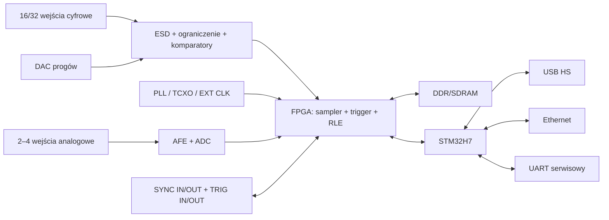

# Logic Analyzer — specyfikacja własnego sprzętu

**Status:** PERSPEKTYWA ROZWOJU — hardware wstrzymany przed wyborem układów i PCB

**Rodziny:** `LA-Lite` (ESP32) oraz `LA-Pro 400` (STM32 + FPGA)

**Maksymalna częstotliwość pierwszej generacji:** 400 MS/s

## 1. Cele i granice

Własny analizator ma:

- działać przez USB, UART i TCP/IP;
- obsługiwać kanały cyfrowe i analogowe na wspólnej osi czasu;
- wykonywać akwizycję buforową oraz strumieniową;
- udostępniać sprzętowy trigger, pre-trigger, RLE i synchronizację urządzeń;
- być obsługiwany natywnie przez Theia i docelowo przez sterownik Sigrok;
- mieć otwarty, wersjonowany protokół i aktualizowalne firmware;
- nie blokować UI niezależnie od szybkości akwizycji.

Zakres `400 MS/s` oznacza szybkość próbkowania cyfrowego. Analiza sygnału o częstotliwości 400 MHz wymagałaby większej szybkości próbkowania oraz toru wejściowego o odpowiednim paśmie i nie jest wymaganiem pierwszej generacji.

## 2. Warianty

### 2.1. LA-Lite

Wariant edukacyjny i zdalny:

- ESP32-S3 jako pierwszy prototyp; ESP32-P4 jako kandydat do szybszej rewizji;
- USB Full-Speed, UART oraz Wi-Fi/TCP;
- 8–16 wejść cyfrowych zależnie od zajętości pinów;
- opcjonalne wolniejsze kanały analogowe z ADC mikrokontrolera;
- szybkie, krótkie przechwycenie do RAM/PSRAM i późniejszy transfer;
- ciągłe strumieniowanie tylko z szybkością zmierzoną w benchmarku;
- RLE szczególnie ważne dla sygnałów o małej aktywności.

ESP32-S3 nie jest urządzeniem do ciągłego 400 MS/s. USB Full-Speed ma szybkość magistrali 12 Mbit/s, więc ten wariant służy do sterowania, diagnostyki, zdalnej pracy i tańszych pomiarów. Źródło: [Espressif USB OTG](https://docs.espressif.com/projects/esp-iot-solution/en/latest/usb/usb_overview/usb_otg.html).

### 2.2. LA-Pro 400

Wariant docelowy pierwszej generacji:

- FPGA/CPLD przechwytuje kanały cyfrowe, triggeruje, kompresuje i zapisuje do pamięci;
- STM32H743/H753 zarządza urządzeniem, USB, Ethernetem, UART-em i aktualizacją;
- USB High-Speed przez zewnętrzny PHY ULPI;
- Ethernet 1 Gb/s dla pracy zdalnej;
- zewnętrzna SDRAM/DDR jako bufor;
- osobny ADC dla kanałów analogowych;
- wejście/wyjście triggera oraz wspólny zegar.

STM32H743 udostępnia USB HS do 480 Mbit/s przy użyciu zewnętrznego PHY ULPI. Źródło: [STM32H743 datasheet](https://www.st.com/resource/en/datasheet/stm32h743ag.pdf).

## 3. Architektura blokowa LA-Pro 400

FPGA jest właścicielem deterministycznego czasu próbek. MCU nie stempluje każdej próbki; przekazuje konfigurację i transportuje gotowe bloki.

## 4. Docelowe tryby cyfrowe

Poniższa macierz jest wymaganiem projektowym, a nie potwierdzonym wynikiem prototypu:

| Aktywne kanały | Buffer | Surowy strumień |
| ---: | ---: | ---: |
| 4 | 400 MS/s | do 100 MS/s |
| 8 | 200 MS/s | do 50 MS/s |
| 16 | 100 MS/s | do 20 MS/s |
| 32, jeśli obsadzone | 50 MS/s | do 10 MS/s |

Wszystkie tryby buforowe mają stały maksymalny strumień zapisu FPGA około 1,6 Gbit/s. Strumień do hosta jest ograniczony przez rzeczywistą przepustowość USB/Ethernet, framing i zapis dyskowy. Wyższa szybkość jest możliwa przy skutecznym RLE, lecz UI nie może prezentować jej jako gwarantowanej.

Minimalny bufor prototypu LA-Pro to 256 MiB:

- `4 × 400 MS/s` lub `16 × 100 MS/s` daje około 200 MB/s;
- 256 MiB przechowuje około 1,34 s nieskompresowanych danych przy 200 MB/s;
- pre-trigger jest konfigurowany jako 0–100% bufora;
- RLE zwiększa czas tylko dla sygnałów zawierających dostatecznie długie serie.

## 5. Tor wejść cyfrowych

Wymagania elektryczne:

- wejścia wysokiej impedancji z małą pojemnością;
- ochrona ESD i ograniczenie przepięć bez nadmiernego pogorszenia zboczy;
- programowalny próg co najmniej grupami po 4 lub 8 kanałów;
- obsługa typowych domen 1,0/1,2/1,5/1,8/2,5/3,3/5 V;
- histereza konfigurowalna albo jasno określona;
- raportowanie zakresu bezpiecznego i absolutnego maksimum;
- wejście zegara zewnętrznego oraz trigger IN/OUT;
- ekranowane przewody/proby dla najwyższych szybkości.

Dobór komparatora, translatora, zabezpieczeń i złącza następuje po symulacji integralności sygnałowej. Nie wolno obiecywać pasma na podstawie samego taktowania FPGA. Test kwalifikacyjny wykorzystuje generator impulsów, różne amplitudy, długości przewodów i analizę błędów bitowych.

## 6. Kanały analogowe

Pierwszy cel mixed-signal:

- 2 kanały synchroniczne, możliwość rozszerzenia do 4;
- 12–16 bitów;
- zakres programowalny przez analog front-end;
- docelowo 1–20 MS/s na kanał, zależnie od wybranego ADC;
- wspólny licznik czasu z częścią cyfrową;
- osobna częstotliwość próbkowania analogowego i cyfrowego;
- kalibracja offsetu, wzmocnienia i czasu między kanałami;
- dane `INT16`/`UINT16` w urządzeniu; konwersja na jednostki fizyczne wykonywana przez skalę z capabilities.

Kanały analogowe nie muszą pracować przy 400 MS/s. Jedna sesja może zawierać cyfrowe 100 MS/s oraz analogowe 10 MS/s, jeśli oba strumienie odnoszą się do tego samego licznika urządzenia.

## 7. FPGA

Bloki logiczne:

- wejściowy bank próbek z wyborem zbocza i mapowaniem pinów;
- licznik czasu 64-bit i generator `deviceTicks`;
- trigger prosty: high/low/rising/falling/either;
- trigger równoległy mask/value;
- sekwencer wielostopniowy jako rozszerzenie;
- kołowy bufor pre-trigger;
- zapis post-trigger do zadanej głębokości;
- RLE ze znacznikiem powtórzeń i bezstratnym fallbackiem RAW;
- DMA/FIFO do pamięci i MCU;
- rejestr overflow, dropped/overrun i CRC bloków;
- SYNC IN/OUT, trigger IN/OUT, opcjonalny external clock;
- tryb wzorca testowego bez podłączonego sygnału.

FPGA emituje bloki międzykanałowe jako słowa 8/16/32-bitowe. Transpozycja do bit-plane jest wykonywana dopiero na żądanie dekodera/viewportu przez backend C++.

Kandydat FPGA musi spełnić timing 400 MS/s poprzez wejścia DDR albo wewnętrzną multipleksację. Wybór między rodziną z otwartym toolchainem a komercyjnym FPGA nastąpi po spike'u timing/IO i analizie kosztów.

## 8. Firmware STM32

Moduły:

- bootloader i podpisana aktualizacja A/B;
- `Device Manager` i capabilities;
- sterownik FPGA oraz ładowanie bitstreamu;
- USB vendor-specific bulk;
- Ethernet/TCP oraz mDNS;
- UART/COBS;
- parser Signal Analyzer Device Protocol;
- kolejki DMA z backpressure;
- diagnostyka temperatury, napięć, przepełnień i reset cause;
- zapis kalibracji oraz numeru seryjnego;
- watchdog i bezpieczny powrót do `IDLE` po błędzie transportu.

Sterowanie i dane mają osobne kolejki. Polecenie `STOP` musi zostać obsłużone nawet przy pełnej kolejce danych.

## 9. Zegary i synchronizacja

Każde urządzenie ma:

- stabilny oscylator lokalny i deklarowaną tolerancję ppm;
- 64-bitowy licznik, którego jednostkę opisuje `tickNumerator/tickDenominator`;
- timestamp pierwszej próbki każdego bloku;
- `SYNC IN`, `SYNC OUT`, `TRIGGER IN`, `TRIGGER OUT`;
- możliwość zerowania/licznikowego latch na zboczu synchronizacji;
- kalibrację opóźnień wejścia i wyjścia.

Poziomy synchronizacji:

1. `SOFTWARE` — start przez hosta, orientacyjna korelacja;
2. `NETWORK_TIME` — PTP/NTP dla urządzeń TCP, bez gwarancji fazowej próbek;
3. `HARDWARE_TRIGGER` — wspólne zbocze, zachowanie lokalnych zegarów;
4. `SHARED_CLOCK` — wspólny zegar i trigger, najwyższa dokładność.

## 10. Transporty

| Transport | Funkcja | Ograniczenia |
| --- | --- | --- |
| USB HS | podstawowy szybki transport LA-Pro | zależy od host controller i współdzielenia huba |
| UART | konfiguracja, serwis, wolne dane, recovery | nie przenosi surowego 400 MS/s |
| TCP/Ethernet | zdalna akwizycja i wiele urządzeń | jitter sieci nie może wpływać na timestamp |
| Wi-Fi | zdalny LA-Lite | zmienna przepustowość, obowiązkowe backpressure |

Wszystkie używają protokołu z `logic-analyzer-device-protocol.md`.

## 11. PCB i mechanika

LA-Pro wymaga:

- kontrolowanej impedancji USB HS/Ethernet i krytycznych linii zegarowych;
- osobnych, dobrze połączonych domen masy analogowej/cyfrowej zgodnie z projektem ADC;
- długościowo dobranych linii pamięci i równoległych wejść FPGA;
- zasilania o sekwencji wymaganej przez FPGA i wystarczającym zapasie prądowym;
- test-pointów dla zegarów, resetów, JTAG/SWD i szyn zasilania;
- ochrony przed błędnym podłączeniem i widocznego oznaczenia masy;
- obudowy i ekranowania ograniczającego zakłócenia;
- numeru rewizji PCB odczytywanego przez firmware.

Przed produkcją wykonywane są: review schematu, review layoutu, SI/PI, DFM/DFT i analiza termiczna.

## 12. Bezpieczeństwo i aktualizacja

- Aktualizacja firmware/FPGA jest podpisana i wersjonowana.
- Bootloader ma partycję recovery i rollback po nieudanym starcie.
- TCP jest domyślnie wyłączone albo związane tylko z siecią lokalną podczas konfiguracji.
- Zdalne sterowanie wymaga tokenu lub certyfikatu; docelowo TLS 1.3.
- Urządzenie odrzuca konfigurację wykraczającą poza capabilities.
- Firmware nie przyjmuje dowolnego zapisu pamięci przez produkcyjny protokół.

## 13. Diagnostyka i telemetria

Obowiązkowe liczniki:

- `capturedSamples`, `transmittedBytes`, `rleRatio`;
- `fpgaOverflow`, `transportOverrun`, `crcErrors`, `sequenceGaps`;
- `usbResets`, `tcpReconnects`, `uartFrameErrors`;
- temperatura, napięcia krytyczne i taktowanie;
- wersje bootloadera, MCU, FPGA i protokołu;
- ostatni reset i ostatni błąd krytyczny.

## 14. Plan prototypów

1. Emulator protokołu na PC — pełny test hosta bez PCB.
2. LA-Lite ESP32 — transporty, discovery, bufor, prosty trigger.
3. STM32H7 dev board + FPGA dev board — benchmark magistrali i USB HS.
4. FPGA digital sampler — tryby do 400 MS/s i generator testowy.
5. Płytka wejść cyfrowych — próg, ochrona, jakość zboczy.
6. ADC/AFE — mixed-signal i kalibracja czasu.
7. EVT PCB — funkcjonalność i poprawki elektryczne.
8. DVT PCB — pełne testy środowiskowe i wielourządzeniowe.
9. PVT — test produkcyjny, serializacja i kalibracja.

## 15. Kryteria akceptacji LA-Pro 400

- każda reklamowana kombinacja kanałów i częstotliwości przechodzi wzorzec bez błędu bitowego w określonym oknie testowym;
- trigger ma powtarzalne położenie, a błąd jest opisany w próbkach/ns;
- 100 cykli akwizycji nie pozostawia urządzenia ani hosta w stanie `BUSY`;
- odłączenie USB/TCP kończy sesję zdarzeniem i nie uszkadza zapisanego pliku;
- bufor nie jest nadpisywany bez jawnego `OVERFLOW`/`GAP`;
- kanały analogowe przechodzą kalibrację offset/gain/time skew;
- równoległa praca dwóch urządzeń nie powoduje lagów UI;
- urządzenie przechodzi testy ESD, temperatury i integralności sygnałowej zdefiniowane przed DVT;
- ten sam egzemplarz działa z naszą aplikacją i sterownikiem Sigrok.

## 16. Otwarte decyzje sprzętowe

Przed schematem należy zatwierdzić:

- 16 czy 32 kanały w pierwszym LA-Pro;
- rodzina FPGA i licencja toolchainu;
- typ oraz pojemność RAM;
- liczba, szybkość i zakres kanałów analogowych;
- USB HS czy od razu USB 3.x w rewizji Pro;
- 1 GbE czy 2.5 GbE;
- rodzaj złącza pomiarowego i przewodów;
- zakres bezpiecznych napięć wejściowych;
- dokładność oscylatora i obecność wejścia referencyjnego 10 MHz.

Te decyzje nie blokują implementacji protokołu, emulatora, backendu ani UI.
