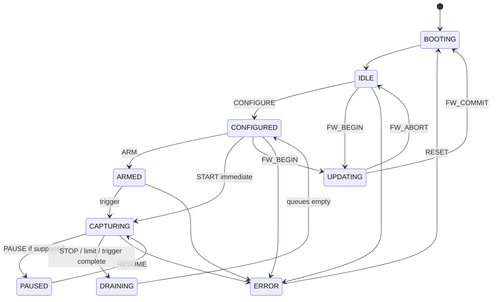

# Signal Analyzer Device Protocol (SADP) v1

**Status:** PERSPEKTYWA ROZWOJU — projekt protokołu wstrzymany

**Transporty:** USB bulk, UART/serial, TCP/IP oraz lokalny IPC bridge

**Kolejność bajtów:** little-endian

**Zakres:** cyfrowe i analogowe strumienie, sterowanie, trigger, synchronizacja, diagnostyka i aktualizacja

## 1. Założenia

SADP oddziela protokół urządzenia od transportu. Ta sama konfiguracja i ten sam format danych działają przez USB, UART i TCP. Adapter transportowy odpowiada wyłącznie za framing, połączenie i limit wielkości ramki.

Wymagania:

- jawne wersjonowanie i negocjacja capabilities;
- brak JSON na ścieżce danych;
- 64-bitowy czas i częstotliwość, gotowe na co najmniej 1 GS/s;
- numer sekwencji i jawne zgłaszanie luk;
- CRC32C nagłówka i opcjonalne/obowiązkowe CRC payloadu;
- kontrola przepływu niezależna od buforowania systemowego;
- możliwość pominięcia nieznanego komunikatu na podstawie długości;
- komendy idempotentne tam, gdzie to możliwe;
- jednoznaczna maszyna stanów urządzenia.

## 2. Typy podstawowe

| Nazwa | Rozmiar | Opis |
| --- | ---: | --- |
| `u8/u16/u32/u64` | 1/2/4/8 | liczba bez znaku LE |
| `i16/i32/i64` | 2/4/8 | liczba ze znakiem LE |
| `uuid128` | 16 | identyfikator w porządku bajtów RFC 4122 |
| `bytes` | zmienny | dane binarne |
| `utf8` | zmienny | tekst bez końcowego NUL |
| `q32.32` | 8 | liczba stałoprzecinkowa, gdy float jest niewskazany |

Nie wolno przesyłać surowych struktur C/C++ z paddingiem ABI.

## 3. Nagłówek ramki

Każda ramka ma 48-bajtowy nagłówek:

| Offset | Pole | Typ | Znaczenie |
| ---: | --- | --- | --- |
| 0 | `magic` | u32 | bajty ASCII `SLA1`, wartość LE `0x31414C53` |
| 4 | `versionMajor` | u8 | wersja niekompatybilna |
| 5 | `versionMinor` | u8 | rozszerzenie kompatybilne |
| 6 | `messageType` | u8 | typ komunikatu |
| 7 | `flags` | u8 | flagi transportowe/danych |
| 8 | `headerLength` | u16 | v1 = 48; pozwala rozszerzyć nagłówek |
| 10 | `statusOrReserved` | u16 | odpowiedź: kod statusu; żądanie/dane: 0 |
| 12 | `streamId` | u32 | 0 dla sterowania, >0 dla strumienia |
| 16 | `sequence` | u64 | monotoniczny per stream |
| 24 | `payloadLength` | u32 | liczba bajtów po nagłówku |
| 28 | `headerCrc32c` | u32 | CRC nagłówka przy wyzerowanych polach CRC |
| 32 | `deviceTicks` | u64 | czas pierwszej próbki/zdarzenia; 0 dla części komend |
| 40 | `payloadCrc32c` | u32 | CRC payloadu albo 0, jeśli wyłączone w capabilities |
| 44 | `reserved` | u32 | 0; odbiorca ignoruje |

Odbiorca odrzuca ramkę, gdy magic, długość lub CRC nagłówka jest błędne. Błędny payload nie może częściowo zmienić stanu ani magazynu. `sequence` jest monotoniczne osobno dla każdego kierunku i strumienia. Dla komunikatów sterujących odpowiedź ustawia `RESPONSE` i powtarza `streamId = 0` oraz `sequence` żądania; dzięki temu host koreluje wiele komend bez parsowania tekstu. Zdarzenia asynchroniczne używają własnego niezerowego `streamId`.

## 4. Flagi

| Bit | Nazwa | Znaczenie |
| ---: | --- | --- |
| 0 | `ACK_REQUIRED` | nadawca oczekuje odpowiedzi |
| 1 | `RESPONSE` | ramka jest odpowiedzią |
| 2 | `END_OF_STREAM` | ostatnia ramka strumienia |
| 3 | `COMPRESSED` | payload używa encoding z opisu streamu |
| 4 | `GAP_BEFORE` | przed blokiem utracono dane |
| 5 | `RETRANSMIT` | retransmisja tej samej sekwencji |
| 6 | `URGENT` | komunikat sterujący omija kolejkę danych |
| 7 | `RESERVED` | musi być 0 w v1 |

## 5. Typy komunikatów

### 5.1. Sterowanie

| Wartość | Nazwa |
| ---: | --- |
| `0x01` | `HELLO` |
| `0x02` | `HELLO_RESPONSE` |
| `0x03` | `GET_CAPABILITIES` |
| `0x04` | `CAPABILITIES` |
| `0x05` | `CONFIGURE` |
| `0x06` | `CONFIGURE_RESPONSE` |
| `0x07` | `ARM` |
| `0x08` | `START` |
| `0x09` | `STOP` |
| `0x0A` | `PAUSE` |
| `0x0B` | `RESUME` |
| `0x0C` | `RESET` |
| `0x0D` | `GET_STATUS` |
| `0x0E` | `STATUS` |
| `0x0F` | `CREDIT` |
| `0x10` | `PING` |
| `0x11` | `PONG` |

### 5.2. Dane i zdarzenia

| Wartość | Nazwa |
| ---: | --- |
| `0x40` | `DIGITAL_DATA` |
| `0x41` | `ANALOG_DATA` |
| `0x42` | `LOD_DIGITAL` |
| `0x43` | `LOD_ANALOG` |
| `0x44` | `ANNOTATION_DATA` |
| `0x45` | `MEASUREMENT_DATA` |
| `0x60` | `TRIGGER_EVENT` |
| `0x61` | `GAP_EVENT` |
| `0x62` | `OVERFLOW_EVENT` |
| `0x63` | `LOG_EVENT` |
| `0x64` | `DEVICE_EVENT` |

### 5.3. Serwis i aktualizacja

| Wartość | Nazwa |
| ---: | --- |
| `0x70` | `GET_DIAGNOSTICS` |
| `0x71` | `DIAGNOSTICS` |
| `0x72` | `GET_CALIBRATION` |
| `0x73` | `SET_CALIBRATION` |
| `0x78` | `FW_BEGIN` |
| `0x79` | `FW_CHUNK` |
| `0x7A` | `FW_COMMIT` |
| `0x7B` | `FW_ABORT` |

Nieznany typ z poprawną długością jest pomijany i opcjonalnie powoduje `UNSUPPORTED_MESSAGE`, jeśli miał `ACK_REQUIRED`.

## 6. Maszyna stanów



`STOP` i `GET_STATUS` są dozwolone w każdym stanie poza `BOOTING`. Powtórzone `STOP` jest idempotentne. Niepoprawna komenda zwraca `INVALID_STATE` bez zmiany stanu.

## 7. HELLO i tożsamość

`HELLO` payload:

| Pole | Typ |
| --- | --- |
| `clientNonce` | u64 |
| `minMajor`, `maxMajor` | u8, u8 |
| `minMinor`, `maxMinor` | u8, u8 |
| `requestedFeatures` | u64 |
| `clientNameLength` | u16 |
| `clientName` | utf8 |

`HELLO_RESPONSE`:

| Pole | Typ |
| --- | --- |
| `clientNonce` | u64 |
| `deviceNonce` | u64 |
| `selectedMajor`, `selectedMinor` | u8, u8 |
| `deviceId` | uuid128 |
| `serialLength`, `serial` | u16 + utf8 |
| `modelLength`, `model` | u16 + utf8 |
| `hardwareRevision` | u32 |
| `firmwareVersion` | u32 packed semver |
| `fpgaVersion` | u32 packed semver |
| `featureFlags` | u64 |

`deviceId` jest stabilny po aktualizacji. Numer seryjny nie może być wyprowadzony wyłącznie z adresu MAC, jeżeli naruszałoby to prywatność użytkownika.

## 8. Capabilities

Capabilities są listą TLV:

```text
type:u16 | flags:u16 | length:u32 | value:length
```

Wymagane rekordy:

- `DEVICE_LIMITS` — maksymalna liczba streamów, rozmiar ramki i bufor;
- `CLOCK` — częstotliwość ticków jako u64 numerator/denominator, ppm i źródła zegara;
- `DIGITAL_BANK` — liczba kanałów, maska, progi, tryby próbkowania;
- `ANALOG_BANK` — kanały, formaty, zakresy, częstotliwości i kalibracja;
- `CAPTURE_MODE` — buffer, stream, roll, RLE;
- `TRIGGER_CAPS` — typy triggerów, etapy, pre/post-trigger;
- `TRANSPORT_CAPS` — maksymalny frame, credits, CRC, reconnect;
- `SYNC_CAPS` — SYNC/clock/trigger IN/OUT;
- `UPDATE_CAPS` — podpis, sloty A/B, maksymalny obraz.

Lista dozwolonych trybów jest jawna. Host nie wylicza jej z marketingowego `maxSampleRate`:

```text
DigitalMode {
  modeId:u32,
  channelMask:u64,
  maxEnabledChannels:u16,
  bytesPerSample:u8,
  encodingMask:u8,
  sampleRateNumerator:u64,
  sampleRateDenominator:u64,
  maxSamples:u64,
  flags:u32
}
```

## 9. CONFIGURE

`CONFIGURE` zawiera:

- `requestId:u64` do deduplikacji;
- tryb akwizycji i `modeId`;
- maski kanałów cyfrowych/analogowych;
- dokładną częstotliwość jako numerator/denominator;
- głębokość lub czas;
- udział pre-trigger;
- encoding `RAW`, `RLE`, `AUTO`;
- progi wejść i zakresy analogowe;
- konfigurację zegara/synchronizacji;
- definicję triggera;
- politykę po zapełnieniu: `STOP`, `DROP_OLDEST`, `DROP_NEWEST`, `SPILL`.

Urządzenie waliduje całość atomowo. `CONFIGURE_RESPONSE` zwraca efektywną konfigurację, ponieważ PLL lub ADC mogą zaokrąglić żądaną częstotliwość.

## 10. Trigger

Trigger v1 jest drzewem TLV o ograniczonej głębokości:

- `EDGE(channel, rising|falling|either)`;
- `LEVEL(channel, high|low)`;
- `PATTERN(mask, value)`;
- `PULSE_WIDTH(channel, relation, ticks)`;
- `AND`, `OR`, `SEQUENCE`;
- `EXTERNAL_TRIGGER`;
- `IMMEDIATE`.

Capabilities określają, które węzły wykonuje sprzęt. Host może realizować trigger programowy tylko wtedy, gdy przepustowość pozwala przeanalizować pełny strumień i użytkownik widzi oznaczenie `Software trigger`.

## 11. DIGITAL_DATA

Prefix payloadu cyfrowego:

| Pole | Typ | Opis |
| --- | --- | --- |
| `channelMask` | u64 | kanały zawarte w słowie |
| `sampleRateNumerator` | u64 | Hz numerator |
| `sampleRateDenominator` | u64 | Hz denominator, nie 0 |
| `sampleCount` | u32 | próbki czasu, nie bity |
| `bytesPerSample` | u8 | 1, 2, 4 albo 8 |
| `bitOrder` | u8 | v1: 0 = channel N in bit N |
| `encoding` | u8 | 0 RAW, 1 RLE, 2 EDGE |
| `reserved` | u8 | 0 |
| `uncompressedLength` | u32 | liczba bajtów po dekodowaniu |
| `data` | bytes | dane |

RAW przechowuje jedno słowo na moment próbkowania. Nieaktywne bity są wyzerowane.

RLE v1:

```text
value:bytesPerSample | repeatMinusOne:u32
```

EDGE v1:

```text
deltaTicks:uleb128 | newValue:bytesPerSample
```

Urządzenie wybiera RLE/EDGE tylko gdy wynik jest mniejszy od RAW. `uncompressedLength` pozwala odrzucić bombę dekompresji przed alokacją.

## 12. ANALOG_DATA

Prefix:

| Pole | Typ |
| --- | --- |
| `channelMask` | u64 |
| `sampleRateNumerator`, `sampleRateDenominator` | u64, u64 |
| `sampleCountPerChannel` | u32 |
| `channelCount` | u16 |
| `format` | u8: I16, U16, F32 |
| `layout` | u8: interleaved, planar |
| `calibrationRevision` | u32 |
| `data` | bytes |

Skala, offset, jednostka i zakres są w capabilities. Dane muszą zachować surową wartość ADC; zastosowanie kalibracji jest odwracalne i wersjonowane.

## 13. Zdarzenia

`TRIGGER_EVENT` zawiera dokładny `deviceTicks`, typ triggera, pozycję w buforze i opóźnienie sprzętowe.

`GAP_EVENT`:

```text
streamId:u32
firstMissingSequence:u64
missingCount:u64
estimatedStartTicks:u64
estimatedEndTicks:u64
reason:u16
```

`OVERFLOW_EVENT` wskazuje warstwę: FPGA, RAM, MCU DMA, transport, host bridge albo store. Luka nigdy nie jest reprezentowana przez syntetyczne zera.

## 14. Kontrola przepływu

Host przesyła `CREDIT(streamId, bytes, frames)`. Urządzenie nie wysyła więcej danych niż dostępny kredyt, poza zdarzeniami `URGENT`.

Tryby:

- `STRICT` — brak kredytu zatrzymuje/kończy capture zgodnie z konfiguracją;
- `BUFFERED` — urządzenie buforuje do limitu i zgłasza overflow;
- `LOSSY_PREVIEW` — może odrzucić stare LOD, nigdy surowy capture oznaczony jako lossless.

Sterowanie ma zarezerwowaną kolejkę i nie konkuruje z danymi o cały bufor transportu.

## 15. Transport USB

- vendor-specific interface z co najmniej jednym bulk IN i bulk OUT;
- opcjonalny osobny interrupt IN dla zdarzeń, ale nie jest wymagany;
- ramka SADP może obejmować wiele transferów USB;
- parser utrzymuje stan i nie zakłada zgodności granic transferu z ramką;
- konfiguracja USB zwraca maksymalny zalecany `payloadLength`;
- seryjny numer USB jest obowiązkowy dla urządzenia produkcyjnego;
- rozwój używa tymczasowego VID/PID tylko lokalnie; produkt wymaga prawidłowo przydzielonych identyfikatorów.

## 16. Transport UART

- ramka SADP jest kodowana COBS i zakończona bajtem `0x00`;
- CRC payloadu jest obowiązkowe;
- domyślny MTU 4096 bajtów, negocjowalny;
- autobaud nie jest wymagany; wspierane szybkości są w capabilities;
- recovery console nie może ujawniać sekretów ani pozwalać ominąć podpisu firmware;
- przy dużym buforze dane są dzielone na wiele ramek, każda z osobnym sequence.

## 17. Transport TCP/IP

- domyślny port deweloperski `9750`, konfigurowalny;
- discovery przez mDNS `_theia-signal._tcp.local`;
- TCP przenosi nagłówek i payload bez dodatkowego framingu;
- keepalive aplikacyjny `PING/PONG` wykrywa zawieszone urządzenie;
- ponowne połączenie nie wznawia automatycznie sterowania istniejącą sesją bez tokenu resume;
- timestamp próbek pochodzi z urządzenia, nie z czasu odebrania pakietu;
- zdalny tryb produkcyjny wymaga TLS i uwierzytelnienia.

## 18. Lokalny IPC bridge

Ten sam envelope może być używany między bridge'em C++/GPL a brokerem Theia. Dla lokalnego IPC:

- control/status idzie przez named pipe/Unix domain socket;
- duże surowe dane mogą pozostać w file-backed store;
- viewport i adnotacje są przesyłane jako ograniczone ramki;
- ścieżka pliku lub uchwyt pamięci nie może pochodzić bez walidacji z procesu zewnętrznego;
- proces ma handshake z wersją bridge API niezależną od SADP firmware.

## 19. Statusy i błędy

| Kod | Nazwa |
| ---: | --- |
| 0 | `OK` |
| 1 | `INVALID_MESSAGE` |
| 2 | `UNSUPPORTED_VERSION` |
| 3 | `UNSUPPORTED_MESSAGE` |
| 4 | `INVALID_STATE` |
| 5 | `INVALID_ARGUMENT` |
| 6 | `UNSUPPORTED_MODE` |
| 7 | `BUSY` |
| 8 | `TIMEOUT` |
| 9 | `CRC_ERROR` |
| 10 | `AUTH_REQUIRED` |
| 11 | `AUTH_FAILED` |
| 12 | `RESOURCE_EXHAUSTED` |
| 13 | `DEVICE_FAULT` |
| 14 | `UPDATE_REJECTED` |
| 15 | `INTERNAL_ERROR` |

Odpowiedź błędu może zawierać `errorCode:u32`, `detailCode:u32`, `messageLength:u16` i krótki tekst UTF-8. Logika hosta nie może zależeć od tekstu.

## 20. Aktualizacja firmware

1. `FW_BEGIN` przekazuje typ obrazu, wersję, długość i hash SHA-256.
2. Urządzenie sprawdza zgodność hardware revision, miejsce i podpis.
3. `FW_CHUNK` ma offset, długość i CRC.
4. `FW_COMMIT` weryfikuje cały obraz i ustawia slot testowy.
5. Bootloader uruchamia obraz i oczekuje potwierdzenia zdrowia.
6. Brak potwierdzenia powoduje rollback.

Nie wolno aktualizować podczas `CAPTURING` ani pozwalać na downgrade poniżej wersji bezpieczeństwa bez fizycznego trybu recovery.

## 21. Bezpieczeństwo parsera

- limit `payloadLength` jest sprawdzany przed alokacją;
- mnożenia `sampleCount × bytesPerSample × channels` są sprawdzane na overflow;
- TLV nie może wyjść poza payload;
- zagnieżdżenie triggera ma twardy limit;
- `uncompressedLength` ma limit capabilities i budżetu hosta;
- błędny frame nie przesuwa sequence zaakceptowanych danych;
- fuzzing obejmuje nagłówek, TLV, RLE, EDGE i COBS;
- parser firmware i parser C++ używają tych samych golden vectors.

## 22. Zgodność i testy

Pakiet conformance zawiera:

- binarne golden frames dla każdego message type;
- testy złego magic/CRC/length/version;
- fragmentację ramki w każdym możliwym miejscu;
- łączenie wielu ramek w jednym odczycie;
- wrap test wartości czasu i sequence;
- RAW/RLE/EDGE round-trip;
- utratę sekwencji i poprawne `GAP`;
- backpressure przy kredycie 0;
- restart i reconnect;
- zgodność USB/UART/TCP z tym samym trace;
- fuzzing co najmniej 10 minut na build CI sanitizera.

Zmiana znaczenia istniejącego pola wymaga nowego `versionMajor`. Dodanie opcjonalnego TLV lub message type może zwiększyć `versionMinor`.
