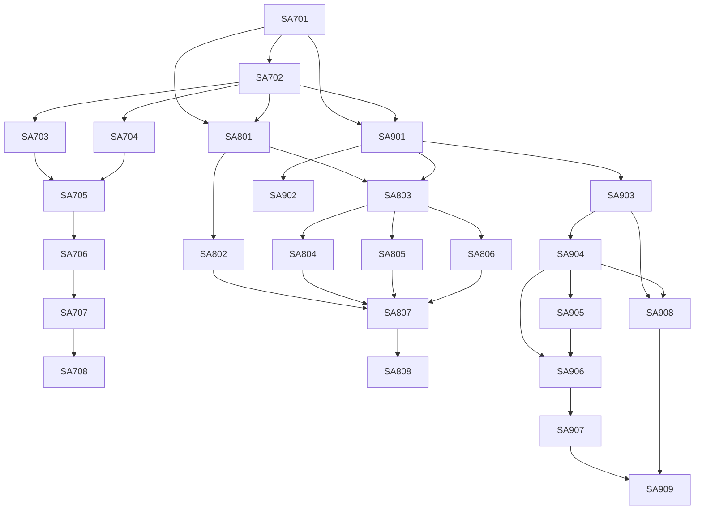

# Logic Analyzer — szczegółowy plan implementacji

**Wersja planu:** 1.1 — perspektywa wstrzymana

**Data:** 2026-08-24

**Zakres:** produkt Theia, backend C++, urządzenia rynkowe i własny hardware do 400 MS/s

> **WSTRZYMANE 2026-08-24 decyzją właściciela.** Ten plan pozostaje perspektywą kolejnego etapu. Aktywną kolejność definiuje `industrial-protocol-analyzer.md`; SA-702…SA-909 nie mogą rozpocząć się bez nowego polecenia właściciela.

## 1. Stan wejściowy

Gotowe elementy do ponownego użycia:

- `@theia/signal-core`: `SampleBlock`, sesje, magazyn RAM, adnotacje i dekodery;
- `@theia/signal-ui`: istniejący `ViewportController` wymagający uzgodnienia faktycznego stanu z kartą SA-301;
- dekodery CAN i UART oraz circuit breaker;
- CAN Analyzer jako istniejący produkt, którego nie wolno regresować;
- binarny transport RPC użyty przez CAN jako wzorzec, ale nie jako ścieżka pełnego 400 MS/s.

Przed implementacją SA-702 supervisor musi rozstrzygnąć niespójność: kod `ViewportController` istnieje, a roadmap nadal oznacza SA-301 jako niewykonane. Nie wolno implementować go ponownie; należy zweryfikować testy i uaktualnić status.

## 2. Decyzje architektoniczne

1. Logic Analyzer jest osobnym widgetem i pakietem `@theia/logic-analyzer`.
2. CAN Analyzer pozostaje bez zmian funkcjonalnych.
3. Wszystkie urządzenia implementują wspólny `DeviceProvider` i capabilities.
4. Pełny raw stream nie przechodzi przez frontend.
5. C++ jest osobnym procesem, nie domyślnym addonem N-API.
6. Theia otrzymuje LOD, adnotacje i żądane okna danych.
7. Sigrok, DSView i ALIENTEK działają przez opcjonalne bridge'e GPL.
8. Własne urządzenie używa SADP przez USB/UART/TCP.
9. Czas próbki pochodzi z urządzenia; czas transportu nie jest czasem pomiaru.
10. API używa u64/rational rates i nie ma twardego limitu 400 MS/s, aby obsłużyć przyszłe 1 GS/s.

## 3. Faza 7 — fundament produktu

### SA-701 — dokumentacja i decyzje graniczne

**Status:** GOTOWE DO REWIZJI

Zakres:

- dokument produktu, sprzętu, protokołu, backendu i zgodności;
- nowy plan Faz 7–9;
- decyzja o C++ sidecar i granicy GPL;
- model wydajności oraz bramki.

DoD:

- dokumenty są w indeksie;
- roadmap/tasks zachowują historię i zawierają nowe fazy;
- `git diff --check` przechodzi;
- brak zmian kodu i regresji istniejących pakietów.

### SA-702 — kontrakty urządzeń i wysokowydajnych chunków

Pakiety:

- additive API w `@theia/signal-core` albo nowy common w `@theia/logic-analyzer` po rewizji granicy;
- `DeviceDescriptor`, `DeviceCapabilities`, `CapturePlan`, `RawCaptureChunk`, `CaptureTelemetry`, `DeviceProvider`;
- registry providerów i lease urządzenia;
- rational sample rate oraz wspólny model clock domain;
- adapter `RawCaptureChunk → SampleBlock` wykonywany na żądanie.

Wymagania:

- nie modyfikować znaczenia zamrożonego `SampleBlock`;
- 8/16/32/64-bitowe słowa cyfrowe bez transpozycji na ingress;
- osobne sample rates analog/digital;
- jawne `GAP`, sequence i overflow;
- serializacja bez utraty bigint.

DoD:

- testy typów i round-trip 32 kanałów;
- 1 GS/s mieści się bez utraty precyzji;
- niezgodna konfiguracja jest odrzucana przed startem;
- rewizja supervisora granicy kontraktu.

### SA-703 — pakiet i wejście UI

- utworzyć `@theia/logic-analyzer` w `packages/logic-analyzer`;
- transient multi-instance widget;
- `Analyzer → New Logic Analyzer` przy zachowaniu `New CAN Bus Analyzer`;
- przenieść własność wspólnego menu z `examples/api-samples` do naszego contribution bez zmiany ścieżki komend;
- Device Library, toolbar capture i puste panele waveform/decoder/events;
- lifecycle/dispose i przywracanie layoutu.

DoD:

- dwa widgety Logic i widget CAN działają równolegle;
- testy komend/menu/DI;
- pełny build Browser i Electron;
- brak warningów focus po aktywacji nowych widgetów.

### SA-704 — simulator i import

- deterministyczny simulator 16D + 2A;
- UART/I2C/SPI/CAN traces, jitter, glitch, GAP i trigger;
- tryby RAW/RLE/EDGE;
- import VCD i minimalny import `.sr` przez bridge/file provider;
- zapis golden traces dla kolejnych etapów.

DoD:

- ten sam seed daje identyczny trace;
- mixed sample rates zachowują wspólną oś czasu;
- plik 1 GB otwiera się bez wczytania całości do RAM;
- błędny plik jest odrzucany atomowo.

### SA-705 — waveform cyfrowy/analogowy i LOD UI

- użyć zweryfikowanego `ViewportController`;
- WebGL2 z fallback Canvas2D;
- cyfrowe krawędzie/pulse preservation;
- analog min/max envelope;
- wirtualizacja listy kanałów;
- overlay triggera, GAP, decoderów i kursorów;
- żądania viewportu anulowane przy szybkim zoom/pan.

DoD:

- 32 kanały zachowują płynne przewijanie;
- brak pełnego raw w pamięci renderera;
- p95 viewport cached <100 ms;
- High-DPI i zmiana motywu bez artefaktów.

### SA-706 — capture, trigger, kursory i pomiary

- formularz capabilities-driven;
- konfiguracja buffer/stream/roll;
- immediate/edge/level/pattern/pre/post-trigger;
- progi cyfrowe i zakres analogowy;
- kursory A/B, delta, częstotliwość, duty, pulse width;
- synchronizacja wielu urządzeń i widoczny poziom dokładności.

DoD:

- UI nigdy nie wysyła nieobsługiwanej konfiguracji;
- konfiguracja efektywna z urządzenia jest pokazana użytkownikowi;
- trigger/gap/overflow mają jawne znaczniki;
- testy jednostek czasu od ns do godzin.

### SA-707 — dekodery, tabela i eksport

- przypisanie ról kanałów do decoderów;
- UART, I2C, SPI i CAN jako pierwsza macierz;
- protocol overlay i wirtualizowana tabela;
- decoder C++/TS/Python przez wspólne adnotacje;
- eksport viewportu i pełnej sesji do CSV/VCD/SR/formatu natywnego;
- anulowanie i circuit breaker.

DoD:

- wyniki golden trace identyczne niezależnie od backendu;
- błąd decodera nie zatrzymuje capture;
- tabela 1 M adnotacji nie tworzy 1 M elementów DOM;
- eksport oznacza GAP i domenę czasu.

### SA-708 — bramka produktu bez fizycznego hardware

- Browser/Electron na Windows i Linux;
- simulator + pliki + minimum dwa równoległe widgety;
- test 24 h simulatora w przyspieszonym/ciągłym trybie;
- przegląd dostępności, focus, klawiatury i motywów;
- dokumentacja użytkowa i troubleshooting.

DoD:

- produkt działa bez backendu natywnego w trybie ograniczonym;
- capture/decode/view/export przechodzi E2E;
- supervisor akceptuje koniec Fazy 7.

## 4. Faza 8 — backend natywny i sprzęt rynkowy

### SA-801 — `signal-native-host` i Bridge API

- C++20/CMake, launcher Node, handshake/version;
- named pipe/Unix domain socket;
- lifecycle, heartbeat, timeout, crash recovery;
- emulator provider i testy fragmentacji IPC;
- prebuilt/debug fallback.

DoD: 1000 start/stop procesu bez zombie/handle leak; awaria C++ nie zabija Theia.

### SA-802 — raw store, LOD i query engine

- pool buforów, SPSC, append-only store, mmap;
- indeks tick range/sequence;
- cyfrowy edge LOD i analog min/max LOD;
- recovery po kill -9/TerminateProcess;
- query viewport i eksport range.

DoD: 100 GB sesja otwiera pierwszy viewport bez pełnego skanu; cached p95 <100 ms.

### SA-803 — USB, UART i TCP

- libusb async bulk;
- UART COBS;
- TCP/mDNS, reconnect i TLS hook;
- wspólny SADP parser i credits;
- topology telemetry USB.

DoD: identyczny conformance trace przez trzy transporty; błędy tworzą GAP/status.

### SA-804 — Sigrok bridge

- oddzielny proces GPL;
- wykrywanie urządzeń i mapowanie capabilities;
- wejście digital/analog i format `.sr`;
- opcjonalny libsigrokdecode;
- pakiet licencji, sources/NOTICE i tryb user-supplied binary.

DoD: co najmniej dwa różne urządzenia Sigrok lub hardware + demo driver działają bez zmiany UI.

### SA-805 — DSLogic bridge

- U2Basic i Plus z rozpoznaniem wszystkich znanych VID/PID;
- firmware/bitstream niebundlowany bez zgody;
- buffer/stream, próg, trigger i external clock;
- testy wszystkich macierzy częstotliwości.

DoD: U2Basic i Plus przechodzą hardware-in-loop; błędny firmware jest raportowany, nie kończy procesu Theia.

### SA-806 — ALIENTEK DL32 feasibility i driver

Etap A — spike:

- deskryptory fizycznego DL32;
- build oficjalnego `atk-logic` i test zgodności;
- potwierdzenie VID/PID/endpointów/protokołu;
- macierz kanały × sample rate × mode;
- decyzja `GO`, `VENDOR SDK REQUIRED` albo `IMPORT ONLY`.

Etap B, tylko po `GO`:

- `alientek-bridge` GPL;
- bezpieczny parser komend i danych;
- 32-kanałowe mapowanie;
- buffer/stream/trigger/RLE/PWM według zweryfikowanych capabilities;
- testy 1 GS/s jako przyszły tryb, bez wymuszenia na naszym hardware 400.

DoD: fizyczne porównanie z ATK-Logic na golden signal; 10 min stream bez niewyjaśnionego GAP.

### SA-807 — wielourządzeniowość i synchronizacja

- concurrent scheduler, per-device budgets i priorities;
- software/hardware/shared-clock sync;
- global timeline z kalibracją offset/drift;
- niezależne restartowanie bridge'y;
- UI topology i ostrzeżenie o współdzielonym hubie USB.

DoD: dwa urządzenia 16 × 20 MS/s, agregat około 80 MB/s, 10 min, UI responsywne.

### SA-808 — bramka wydajności, bezpieczeństwa i dystrybucji

- ASan/UBSan, fuzz, SBOM, podpis binarek;
- 80 MB/s bramka obowiązkowa, 160 MB/s cel rozszerzony;
- test wolnego dysku, pełnego dysku, disconnect i crash;
- Windows/Linux installers i cleanup;
- przegląd GPL/firmware.

DoD: supervisor akceptuje raport benchmarków i macierz licencji.

## 5. Faza 9 — własny hardware

### SA-901 — SADP emulator i conformance kit

- referencyjny parser C++ i firmware-friendly parser C;
- golden frames, fuzz corpus i network/serial emulator;
- CLI diagnostyczne;
- Wireshark dissector opcjonalnie po stabilizacji v1.

### SA-902 — LA-Lite ESP32

- USB/UART/TCP, discovery, capabilities;
- buforowane wejścia cyfrowe i opcjonalny analog;
- trigger, RLE, update i telemetry;
- benchmark ustalający uczciwe limity produktu.

### SA-903 — STM32H7 control/transport board

- USB HS ULPI, Ethernet, UART i bootloader;
- SADP, DMA queues, FPGA control i diagnostics;
- signed A/B firmware update;
- benchmark przepustowości bez FPGA.

### SA-904 — FPGA sampler 400

- digital input, 64-bit ticks, DDR sampling;
- 4×400, 8×200, 16×100 i opcjonalnie 32×50 MS/s;
- pre/post-trigger, RLE, memory controller;
- generator wzorcowy i formal/unit simulation.

### SA-905 — analog front-end

- 2 synchroniczne kanały, docelowo 1–20 MS/s;
- AFE, ADC, zakresy i kalibracja;
- wspólna domena czasu z FPGA;
- analog min/max LOD i pomiary.

### SA-906 — EVT PCB LA-Pro

- schemat, SI/PI, layout, BOM i produkcja prototypowa;
- cyfrowy front-end, FPGA, RAM, STM32, USB, Ethernet, sync i analog;
- bring-up checklist i rework log;
- bezpieczne limity wejść potwierdzone pomiarem.

### SA-907 — synchronizacja, kalibracja i update produkcyjny

- SYNC/TRIG/CLOCK IN/OUT;
- offset/drift calibration;
- serializacja, secure update i recovery;
- fabryczny self-test oraz rekord kalibracji.

### SA-908 — sterownik Sigrok naszego urządzenia

- driver libsigrok albo kompatybilny bridge zaakceptowany przez projekt;
- mapowanie kanałów/modes/trigger;
- upstreamability review;
- test PulseView i sigrok-cli.

### SA-909 — kwalifikacja DVT/PVT i wydanie

- testy funkcjonalne, termiczne, ESD, długotrwałe i integralności sygnału;
- macierz Windows/Linux i USB/UART/TCP;
- instrukcja użytkownika, safety, calibration i recovery;
- raport ograniczeń i wersja stabilna decyzją właściciela.

## 6. Zależności



Fazy mogą częściowo zachodzić na siebie. Emulator SA-901 może powstawać równolegle z UI po zamrożeniu SA-702. PCB nie rozpoczyna się przed przejściem benchmarku STM32↔FPGA i zamrożeniem SADP v1.

## 7. Kamienie milowe

| Kamień | Zakres | Wynik użytkowy |
| --- | --- | --- |
| M1 | SA-701–704 | otwarcie Logic Analyzer i symulator mixed-signal |
| M2 | SA-705–708 | pełna analiza plików/symulatora bez hardware |
| M3 | SA-801–803 | natywny capture/store przez USB/UART/TCP emulator |
| M4 | SA-804–806 | Sigrok, DSLogic i decyzja DL32 |
| M5 | SA-807–808 | stabilna praca wielu urządzeń |
| M6 | SA-901–905 | działające moduły własnego urządzenia |
| M7 | SA-906–909 | zweryfikowany LA-Pro i integracja Sigrok |

## 8. Ryzyka i działania

| Ryzyko | Wpływ | Działanie |
| --- | --- | --- |
| UI dostaje za dużo danych | lag/OOM | LOD i query viewport w C++ |
| USB współdzieli hub | utrata throughput | topology telemetry i osobne kontrolery |
| DL32 ma inny protokół | brak live integration | spike + vendor SDK + import fallback |
| GPL wpływa na dystrybucję | opóźnienie wydania | oddzielne bridge'e i przegląd licencji |
| FPGA nie domyka 400 MS/s | brak trybu | DDR input, zmiana FPGA/front-end, nie marketing |
| tor wejściowy zniekształca zbocza | błędne próbki | SI, komparator i test BER/pulse |
| dysk nie nadąża | GAP/utrata | credits, bufor, stop lossless, telemetry |
| decoder zużywa CPU | lag | scheduler, cancellation, worker C++/Python |
| zdalne urządzenie jest niezabezpieczone | przejęcie sterowania | TLS/auth, bezpieczne defaults |
| plan dubluje istniejący SA-301 | marnowanie pracy | audit i korekta statusu przed SA-705 |

## 9. Kolejność po przyszłym wznowieniu — NIEAKTYWNA

Poniższa lista zachowuje zależności Logic Analyzer, ale nie jest bieżącą kolejką projektu. Aktualne zadania to SA-610…SA-619 z `industrial-protocol-analyzer.md`.

1. Rewizja i akceptacja SA-701.
2. Audit faktycznego SA-301/ViewportController.
3. SA-702 — zamrożenie kontraktów urządzeń i raw chunk.
4. Równolegle po SA-702: SA-703, SA-704, SA-801 i SA-901, o ile pliki są rozłączne.
5. Pierwszy działający vertical slice: simulator 16D+2A → waveform → UART decode → event table.
6. Dopiero później fizyczny DSLogic i backend C++.
7. ALIENTEK DL32 rozpoczyna się dopiero po dostępie do fizycznego urządzenia.

## 10. Polecenia weryfikacyjne dla przyszłych kart

Zakres TypeScript:

```powershell
npx lerna run compile --scope @theia/logic-analyzer --scope @theia/signal-core --scope @theia/signal-ui
npx lerna run lint --scope @theia/logic-analyzer --scope @theia/signal-core --scope @theia/signal-ui
npx lerna run test --scope @theia/logic-analyzer --scope @theia/signal-core --scope @theia/signal-ui
npm run build:browser
```

Zakres C++ — dokładne presets zostaną dodane w SA-801:

```powershell
cmake --preset windows-x64-release
cmake --build --preset windows-x64-release
ctest --preset windows-x64-release
```

Dokumentacja:

```powershell
git diff --check
Get-ChildItem doc/signal-analyzer -Filter 'logic-analyzer*.md' | Select-String -Pattern '^(TODO|TBD|DO UZUPEŁNIENIA)(:|$)'
```
