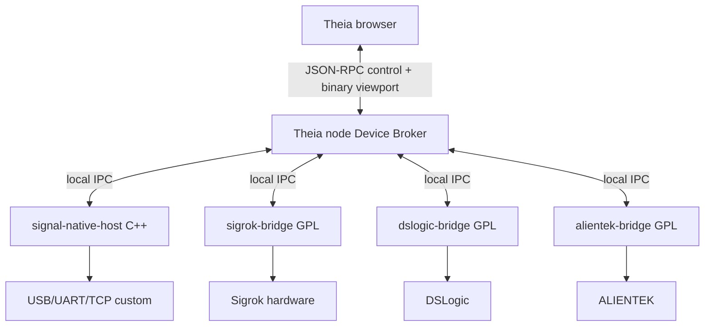

# Logic Analyzer — wysokowydajny backend natywny

**Status:** PERSPEKTYWA ROZWOJU — architektura Logic Analyzer wstrzymana

**Język:** C++20

**Cel:** przechwytywanie, magazynowanie, LOD i dekodowanie bez blokowania Theia

## 1. Decyzja

Pełny strumień 32 kanałów i setek MS/s nie może przechodzić przez renderer ani być kopiowany jako obiekty JavaScript. Wysokowydajna ścieżka jest realizowana w osobnym procesie `signal-native-host`.

Proces zewnętrzny jest preferowany względem N-API dla sterowników i dekoderów dużej przepustowości, ponieważ:

- awaria, segfault lub wyciek nie zabija IDE;
- można restartować pojedynczy backend bez utraty innych widgetów;
- łatwiej izolować komponenty GPL producentów;
- C++ może bezpośrednio korzystać z libusb, DMA-friendly buffers i mmap;
- Theia otrzymuje dane już zredukowane do viewportu i wyniki dekoderów.

N-API pozostaje opcją wyłącznie dla małego, dobrze przetestowanego mostu lub operacji, której benchmark nie pozwala wykonać przez IPC. Nie jest domyślną granicą całego systemu.

## 2. Podział procesów



Każdy bridge implementuje wspólny `Bridge API`. Broker może uruchomić proces per provider albo per urządzenie. Domyślnie proces per urządzenie jest używany dla kodu producenta; `signal-native-host` może bezpiecznie obsłużyć wiele naszych urządzeń.

## 3. Odpowiedzialności

| Obszar | C++/bridge | Theia node | Theia browser |
| --- | --- | --- | --- |
| wykrywanie sprzętu | tak | agregacja | lista |
| USB/UART/TCP | tak | nie | nie |
| surowy store | tak | metadane | nie |
| RLE/dekompresja | tak | nie | nie |
| LOD | tak | cache małych wyników | render |
| dekodery hot-path | tak | orkiestracja | konfiguracja/wyniki |
| dekodery TS | okno na żądanie | routing | WebWorker |
| konfiguracja sesji | walidacja sprzętowa | walidacja domenowa | formularz |
| widget i komendy | nie | contribution/RPC | tak |
| eksport | odczyt store | koordynacja | wybór |

## 4. Moduły C++

Proponowana struktura:

```text
packages/signal-native/
  package.json
  src/node/
    native-host-manager.ts
    native-host-protocol.ts
  native/
    CMakeLists.txt
    include/signal/
      bridge_api.hpp
      capture_chunk.hpp
      device_provider.hpp
      decoder.hpp
    src/
      main.cpp
      ipc/
      device/
      transport/
      capture/
      store/
      lod/
      decoder/
      telemetry/
    tests/
    fuzz/
```

Podstawowe komponenty:

- `DeviceRegistry` — providerzy i rezerwacja urządzeń;
- `CaptureScheduler` — stan i priorytety wielu sesji;
- `Transport` — USB, UART, TCP, replay;
- `FrameParser` — SADP/bridge frames;
- `RawChunkPool` — prealokowane, wyrównane bufory;
- `CapturePipeline` — walidacja, sequence, CRC, GAP;
- `PagedCaptureStore` — mmap/file-backed store;
- `LodBuilder` — piramida zboczy/min-max;
- `DecoderScheduler` — pule dekoderów i deadline;
- `BridgeServer` — lokalny IPC;
- `Telemetry` — liczniki i histogramy.

## 5. Model wątków

Na urządzenie:

- 1 event-loop transportu albo zestaw async transferów libusb;
- 1 sekwencyjny ingestion stage zachowujący kolejność;
- 1 SPSC queue transport → capture;
- współdzielona pula workerów LOD/decode;
- 1 asynchroniczny writer store na fizyczny dysk/volume;
- osobna kolejka control o najwyższym priorytecie.

Nie tworzymy wątku na kanał. Dekodery są planowane per okno/zadanie, a nie per pojedynczą ramkę USB.

Affinitization i liczba workerów są opcjonalne. Domyślnie backend pozostawia co najmniej jeden rdzeń dla Theia i systemu.

## 6. Bufory i własność pamięci

Ścieżka surowa:

```text
libusb/TCP buffer -> validated RawChunk -> store extent -> LOD/decode view
```

Zasady:

- pule rozmiarów 16 KiB, 64 KiB, 256 KiB i 1 MiB;
- brak alokacji per próbka;
- move-only `RawChunk` z jednoznacznym właścicielem;
- SPSC queue między pojedynczym producentem i konsumentem;
- licznik referencji tylko gdy chunk jest równolegle używany przez store i decoder;
- wyrównanie co najmniej 64 bajty;
- oddzielny limit RAM per sesja i globalny;
- po przekroczeniu budżetu store przechodzi na mmap/dysk albo stosuje skonfigurowaną politykę;
- żadnego cichego `drop`; każde odrzucenie tworzy telemetry i `GAP`.

## 7. Transport i backpressure

USB wykorzystuje wiele transferów asynchronicznych, ale ich liczba jest regulowana na podstawie zajętości kolejki. TCP i UART korzystają z asynchronicznego I/O.

Watermarks:

- `<50%` — normalna praca;
- `50–75%` — ograniczenie zadań tła i preview;
- `75–90%` — zmniejszenie credits dla urządzenia;
- `>90%` — polityka sesji: zatrzymanie, bufor urządzenia albo jawny GAP;
- `100%` — nigdy nie nadpisuje danych oznaczonych lossless bez zdarzenia.

Sterowanie `STOP`, `RESET` i heartbeat nie czeka za danymi.

## 8. Magazyn sesji

Format store jest append-only podczas capture:

```text
session.meta
chunks.dat
chunks.idx
lod-digital.dat
lod-analog.dat
annotations.dat
events.log
```

Każdy extent indeksu zawiera device/stream ID, sequence, tick range, file offset, długość, format i CRC. `events.log` jest zapisywany przed aktualizacją indeksu, aby możliwe było odzyskanie sesji po awarii.

Store wspiera:

- odczyt widocznego zakresu bez mapowania całego pliku;
- niezależne sample rates;
- luki i zmiany konfiguracji;
- crash recovery przez skan ostatnich extentów;
- limit rozmiaru i politykę rotacji;
- eksport bez zatrzymywania capture, jeśli filesystem na to pozwala;
- usunięcie sesji dopiero po jawnej decyzji użytkownika.

## 9. LOD

### 9.1. Cyfrowe

LOD nie uśrednia sygnału. Dla każdego bucketu przechowuje:

- wartość początkową i końcową;
- liczbę zboczy;
- pozycję pierwszego i ostatniego zbocza;
- flagę `activity`/`dense`;
- min/max długość impulsu, jeśli obliczona.

Przy dużym zoom-out renderer widzi aktywność bez utraty krótkiego piku. Po przybliżeniu backend zwraca dokładne krawędzie lub surowe próbki.

### 9.2. Analogowe

Każdy bucket przechowuje min, max, first, last i opcjonalnie średnią/RMS. Piramida jest budowana inkrementalnie, poziom po poziomie.

### 9.3. Kontrakt viewportu

Żądanie zawiera:

- session/stream/channel IDs;
- `startTimeNs`, `endTimeNs`;
- szerokość viewportu w pikselach;
- preferowany maksymalny punktów na piksel;
- wymagany rodzaj danych.

Odpowiedź nie przekracza skonfigurowanego limitu, np. 4 punkty/zdarzenia na piksel na kanał, chyba że użytkownik żąda dokładnego eksportu.

## 10. Dekodery

Trzy klasy wykonania:

1. TypeScript WebWorker — konfiguracja, małe/średnie viewporty i obecne dekodery CAN/UART.
2. C++ plugin — dekodery wymagające pełnej przepustowości lub ciężkich obliczeń.
3. Python/libsigrokdecode bridge — szeroki ekosystem, uruchamiany poza procesem Theia.

Wspólne wyjście to `ProtocolAnnotation`. C++ emituje binarną postać adnotacji, a broker mapuje ją na kontrakt signal-core.

Zasady schedulera:

- priorytet viewport > trigger programowy > zapis pełnych adnotacji > prefetch;
- deadline i cancellation token;
- limit pamięci i CPU per decoder;
- circuit breaker zgodny z istniejącym `DecoderCircuitBreaker`;
- checkpointy dla długiego dekodera stanowego;
- jeden wadliwy decoder nie zatrzymuje capture ani innych decoderów;
- wyniki cache'owane według input hash + konfiguracja + wersja decodera.

## 11. Bridge API do Theia

Control API:

- `listProviders`, `scanDevices`, `reserveDevice`, `releaseDevice`;
- `getCapabilities`, `configure`, `arm`, `start`, `stop`, `status`;
- `createSession`, `closeSession`, `recoverSession`;
- `queryViewport`, `queryAnnotations`, `queryMeasurements`;
- `installDecoder`, `enableDecoder`, `cancelDecode`;
- `getTelemetry`, `getLogs`, `shutdown`.

Zdarzenia:

- `deviceAdded/Removed/Changed`;
- `captureStateChanged`;
- `captureProgress`;
- `triggered`;
- `gap/overflow/fault`;
- `viewportReady`, `annotationsReady`;
- `bridgeCrashed/restarted`.

Komendy mają `requestId` i odpowiedzi asynchroniczne. Eventy mają kolejność per session.

## 12. Lokalny IPC

Preferencja:

- Windows: named pipe;
- Linux/macOS: Unix domain socket;
- framing: envelope SADP/Bridge API z CRC i limitami;
- duże dane: file-backed store, IPC przekazuje deskryptor logiczny i zakres;
- brak TCP localhost jako domyślnej granicy, aby ograniczyć ekspozycję portu;
- żaden bridge nie może wskazać dowolnej ścieżki do odczytu przez Theia.

Jeżeli benchmark viewportu wykaże, że socket jest wąskim gardłem, następny krok to read-only mmap z losowym tokenem i walidowanym katalogiem sesji, nie bezpośrednie N-API do sterownika.

## 13. Integracja GPL i vendor bridge

`sigrok-bridge`, `dslogic-bridge` oraz `alientek-bridge` mają:

- osobny proces i manifest providerów;
- osobną licencję i numer wersji;
- to samo Bridge API, ale niezależny build;
- ograniczone uprawnienia i katalog roboczy;
- watchdog, timeout shutdown i wymuszone zakończenie dopiero po grace period;
- log źródła sterownika i dokładny VID/PID;
- możliwość instalacji jako opcjonalny komponent.

Nie kopiujemy kodu GPL do `@theia/signal-core`, `@theia/signal-ui` ani głównego pliku wykonywalnego C++ bez zatwierdzonej strategii licencyjnej.

## 14. Odporność na awarie

- heartbeat bridge co 1 s podczas capture;
- po 3 brakujących heartbeat broker oznacza `UNRESPONSIVE` i nie blokuje UI;
- stop grace period, potem terminate, na końcu kill tylko dla dokładnie znanego PID procesu potomnego;
- crash nie usuwa store; przy restarcie wykonywane jest recovery;
- urządzenie ma lease/token; nowy bridge nie przejmuje go bez wygaśnięcia lub resetu;
- stdout/stderr są limitowane i rotowane;
- restart ma exponential backoff i limit, aby uniknąć crash loop;
- zamknięcie Theia kończy wszystkie child procesy i zwalnia urządzenia.

## 15. Bezpieczeństwo

- walidacja wszystkich długości, enumów i ścieżek na obu stronach IPC;
- sandbox/ograniczenie uprawnień bridge'a tam, gdzie platforma pozwala;
- brak ładowania biblioteki/decodera z dowolnej ścieżki użytkownika bez zatwierdzenia;
- podpis/allowlist dla binarnych pluginów produkcyjnych;
- ASan/UBSan w CI Linux, fuzzing parserów;
- Control Flow Guard/odpowiednie hardening flags na Windows;
- SBOM i skan zależności dla artefaktów natywnych;
- protokół TCP urządzenia uwierzytelniony i szyfrowany.

## 16. Budowanie i dystrybucja

- CMake Presets dla Windows x64, Linux x64/arm64 i docelowo macOS arm64/x64;
- kompilatory: MSVC oraz Clang/GCC wspierające C++20;
- zależności pobierane wersjonowanym mechanizmem i zapisane w SBOM;
- prebuilt binary ma checksum i wersję Bridge API;
- brak binarki powoduje czytelny status `Native backend unavailable`, nie awarię Theia;
- simulator i import plików pozostają dostępne bez backendu natywnego;
- bridge GPL jest osobnym opcjonalnym artefaktem.

## 17. Budżety wydajności

Pierwsza bramka:

| Metryka | Cel |
| --- | ---: |
| agregat ingestion | ≥80 MB/s, 2 urządzenia |
| długotrwały capture | 10 min, 0 niewyjaśnionych GAP |
| RAM hosta | limit konfigurowalny, domyślnie ≤1 GiB na sesję |
| p95 control RPC | <50 ms bez capture; <100 ms pod obciążeniem |
| viewport 16 kanałów | p95 <100 ms dla cached LOD |
| reakcja STOP | <250 ms do rozpoczęcia draining |
| UI | brak long task >100 ms powodowanego przez ingestion |

Druga bramka:

- ≥160 MB/s agregatu na odpowiednim sprzęcie i topologii I/O;
- 4 urządzenia, niezależne awarie i backpressure;
- sesja 100 GB otwiera timeline i pierwszy viewport bez skanowania całego pliku;
- decoder C++ utrzymuje zadaną przepustowość trace z jawnie określonym CPU.

Wynik benchmarku zapisuje wersję CPU, RAM, dysku, systemu, kontrolera USB i build flags. Próg nie może być zwiększany tylko po to, żeby test przeszedł.

## 18. Testy

- unit: parsers, queues, state machine, store index, LOD, CRC;
- property: RAW/RLE/EDGE round-trip i losowe fragmentacje;
- integration: emulator SADP przez USB-like stream/UART/TCP;
- hardware-in-loop: ESP32, STM32/FPGA, DSLogic, DL32 po pozyskaniu;
- soak: 1/8/24 h z monitorowaniem RSS, handles i temperatury;
- fault injection: disconnect, timeout, zły CRC, pełny dysk, wolny konsument;
- performance: 80/160 MB/s, wiele decoderów i viewport podczas capture;
- fuzz: SADP, vendor protocols, store recovery i pliki importu;
- UI E2E: start/stop, zoom, decoder, disconnect bez zamrożenia.

## 19. Bramka decyzji C++

Kod natywny jest wdrażany dla:

- sterowników USB 3/HS i vendor protocols;
- surowego store i LOD;
- transpozycji 16/32-bitowych próbek;
- dekoderów, których profil pokazuje przekroczenie budżetu TS;
- kryptografii/kompresji tylko przez sprawdzone biblioteki.

Kod pozostaje w TypeScript dla:

- menu, widgetów i konfiguracji;
- Device Broker i DI Theia;
- logiki produktu niewykonywanej na hot-path;
- istniejących decoderów, które spełniają benchmark;
- fallbacku simulator/import.

Każde przeniesienie decodera do C++ wymaga profilu before/after, testów golden trace i zachowania identycznego kontraktu wynikowego.
