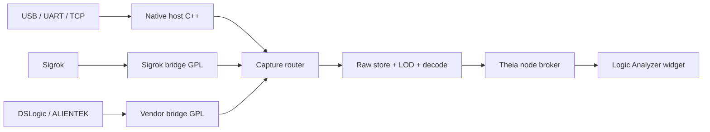

# Logic Analyzer — funkcjonalność produktu

**Status:** PERSPEKTYWA ROZWOJU — WSTRZYMANE DO KOLEJNEGO POLECENIA WŁAŚCICIELA

**Zakres początkowy:** kanały cyfrowe i analogowe, 1 Hz–400 MS/s, wiele urządzeń równolegle

**Zakres przyszły:** urządzenia klasy 1 GS/s, w tym ALIENTEK DL32

> Decyzja z 2026-08-24: Logic Analyzer nie jest obecnym etapem. Dokument zachowuje koncepcję do wznowienia po Industrial Protocol Analyzer; nie wolno rozpoczynać jego kart na podstawie samego istnienia tego planu.

## 1. Cel

Logic Analyzer jest osobnym narzędziem obok istniejącego CAN Bus Analyzer. CAN zachowuje dotychczasowe zachowanie i nazwę. W menu głównym `Analyzer` pojawi się oddzielna komenda `New Logic Analyzer`.

Każde otwarcie tworzy niezależną sesję:

- `CAN Bus Analyzer #N` — obecny analizator CAN;
- `Logic Analyzer #N` — nowe narzędzie cyfrowe/mixed-signal;
- kilka sesji może przechwytywać dane jednocześnie z różnych urządzeń.

## 2. Funkcje

Pierwsza kompletna wersja obejmie:

- kanały `Digital`, `Analog`, `Derived` i ścieżki dekoderów;
- tryb buforowy, strumieniowy i ciągły podgląd;
- zbocze, poziom, wzorzec równoległy i pre/post-trigger;
- powiększanie, przesuwanie, kursory, pomiary okresu, częstotliwości i wypełnienia;
- nakładki UART, I2C, SPI, CAN, LIN i kolejnych dekoderów;
- wirtualizowaną tabelę zdarzeń;
- import i eksport VCD, CSV oraz sesji Sigrok `.sr`;
- bibliotekę urządzeń i dynamiczne wykrywanie ich możliwości;
- równoległe przechwytywanie z USB, UART i TCP/IP;
- wspólną oś czasu dla urządzeń o różnych częstotliwościach próbkowania.

Interfejs ma korzystać ze standardowych kontrolek, kolorów i układu Theia. Obrazy Saleae, PulseView i DSView są materiałem funkcjonalnym, a nie wzorem wizualnym do kopiowania.

## 3. Biblioteka urządzeń

Biblioteka grupuje urządzenia według dostawcy backendu:

| Grupa | Przykłady | Sposób obsługi |
| --- | --- | --- |
| Native | nasze ESP32, STM32/FPGA | otwarty protokół Signal Analyzer Device Protocol |
| DSLogic | U2Basic, Plus | izolowany most producenta/libusb |
| Sigrok | urządzenia obsługiwane przez libsigrok | opcjonalny most GPL uruchamiany jako proces |
| ALIENTEK | DL16, docelowo DL32 | izolowany most libusb po walidacji urządzenia |
| File | VCD, CSV, SR | importer bez urządzenia fizycznego |
| Simulator | cyfrowy i mixed-signal | deterministyczne dane testowe |

Każda pozycja pokazuje:

- nazwę, producenta, numer seryjny i transport;
- liczbę kanałów cyfrowych i analogowych;
- dozwolone kombinacje kanałów i częstotliwości;
- tryby akwizycji, pamięć, trigger, RLE i synchronizację;
- status: `Ready`, `Driver required`, `Firmware required`, `Experimental`, `Busy`, `Disconnected`;
- właściciela sterownika, wersję protokołu i informację licencyjną.

Jedno urządzenie może być widoczne przez kilka providerów. Broker stosuje priorytet: sterownik natywny zweryfikowany dla konkretnego VID/PID, następnie dedykowany most producenta, a na końcu ogólny Sigrok. Zapobiega to jednoczesnemu otwarciu tego samego USB przez dwa procesy.

## 4. Przebieg użycia

Po wdrożeniu użytkownik:

1. wybiera `Analyzer → New Logic Analyzer`;
2. otwiera `Device Library` i wybiera urządzenie lub symulator;
3. włącza kanały i wybiera tryb/częstotliwość dopuszczoną przez capabilities urządzenia;
4. ustawia próg wejściowy, trigger, czas lub głębokość przechwycenia;
5. uruchamia `Arm` albo `Start`;
6. dodaje dekodery i przypisuje role kanałów;
7. analizuje przebieg, tabelę zdarzeń i pomiary;
8. zapisuje sesję albo eksportuje wybrany zakres.

UI nie udostępnia kombinacji, których sprzęt nie obsługuje. `400 MS/s` jest częstotliwością próbkowania. Nie oznacza automatycznie możliwości poprawnej analizy sygnału wejściowego 400 MHz; pasmo toru wejściowego i wymagana nadpróbkowość są osobnymi parametrami.

## 5. Architektura wykonawcza

Surowe próbki o pełnej szybkości pozostają w procesie natywnym i magazynie sesji. Theia otrzymuje:

- stan urządzenia i statystyki;
- zagregowane dane potrzebne do bieżącego viewportu;
- pozycje zboczy i wartości min/max kanałów analogowych;
- adnotacje dekoderów, wyniki pomiarów i informacje o lukach;
- surowy wycinek tylko na jawne żądanie dekodera lub eksportu.

Szczegóły opisują:

- `logic-analyzer-custom-hardware.md` — nasze urządzenia;
- `logic-analyzer-device-protocol.md` — protokół USB/UART/TCP;
- `logic-analyzer-native-backend.md` — C++ i komunikacja z Theia;
- `logic-analyzer-device-compatibility.md` — Sigrok, DSLogic i ALIENTEK;
- `logic-analyzer-implementation-plan.md` — kolejność implementacji i bramki jakości.

## 6. Kryteria produktu

- UI zachowuje interakcję podczas przechwytywania; żaden transport ani dekoder nie działa na głównym wątku renderera.
- Odłączenie jednego urządzenia nie zatrzymuje pozostałych sesji.
- Każdy blok ma numer sekwencji; luka tworzy zdarzenie `GAP`, a nie cichą utratę danych.
- Zużycie RAM jest ograniczone budżetem; długie sesje przechodzą na magazyn dyskowy.
- Dwa urządzenia `16 × 20 MS/s` przechodzą 10-minutowy test bez utraty danych na odpowiedniej topologii USB i dysku.
- Format i UI są gotowe na 1 GS/s, chociaż pierwsze własne urządzenie kończy się na 400 MS/s.

## 7. Ograniczenia pierwszej wersji

- dokładność nanosekundowa pomiędzy niezależnymi urządzeniami wymaga wspólnego zegara lub przewodu synchronizacji;
- UART służy do sterowania, wolnego strumienia lub odczytu danych wcześniej zapisanych w buforze;
- Wi-Fi/TCP nie gwarantuje czasu dostarczenia; timestamp pochodzi zawsze z urządzenia;
- U2Basic/Plus mają wyłącznie kanały cyfrowe;
- obsługa DL32 pozostaje eksperymentalna do czasu testu fizycznego egzemplarza.
